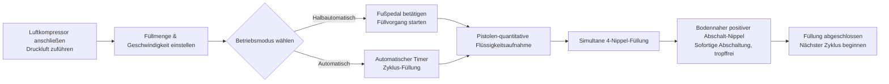

# AL4-5000 Flüssigkeitsfüllmaschine


## Kernzusammenfassung
> Die AL4-5000 ist eine vollautomatische Vier-Nippel-Piston-Flüssigkeitsfüllmaschine des Wenzhou T&D Verpackungsmaschinenwerks, speziell für kleine bis mittlere Hersteller im Bereich Lebensmittel & Getränke, Speiseöle, Alkohol, tägliche Chemikalien und Pharmazeutika entwickelt. Sie füllt pro Zyklus 5–5000 ml bei einer Geschwindigkeit von 1–100 Mal pro Minute mit einer Genauigkeit von ±1 % und wechselt problemlos zwischen halbautomatischer (Fußpedal) und vollautomatischer (Timer) Betriebsart. Der voll pneumatische Antrieb funktioniert ohne Strom – ein intrinsisch sicherer, explosionsgeschützter Aufbau, ideal für brennbare Werkstätten – und alle Teile, die mit Flüssigkeiten in Berührung kommen, bestehen aus lebensmitteltauglichem 304 Edelstahl (316 auf Anfrage), mit Silikon-Dichtungen bis 200 °C und bodennahen Anti-Tropf-Nippeln (3–12 mm), die ein vollständiges Abtropfen gewährleisten. Sofort lieferbar, per Seeversand, mit 1-Jahres-Garantie.

- **Maschinenname**: Flüssigkeitsfüllmaschine  
- **Modell**: AL4-5000  
- **Lieferant**: Wenzhou T&D Verpackungsmaschinenwerk  

---

## I. Produktübersicht

### Produktkategorie
- Verpackungsmaschinen → Flüssigkeitsfüllanlagen (Pistolen-Typ-Füller)  
- Automatisierungsgrad: Vollautomatisch (umschaltbar auf halbautomatisch)  
- Antriebstyp: Elektrisch + pneumatisch (externer Luftkompressor und Steckdose erforderlich)

### Anwendungen
Geeignet zum Füllen fließfähiger Flüssigkeiten, weit verbreitet in:
- Lebensmittel & Getränke: Trinkwasser, Saft, Milch, Speiseöl, Alkohol  
- Tägliche Chemikalien: Spülmittel, Flüssigwaschmittel  
- Pharmazeutika: Flüssigmedikamente

### Hauptmerkmale
- Füllvolumenbereich: 5–5000 ml, Füllgeschwindigkeit: 1–100 Mal/min  
- Füllgenauigkeit innerhalb ±1 %  
- Vier-Nippel-Füllung (Einzelkopf oder Doppelkopf optional)  
- Zwei Betriebsmodi: Fußpedal-Schalter oder automatischer Timer, umschaltbar zwischen halbautomatisch und automatisch  
- Einstellbare Füllmenge und Füllgeschwindigkeit

---

## II. Wettbewerbsvorteile

1. **Explosionssicher & sicher (kein Strom für pneumatische Funktionen erforderlich)**: Ausgestattet mit Airtac-Pneumatikkomponenten und vollständig pneumatischem Antrieb. Kann ohne Stromversorgung betrieben werden, bietet hohe Sicherheit, einfache Bedienung und hohe Füllgenauigkeit.
2. **Vollständig aus Edelstahl, konform mit Lebensmittelsicherheitsstandards**: Vollständig aus Edelstahl, Körper aus 201-Edelstahl, Kontaktteile aus lebensmitteltauglichem 304-Edelstahl, erfüllt Lebensmittelsicherheitsanforderungen. Kontaktteile können auf 304 oder 316 Edelstahl upgradet werden. Edelstahl-Ventilsystem.
3. **Tropfvermeidendes Design**: Einstellbare Füllmenge und -geschwindigkeit. Bodennaher positiver Abschalt-Nippel sorgt für kein Tropfen während des Füllvorgangs. Nippeldurchmesser wählbar zwischen 3–12 mm.
4. **Pistolenfüllung mit Dual-Modus-Umschaltung**: Unterstützt Fußpedalbetrieb oder automatischen Timerbetrieb, ermöglicht freies Umschalten zwischen halbautomatisch und automatisch.
5. **Hochtemperatur-fähige Lebensmittel-Dichtungen**: Silikon-O-Ringe widerstehen Temperaturen bis 200 °C und entsprechen Lebensmittelsicherheitsstandards. Optional Silikon- oder Gummidichtungen; Gummidichtungen sind für korrosive Produkte geeignet.
6. **Unabhängiger Zylinder pro Kopf, flexible Konfiguration**: Jeder Füllkopf verfügt über einen eigenen Zylinder. Füllköpfe können individuell als Einzel- oder Doppelkopf konfiguriert werden.

---

## III. Technische Spezifikationen

| Parameter | Spezifikation |
| --- | --- |
| Modell | AL4-5000 |
| Füllbereich | 5–5000 ml |
| Füllnozzle | 4 Nippel (Einzelkopf / Doppelkopf optional) |
| Füllgeschwindigkeit | 1–100 Mal/min |
| Füllgenauigkeit | ≤1 % |
| Automatisierungsgrad | Automatisch (umschaltbar auf halbautomatisch) |
| Antriebstyp | Voll pneumatischer Antrieb (externer Luftkompressor erforderlich, kein Strom für pneumatische Steuerung nötig) |
| Nippeldurchmesser | 3–12 mm (optional) |
| Dichtungsring | Silikon-O-Ring (beständig bis 200 °C) / Gummiring (korrosionsbeständig) |
| Bruttogewicht / Netto-Gewicht | 200 kg |
| Verpackungsabmessungen | 165 × 80 × 65 cm |

### Verpackungsinformationen

| Artikel | Inhalt |
| --- | --- |
| Im Lieferumfang enthalten | Werkzeuge, Zubehör |
| Einheitenverpackung | 1 Maschine pro Kiste |
| Verpackungsmethode | Verstärkter Kartonkarton |

---

## IV. Verkaufsempfehlungen & FAQ

### Verkaufsempfehlungen
- **Wesentliche Verkaufsargumente**: Stromfreies explosionssicheres Design + Lebensmitteltauglicher Edelstahl + Tropfvermeidender Nippel. Ideal für Sicherheitsproduktion in Lebensmittel-, Chemie- und pharmazeutischen Industrien.
- **Zielkunden**: Kleine bis mittlere Lebensmittel- und Getränkefabriken, Speiseöl-/Alkoholfüllwerkstätten, tägliche Chemikalienhersteller und pharmazeutische Verpackungsunternehmen.
- **Abschlussargument**: Sofort lieferbar + Seefracht inklusive + 1-Jahres-Garantie (ideal für schnelle Umsetzung).
- **Upselling / Zusatzprodukte**: Fragen Sie nach den Kundenfüllvolumen-Anforderungen, um passende Modelle zu empfehlen (6 Varianten von 5–150 ml bis 500–5000 ml); empfehlen Sie 316-Edelstahl + Gummidichtungen für korrosive Flüssigkeiten; empfehlen Sie 304/316-Lebensmittelkonfiguration für hohe Hygienestandards.

### FAQ
1. **Benötigt die Maschine Strom?**  
   Nein. Der voll pneumatische Antrieb benötigt nur eine Verbindung zum Luftkompressor, um sicher und explosionsgeschützt zu arbeiten.
2. **Welche Flüssigkeiten kann sie füllen?**  
   Geeignet für fließfähige Flüssigkeiten: Wasser, Speiseöl, Saft, Milch, Alkohol, Flüssigmedikamente, Spülmittel usw.
3. **Wie genau ist die Füllung? Tropft es?**  
   Genauigkeit liegt innerhalb von 1 %. Die Nippel verwenden ein bodennahe positives Abschalt-Design, um jedes Tropfen zu verhindern.
4. **Wie wird sie bedient?**  
   Sie kann über Fußpedal-Schalter oder automatischen Timer für kontinuierliches Füllen bedient werden. Einfaches Umschalten zwischen halbautomatisch und automatisch.
5. **Was ist die Garantiepolitik?**  
   1-Jahres-Garantie. Kostenlose Reparatur oder Austausch bei Schäden unter normaler Nutzung während der Garantiezeit (Versandkosten von China zur Zieladresse tragen der Kunde). Reisekosten für vor Ort tätige Ingenieure trägt der Kunde. Leistungsbezogene Wartung wird nach Ablauf der Garantie bereitgestellt.
6. **Können Nippeldurchmesser oder die Anzahl der Füllköpfe angepasst werden?**  
   Ja. Nippeldurchmesseroptionen reichen von 3–12 mm, und Füllköpfe können auf Einzel- oder Doppelkopf konfiguriert werden (Standard: 4 Köpfe).
7. **Wie lange ist die Lieferzeit?**  
   Sofort lieferbar. Versand sofort nach Zahlungseingang (einschließlich Seefracht).

### FAQ Schema (JSON-LD)

```json
{
  "@context": "https://schema.org",
  "@type": "FAQPage",
  "mainEntity": [
    {
      "@type": "Question",
      "name": "Benötigt die Maschine Strom?",
      "acceptedAnswer": {
        "@type": "Answer",
        "text": "Nein. Der voll pneumatische Antrieb benötigt nur eine Verbindung zum Luftkompressor, um sicher und explosionsgeschützt zu arbeiten."
      }
    },
    {
      "@type": "Question",
      "name": "Welche Flüssigkeiten kann sie füllen?",
      "acceptedAnswer": {
        "@type": "Answer",
        "text": "Geeignet für fließfähige Flüssigkeiten: Wasser, Speiseöl, Saft, Milch, Alkohol, Flüssigmedikamente, Spülmittel usw."
      }
    },
    {
      "@type": "Question",
      "name": "Wie genau ist die Füllung? Tropft es?",
      "acceptedAnswer": {
        "@type": "Answer",
        "text": "Genauigkeit liegt innerhalb von 1 %. Die Nippel verwenden ein bodennahe positives Abschalt-Design, um jedes Tropfen zu verhindern."
      }
    },
    {
      "@type": "Question",
      "name": "Wie wird sie bedient?",
      "acceptedAnswer": {
        "@type": "Answer",
        "text": "Sie kann über Fußpedal-Schalter oder automatischen Timer für kontinuierliches Füllen bedient werden. Einfaches Umschalten zwischen halbautomatisch und automatisch."
      }
    },
    {
      "@type": "Question",
      "name": "Was ist die Garantiepolitik?",
      "acceptedAnswer": {
        "@type": "Answer",
        "text": "1-Jahres-Garantie. Kostenlose Reparatur oder Austausch bei Schäden unter normaler Nutzung während der Garantiezeit (Versandkosten von China zur Zieladresse tragen der Kunde). Reisekosten für vor Ort tätige Ingenieure trägt der Kunde. Leistungsbezogene Wartung wird nach Ablauf der Garantie bereitgestellt."
      }
    },
    {
      "@type": "Question",
      "name": "Können Nippeldurchmesser oder die Anzahl der Füllköpfe angepasst werden?",
      "acceptedAnswer": {
        "@type": "Answer",
        "text": "Ja. Nippeldurchmesseroptionen reichen von 3–12 mm, und Füllköpfe können auf Einzel- oder Doppelkopf konfiguriert werden (Standard: 4 Köpfe)."
      }
    },
    {
      "@type": "Question",
      "name": "Wie lange ist die Lieferzeit?",
      "acceptedAnswer": {
        "@type": "Answer",
        "text": "Sofort lieferbar. Versand sofort nach Zahlungseingang (einschließlich Seefracht)."
      }
    }
  ]
}
```

### Servicebedingungen nach dem Verkauf
- 1-Jahres-Garantie; kostenlose Reparatur/Austausch bei normalem Verschleiß (Versandkosten von China zur Zieladresse tragen der Kunde)  
- Reisekosten bei Vor-Ort-Ingenieur-Service trägt der Kunde  
- Leistungsbezogene Wartung auch nach Ablauf der Garantiezeit verfügbar

---

## V. Medien- & Ressourcenbibliothek

| Ressourcentyp | Beschreibung / Link |
| --- | --- |
| Arbeitsablauf-Video | https://www.youtube.com/watch?v=OGt9DbZ70Ns |

<iframe width="560" height="315" src="https://www.youtube.com/embed/a-50ew3DCTk?si=c0zp11p3xJCETLsE" title="YouTube-Videoplayer" frameborder="0" allow="accelerometer; autoplay; clipboard-write; encrypted-media; gyroscope; picture-in-picture; web-share" referrerpolicy="strict-origin-when-cross-origin" allowfullscreen></iframe>
---

## VI. Arbeitsablauf



### Angebot anfordern & kaufen

[🛒 Hier klicken, um Preise anzuzeigen und im offiziellen Shop zu kaufen](https://cecle.net/de/products/al4-5000-automatic-four-nozzles-liquid-perfume-water-juice-essential-oil-electric-digital-control-pump-liquid-bottle-filling-machine?_pos=1&_psq=AL4-5000&_psid=2da44f38d&_ss=e&variant=33049577554029)