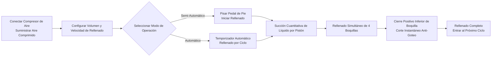

# Máquina de Rellenado Líquido AL4-5000


## Resumen Principal
> La AL4-5000 es una máquina de rellenado líquido automática de cuatro boquillas del tipo pistón, fabricada por Wenzhou T&D Packaging Machinery Factory, diseñada para productores de alimentos y bebidas, aceites comestibles, alcohol, productos químicos diarios y farmacéuticos de pequeño a mediano tamaño. Rellena entre 5 y 5000 ml por ciclo a una velocidad de 1–100 veces por minuto con precisión ±1%, y permite cambiar libremente entre operación semi-automática (pedal de pie) y totalmente automática (temporizador). Su accionamiento completamente neumático funciona sin electricidad — un diseño intrínsecamente seguro y antiexplosivo ideal para talleres inflamables — y todas las partes en contacto con el líquido son de acero inoxidable grado alimenticio 304 (316 opcional), con anillos O de silicona resistentes hasta 200 °C y boquillas antidesbordamiento con cierre inferior (3–12 mm), garantizando cero goteo. Disponible en stock, enviado por mar, respaldado por garantía de 1 año.

- **Nombre de la máquina**: Máquina de Rellenado Líquido  
- **Modelo**: AL4-5000  
- **Proveedor**: Fábrica de Maquinaria de Empaque Wenzhou T&D  

---

## I. Visión General del Producto

### Categoría del Producto
- Maquinaria de Empaque → Equipos de Rellenado Líquido (Rellenador de Tipo Pistón)  
- Grado de Automatización: Totalmente Automático (conmutable a Semi-Automático)  
- Tipo de Accionamiento: Accionamiento Eléctrico + Neumático (requiere compresor de aire externo y enchufe eléctrico)

### Aplicaciones
Adecuada para líquidos con buena fluidez, ampliamente utilizada en:
- Alimentos y Bebidas: Agua potable, jugos, leche, aceite comestible, alcohol  
- Productos Químicos Diarios: Jabón líquido para platos, detergente líquido  
- Farmacéuticos: Medicamentos líquidos

### Características Principales
- Rango de volumen de relleno: 5–5000 ml, velocidad de relleno: 1–100 veces/min  
- Precisión de relleno controlada dentro de ±1%  
- Rellenado de cuatro boquillas (opcional cabeza simple o doble)  
- Dos modos de operación: interruptor de pedal de pie o temporizador automático, conmutables entre modo semi-automático y automático  
- Volumen de relleno y velocidad ajustables

---

## II. Ventajas Clave

1. **Antiexplosión y Seguro (Sin Necesidad de Electricidad para Operaciones Neumáticas)**: Equipada con componentes neumáticos Airtac y accionamiento completamente neumático. Puede funcionar sin suministro eléctrico, ofreciendo alta seguridad, operación sencilla y alta precisión de relleno.
2. **Cuerpo Total en Acero Inoxidable, Cumplimiento con Normas de Seguridad Alimentaria**: Estructura completa en acero inoxidable, cuerpo en acero inoxidable 201, y partes en contacto con el líquido en acero inoxidable grado alimenticio 304, cumpliendo con los requisitos de seguridad alimentaria. Las partes en contacto pueden actualizarse a acero inoxidable 304 o 316. Diseño de sistema de válvulas en acero inoxidable.
3. **Diseño Anti-Goteo**: Volumen y velocidad de relleno ajustables. Boquilla de cierre positivo inferior asegura ausencia de goteo durante el proceso de relleno. Diámetro de boquilla seleccionable entre 3–12 mm.
4. **Rellenado por Pistón con Conmutación Dual**: Soporta operación mediante pedal de pie o temporizador automático, permitiendo cambio libre entre modo semi-automático y automático.
5. **Sellos de Alta Temperatura de Calidad Alimentaria**: Anillos O de silicona resisten temperaturas hasta 200 °C y cumplen con normas de seguridad alimentaria. Sellos de silicona o goma opcionales; los sellos de goma son adecuados para productos corrosivos.
6. **Cilindro Independiente por Cabeza, Configuración Flexible**: Cada cabeza de relleno está equipada con un cilindro independiente. Las cabezas de relleno pueden personalizarse como cabeza simple o doble.

---

## III. Especificaciones Técnicas

| Parámetro | Especificación |
| --- | --- |
| Modelo | AL4-5000 |
| Rango de Rellenado | 5–5000 ml |
| Boquillas de Rellenado | 4 boquillas (opcional cabeza simple / doble) |
| Velocidad de Rellenado | 1–100 veces/min |
| Precisión de Rellenado | ≤1% |
| Grado de Automatización | Automático (conmutable a semi-automático) |
| Tipo de Accionamiento | Accionamiento Neumático Completo (requiere compresor de aire externo, no se necesita electricidad para control neumático) |
| Diámetro de Boquilla | 3–12 mm (opcional) |
| Anillo de Sellado | Anillo O de silicona (resistente a 200 °C) / Anillo de sellado de goma (anti-corrosión) |
| Peso Bruto / Neto | 200 kg |
| Dimensiones de Empaque | 165 × 80 × 65 cm |

### Información de Empaque

| Artículo | Contenido |
| --- | --- |
| Piezas de Repuesto Incluidas | Herramientas, Accesorios |
| Empaque por Unidad | 1 Máquina por Caja |
| Método de Empaque | Caja de cartón reforzado |

---

## IV. Recomendaciones de Venta y Preguntas Frecuentes

### Recomendaciones de Venta
- **Puntos de Venta Principales**: Diseño antiexplosión sin electricidad + acero inoxidable grado alimenticio + boquilla anti-goteo. Ideal para necesidades de producción segura en industrias alimentarias, químicas y farmacéuticas.
- **Clientes Objetivo**: Fábricas pequeñas a medianas de alimentos y bebidas, talleres de llenado de aceite/comestibles/alcohol, fabricantes de productos químicos diarios y empresas de empaque farmacéutico.
- **Propuesta de Cierre**: Producto disponible en stock + transporte marítimo incluido + garantía de 1 año (excelente para conversión rápida).
- **Productos Adicionales / Upsell**: Consulte el volumen de relleno requerido por el cliente para recomendar modelos (6 rangos desde 5–150 ml hasta 500–5000 ml); recomiende acero inoxidable 316 + sellos de goma para líquidos corrosivos; recomiende configuración grado alimenticio 304/316 para altos estándares de higiene.

### Preguntas Frecuentes

1. **¿Requiere la máquina electricidad?**  
   No. El accionamiento completamente neumático solo requiere conectar un compresor de aire para operar de forma segura y antiexplosiva.
2. **¿Qué líquidos puede llenar?**  
   Adecuada para líquidos con buena fluidez: agua, aceite comestible, jugos, leche, alcohol, medicamentos líquidos, jabón para platos, etc.
3. **¿Cuál es la precisión del relleno? ¿Gotea?**  
   La precisión está dentro del 1%. Las boquillas usan un diseño de cierre positivo inferior para garantizar cero goteo.
4. **¿Cómo se opera?**  
   Puede operarse mediante pedal de pie o temporizador automático para llenado continuo. Cambio fácil entre modo semi-automático y automático.
5. **¿Cuál es la política de garantía?**  
   Garantía de 1 año. Reparación o sustitución gratuita por daños por desgaste normal durante el período de garantía (los costos de envío desde China hasta el destino corren por cuenta del cliente). Los gastos de viaje del ingeniero en sitio corren por cuenta del cliente. Servicio de mantenimiento de por vida disponible después de la garantía.
6. **¿Se pueden personalizar los tamaños de boquilla o el número de cabezas de relleno?**  
   Sí. Las opciones de diámetro de boquilla van de 3–12 mm, y las cabezas de relleno pueden personalizarse como cabeza simple o doble (por defecto son 4 cabezas).
7. **¿Cuál es el tiempo de entrega?**  
   En stock. Envío inmediato tras el pago (incluyendo flete marítimo).

### FAQ Schema (JSON-LD)

```json
{
  "@context": "https://schema.org",
  "@type": "FAQPage",
  "mainEntity": [
    {
      "@type": "Question",
      "name": "Does the machine require electricity?",
      "acceptedAnswer": {
        "@type": "Answer",
        "text": "No. Full pneumatic drive only requires connecting an air compressor to operate safely and explosion-proof."
      }
    },
    {
      "@type": "Question",
      "name": "What liquids can it fill?",
      "acceptedAnswer": {
        "@type": "Answer",
        "text": "Suitable for liquids with good fluidity: water, edible oil, juice, milk, alcohol, liquid medicine, dishwashing liquid, etc."
      }
    },
    {
      "@type": "Question",
      "name": "How is the filling accuracy? Will it drip?",
      "acceptedAnswer": {
        "@type": "Answer",
        "text": "Accuracy is within 1%. The nozzles use a bottom close positive shutoff design to ensure zero dripping."
      }
    },
    {
      "@type": "Question",
      "name": "How to operate it?",
      "acceptedAnswer": {
        "@type": "Answer",
        "text": "It can be operated via foot pedal switch or automatic timer for continuous filling. Easily switch between semi-automatic and automatic modes."
      }
    },
    {
      "@type": "Question",
      "name": "What is the warranty policy?",
      "acceptedAnswer": {
        "@type": "Answer",
        "text": "1-year warranty. Free repair or replacement for damage under normal operation during the warranty period (shipping costs from China to destination borne by customer). On-site engineer travel expenses are borne by the customer. Lifetime maintenance provided after the warranty expires."
      }
    },
    {
      "@type": "Question",
      "name": "Can nozzle sizes or the number of filling heads be customized?",
      "acceptedAnswer": {
        "@type": "Answer",
        "text": "Yes. Nozzle diameter options range from 3–12 mm, and filling heads can be customized to single-head or double-head (default is 4 heads)."
      }
    },
    {
      "@type": "Question",
      "name": "What is the delivery lead time?",
      "acceptedAnswer": {
        "@type": "Answer",
        "text": "In stock. Ships immediately after payment (including sea freight)."
      }
    }
  ]
}
```

### Términos de Servicio Postventa
- Garantía de 1 año; reparación o sustitución gratuita por daños por desgaste normal (el envío desde China hasta el sitio local correrá por cuenta del cliente)  
- El cliente cubre los costos de viaje si se requiere servicio de ingeniero en sitio  
- Servicio de mantenimiento de por vida proporcionado más allá del período de garantía

---

## V. Biblioteca de Medios y Recursos

| Tipo de Recurso | Descripción / Enlace |
| --- | --- |
| Video de Flujo de Trabajo | https://www.youtube.com/watch?v=OGt9DbZ70Ns |

<iframe width="560" height="315" src="https://www.youtube.com/embed/a-50ew3DCTk?si=c0zp11p3xJCETLsE" title="Reproductor de video de YouTube" frameborder="0" allow="accelerometer; autoplay; clipboard-write; encrypted-media; gyroscope; picture-in-picture; web-share" referrerpolicy="strict-origin-when-cross-origin" allowfullscreen></iframe>
---

## VI. Flujo de Trabajo



### Solicitar Cotización y Comprar

[🛒 Haz clic aquí para ver precios y comprar en nuestra tienda oficial](https://cecle.net/es/products/al4-5000-automatic-four-nozzles-liquid-perfume-water-juice-essential-oil-electric-digital-control-pump-liquid-bottle-filling-machine?_pos=1&_psq=AL4-5000&_psid=2da44f38d&_ss=e&variant=33049577554029)