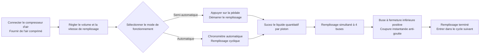

# AL4-5000 Machine de remplissage liquide


## Résumé principal
> L'AL4-5000 est une machine de remplissage liquide à piston à quatre buses entièrement automatique fabriquée par l'usine de machines d'emballage Wenzhou T&D, conçue pour les producteurs alimentaires et non alimentaires de petite et moyenne taille, tels que les boissons, huiles comestibles, alcools, produits chimiques ménagers et médicaments. Elle remplit 5 à 5000 ml par cycle à une vitesse de 1 à 100 cycles par minute avec une précision de ±1 %, et peut passer librement entre le mode semi-automatique (pédale au pied) et le mode entièrement automatique (chronomètre). Son actionnement pneumatique complet fonctionne sans électricité — une conception intrinsèquement sûre et anti-explosion idéale pour les ateliers inflammables — et toutes les pièces en contact avec le liquide sont en acier inoxydable alimentaire 304 (316 en option), avec des joints en silicone résistants jusqu’à 200 °C et des buses anti-goutte à fermeture inférieure (3–12 mm), garantissant une absence totale de goutte. En stock, expédiée par voie maritime, couverte par une garantie de 1 an.

- **Nom de la machine** : Machine de remplissage liquide  
- **Modèle** : AL4-5000  
- **Fournisseur** : Usine de machines d'emballage Wenzhou T&D  

---

## I. Aperçu produit

### Catégorie produit
- Machines d'emballage → Équipement de remplissage liquide (Remplisseur à piston)  
- Niveau d'automatisation : Entièrement automatique (convertible en semi-automatique)  
- Type d'actionnement : Actionnement électrique + pneumatique (nécessite compresseur d'air externe et prise électrique)

### Applications
Convient au remplissage de liquides à bonne fluidité, largement utilisé dans :
- Alimentation & Boissons : Eau potable, jus, lait, huile comestible, alcool  
- Produits chimiques ménagers : Liquide vaisselle, détergent liquide  
- Pharmaceutique : Médicaments liquides

### Fonctionnalités principales
- Plage de volume de remplissage : 5–5000 ml, vitesse de remplissage : 1–100 cycles/min  
- Précision de remplissage contrôlée à ±1 %  
- Remplissage à 4 buses (optionnel : tête unique ou double tête)  
- Deux modes de fonctionnement : interrupteur pédal ou chronomètre automatique, commutables entre mode semi-automatique et automatique  
- Volume de remplissage et vitesse ajustables

---

## II. Avantages clés

1. **Anti-explosion et sécurisé (pas d’électricité nécessaire pour les opérations pneumatiques)** : Équipé de composants pneumatiques Airtac et actionnement pneumatique intégral. Peut fonctionner sans alimentation électrique, offrant une grande sécurité, une manipulation simple et une haute précision de remplissage.
2. **Corps entièrement en acier inoxydable, conforme aux normes de sécurité alimentaire** : Cadre entièrement en acier inoxydable, corps en acier inoxydable 201, parties en contact avec le liquide en acier inoxydable alimentaire 304, répondant aux exigences de sécurité alimentaire. Les pièces en contact peuvent être mises à niveau vers 304 ou 316. Conception du système de valve en acier inoxydable.
3. **Design anti-goutte** : Volume et vitesse de remplissage réglables. Buses à fermeture positive en bas assurent l’absence de goutte pendant le processus de remplissage. Diamètre de buse sélectionnable entre 3 et 12 mm.
4. **Remplissage par piston avec commutation en mode dual** : Supporte le fonctionnement à pédale ou au chronomètre automatique, permettant un changement libre entre les modes semi-automatique et automatique.
5. **Joints étanches alimentaires haute température** : O-rings en silicone résistent jusqu’à 200 °C et respectent les normes alimentaires. Joint en silicone ou en caoutchouc disponible en option ; les joints en caoutchouc conviennent aux produits corrosifs.
6. **Cylindre indépendant par tête, configuration flexible** : Chaque tête de remplissage est équipée d’un cylindre indépendant. Les têtes de remplissage peuvent être personnalisées en tête unique ou double tête.

---

## III. Spécifications techniques

| Paramètre | Spécification |
| --- | --- |
| Modèle | AL4-5000 |
| Plage de remplissage | 5–5000 ml |
| Buses de remplissage | 4 buses (optionnel : tête unique / double tête) |
| Vitesse de remplissage | 1–100 cycles/min |
| Précision de remplissage | ≤1 % |
| Niveau d'automatisation | Automatique (convertible en semi-automatique) |
| Type d'actionnement | Actionnement pneumatique complet (compresseur d'air externe requis, pas d'électricité nécessaire pour le contrôle pneumatique) |
| Diamètre de buse | 3–12 mm (en option) |
| Anneau d'étanchéité | O-ring en silicone (résistant à 200 °C) / Joint en caoutchouc (anti-corrosion) |
| Poids brut / Net | 200 kg |
| Dimensions d'emballage | 165 × 80 × 65 cm |

### Informations sur l'emballage

| Article | Contenu |
| --- | --- |
| Pièces de rechange incluses | Outils, accessoires |
| Emballage unitaire | 1 machine par carton |
| Méthode d'emballage | Carton renforcé |

---

## IV. Recommandations commerciales & FAQ

### Recommandations commerciales
- **Points forts principaux** : Conception anti-explosion sans électricité + acier inoxydable alimentaire + buse anti-goutte. Idéal pour les besoins de production sécurisée dans les secteurs alimentaire, chimique et pharmaceutique.
- **Clients cibles** : Petites et moyennes usines alimentaires et de boissons, ateliers de remplissage d’huiles comestibles/alcool, fabricants de produits chimiques ménagers, entreprises de conditionnement pharmaceutique.
- **Argument de vente** : Stock disponible + fret maritime inclus + garantie de 1 an (idéal pour une conversion rapide).
- **Produits complémentaires / Upsell** : Demandez le volume de remplissage souhaité pour recommander un modèle adapté (6 gammes de 5–150 ml à 500–5000 ml) ; recommandez l’acier 316 + joints en caoutchouc pour les liquides corrosifs ; recommandez la configuration alimentaire 304/316 pour des normes d’hygiène élevées.

### FAQ

1. **La machine nécessite-t-elle de l’électricité ?**  
   Non. L’actionnement pneumatique complet n’a besoin que de se connecter à un compresseur d’air pour fonctionner en toute sécurité et en zone anti-explosion.
2. **Quels liquides peut-elle remplir ?**  
   Convient aux liquides à bonne fluidité : eau, huile comestible, jus, lait, alcool, médicaments liquides, liquide vaisselle, etc.
3. **Quelle est la précision du remplissage ? Y a-t-il des gouttes ?**  
   La précision est inférieure à 1 %. Les buses utilisent une conception de fermeture positive en bas pour garantir l’absence totale de goutte.
4. **Comment l’utiliser ?**  
   Il peut être opéré via une pédale ou un chronomètre automatique pour un remplissage continu. Le passage entre les modes semi-automatique et automatique est facile.
5. **Quelle est la politique de garantie ?**  
   Garantie de 1 an. Réparation ou remplacement gratuit en cas de dommages dus à une utilisation normale pendant la période de garantie (les frais d’expédition depuis la Chine jusqu’à destination sont à la charge du client). Les frais de voyage de l’ingénieur sur site sont à la charge du client. Maintenance à vie fournie après expiration de la garantie.
6. **Les diamètres de buses ou le nombre de têtes de remplissage peuvent-ils être personnalisés ?**  
   Oui. Les options de diamètre de buse vont de 3 à 12 mm, et les têtes de remplissage peuvent être personnalisées en tête unique ou double tête (par défaut : 4 têtes).
7. **Quel est le délai de livraison ?**  
   En stock. Expédition immédiate après paiement (fret maritime inclus).

### FAQ Schema (JSON-LD)

```json
{
  "@context": "https://schema.org",
  "@type": "FAQPage",
  "mainEntity": [
    {
      "@type": "Question",
      "name": "Does the machine require electricity?",
      "acceptedAnswer": {
        "@type": "Answer",
        "text": "No. Full pneumatic drive only requires connecting an air compressor to operate safely and explosion-proof."
      }
    },
    {
      "@type": "Question",
      "name": "What liquids can it fill?",
      "acceptedAnswer": {
        "@type": "Answer",
        "text": "Suitable for liquids with good fluidity: water, edible oil, juice, milk, alcohol, liquid medicine, dishwashing liquid, etc."
      }
    },
    {
      "@type": "Question",
      "name": "How is the filling accuracy? Will it drip?",
      "acceptedAnswer": {
        "@type": "Answer",
        "text": "Accuracy is within 1%. The nozzles use a bottom close positive shutoff design to ensure zero dripping."
      }
    },
    {
      "@type": "Question",
      "name": "How to operate it?",
      "acceptedAnswer": {
        "@type": "Answer",
        "text": "It can be operated via foot pedal switch or automatic timer for continuous filling. Easily switch between semi-automatic and automatic modes."
      }
    },
    {
      "@type": "Question",
      "name": "What is the warranty policy?",
      "acceptedAnswer": {
        "@type": "Answer",
        "text": "1-year warranty. Free repair or replacement for damage under normal operation during the warranty period (shipping costs from China to destination borne by customer). On-site engineer travel expenses are borne by the customer. Lifetime maintenance provided after the warranty expires."
      }
    },
    {
      "@type": "Question",
      "name": "Can nozzle sizes or the number of filling heads be customized?",
      "acceptedAnswer": {
        "@type": "Answer",
        "text": "Yes. Nozzle diameter options range from 3–12 mm, and filling heads can be customized to single-head or double-head (default is 4 heads)."
      }
    },
    {
      "@type": "Question",
      "name": "What is the delivery lead time?",
      "acceptedAnswer": {
        "@type": "Answer",
        "text": "In stock. Ships immediately after payment (including sea freight)."
      }
    }
  ]
}
```

### Conditions de service après-vente
- Garantie de 1 an ; réparation ou remplacement gratuits pour les dommages liés à l’usure normale (frais d’expédition depuis la Chine jusqu’au lieu local à la charge du client)  
- Frais de voyage à la charge du client en cas de service sur site par ingénieur  
- Service de maintenance à vie fourni au-delà de la période de garantie

---

## V. Bibliothèque multimédia & ressources

| Type de ressource | Description / Lien |
| --- | --- |
| Vidéo de fonctionnement | https://www.youtube.com/watch?v=OGt9DbZ70Ns |

<iframe width="560" height="315" src="https://www.youtube.com/embed/a-50ew3DCTk?si=c0zp11p3xJCETLsE" title="Player vidéo YouTube" frameborder="0" allow="accelerometer; autoplay; clipboard-write; encrypted-media; gyroscope; picture-in-picture; web-share" referrerpolicy="strict-origin-when-cross-origin" allowfullscreen></iframe>

---

## VI. Processus de fonctionnement



### Demandez un devis & achetez

[🛒 Cliquez ici pour consulter les prix et acheter sur notre boutique officielle](https://cecle.net/fr/products/al4-5000-automatic-four-nozzles-liquid-perfume-water-juice-essential-oil-electric-digital-control-pump-liquid-bottle-filling-machine?_pos=1&_psq=AL4-5000&_psid=2da44f38d&_ss=e&variant=33049577554029)