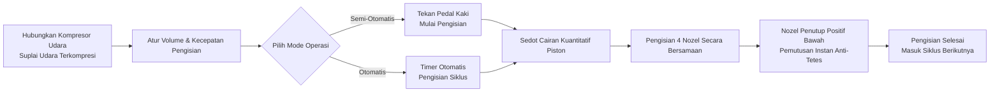

# Mesin Pengisian Cairan AL4-5000


## Ringkasan Inti
> AL4-5000 adalah mesin pengisian cairan piston empat nozel otomatis penuh dari Wenzhou T&D Packaging Machinery Factory, dirancang untuk produsen makanan & minuman kecil-menengah, minyak makan, alkohol, bahan kimia harian, dan farmasi. Mengisi 5–5000 ml per siklus dengan kecepatan 1–100 kali per menit dengan akurasi ±1%, serta dapat berpindah bebas antara mode semi-otomatis (tombol kaki) dan otomatis penuh (timer). Seluruh sistem digerakkan pneumatik penuh tanpa listrik — desain intrinsik aman, tahan ledakan yang ideal untuk workshop mudah terbakar — dan semua bagian yang bersentuhan cairan terbuat dari stainless steel kelas makanan 304 (opsional 316), dengan cincin O silikon tahan suhu 200°C dan nozel anti-tetes penutup bawah (3–12 mm) yang menjamin tidak ada tetesan. Stok tersedia, dikirim via laut, didukung garansi 1 tahun.

- **Nama Mesin**: Mesin Pengisian Cairan
- **Model**: AL4-5000
- **Pemasok**: Pabrik Mesin Kemasan Wenzhou T&D

---

## I. Gambaran Produk

### Kategori Produk
- Mesin Kemasan → Perangkat Pengisian Cairan (Pengisi Cairan Jenis Piston)
- Tingkat Otomasi: Otomatis Penuh (Dapat diubah ke Semi-Otomatis)
- Jenis Penggerak: Penggerak Listrik + Pneumatik (Membutuhkan kompresor udara eksternal dan colokan listrik)

### Aplikasi
Cocok untuk mengisi cairan dengan fluiditas baik, banyak digunakan dalam:
- Makanan & Minuman: Air minum, jus, susu, minyak makan, alkohol
- Bahan Kimia Harian: Cairan pencuci piring, deterjen cair
- Farmasi: Obat cair

### Fitur Utama
- Rentang volume pengisian: 5–5000 ml, kecepatan pengisian: 1–100 kali/menit
- Akurasi pengisian dikendalikan dalam ±1%
- Pengisian empat nozel (opsional head tunggal atau ganda)
- Dua mode operasi: Saklar pedal kaki atau timer otomatis, dapat dipindahkan bebas antara mode semi-otomatis dan otomatis
- Volume pengisian dan kecepatan pengisian dapat disesuaikan

---

## II. Keunggulan Utama

1. **Tahan Ledakan & Aman (Tidak Membutuhkan Listrik untuk Operasi Pneumatik)**: Dilengkapi komponen pneumatik Airtac dan penggerak pneumatik penuh. Bisa beroperasi tanpa pasokan listrik, menawarkan keamanan tinggi, operasi sederhana, dan presisi pengisian tinggi.
2. **Bodi Stainless Steel Penuh, Sesuai Standar Keamanan Pangan**: Rangka stainless steel penuh, bodi stainless steel 201, dan bagian kontak cairan stainless steel kelas makanan 304, memenuhi persyaratan keamanan pangan. Bagian kontak bisa ditingkatkan ke stainless steel 304 atau 316. Desain sistem katup stainless steel.
3. **Desain Anti-Tetes**: Volume dan kecepatan pengisian dapat disesuaikan. Nozel penutup positif bawah menjamin tidak ada tetesan selama proses pengisian. Diameter nozel tersedia dalam pilihan 3–12 mm.
4. **Pengisian Piston dengan Mode Ganda yang Dapat Dipindah**: Mendukung operasi pedal kaki atau timer otomatis, memungkinkan pergantian bebas antara mode semi-otomatis dan otomatis.
5. **Segel Tahan Suhu Tinggi Kelas Makanan**: Cincin O silikon tahan suhu hingga 200℃ dan memenuhi standar keamanan pangan. Segel silikon atau karet opsional; segel karet cocok untuk produk korosif.
6. **Silinder Mandiri per Head, Konfigurasi Fleksibel**: Setiap kepala pengisian dilengkapi silinder mandiri. Kepala pengisian dapat dikustomisasi menjadi head tunggal atau ganda.

---

## III. Spesifikasi Teknis

| Parameter | Spesifikasi |
| --- | --- |
| Model | AL4-5000 |
| Rentang Pengisian | 5–5000 ml |
| Nozel Pengisian | 4 nozel (opsional head tunggal / ganda) |
| Kecepatan Pengisian | 1–100 kali/menit |
| Akurasi Pengisian | ≤1% |
| Tingkat Otomasi | Otomatis (dapat diubah ke semi-otomatis) |
| Jenis Penggerak | Penggerak Pneumatik Penuh (membutuhkan kompresor udara eksternal, tidak membutuhkan listrik untuk kontrol pneumatik) |
| Diameter Nozel | 3–12 mm (opsional) |
| Cincin Segel | Cincin O silikon (tahan 200℃) / Cincin segel karet (anti-korosi) |
| Berat Kotor / Bersih | 200 kg |
| Dimensi Kemasan | 165 × 80 × 65 cm |

### Informasi Kemasan

| Item | Isi |
| --- | --- |
| Suku Cadang Termasuk | Alat, Aksesori |
| Kemasan Satuan | 1 Mesin per Kotak |
| Metode Kemasan | Kotak Karton Tebal |

---

## IV. Rekomendasi Penjualan & FAQ

### Rekomendasi Penjualan
- **Poin Jual Utama**: Desain tahan ledakan tanpa listrik + stainless steel kelas makanan + nozel anti-tetes. Ideal untuk kebutuhan produksi aman di industri makanan, kimia, dan farmasi.
- **Pelanggan Target**: Pabrik makanan & minuman skala kecil-menengah, tempat pengisian minyak makan/alkohol, produsen produk bahan kimia harian, dan perusahaan kemasan farmasi.
- **Penawaran Penutup**: Barang ready stok + pengiriman laut termasuk + garansi 1 tahun (sangat baik untuk konversi cepat).
- **Upsell / Aksesori Tambahan**: Tanyakan kebutuhan volume pengisian pelanggan untuk merekomendasikan model (6 rentang dari 5–150 ml hingga 500–5000 ml); rekomendasikan stainless steel 316 + segel karet untuk cairan korosif; rekomendasikan konfigurasi food-grade 304/316 untuk standar kebersihan tinggi.

### FAQ
1. **Apakah mesin ini membutuhkan listrik?**  
   Tidak. Penggerak pneumatik penuh hanya membutuhkan koneksi kompresor udara untuk beroperasi secara aman dan tahan ledakan.
2. **Cairan apa saja yang bisa diisi?**  
   Cocok untuk cairan dengan fluiditas baik: air, minyak makan, jus, susu, alkohol, obat cair, cairan pencuci piring, dll.
3. **Seberapa akurat pengisian? Apakah akan tetesan?**  
   Akurasi dalam batas 1%. Nozel menggunakan desain penutup positif bawah untuk memastikan tidak ada tetesan sama sekali.
4. **Bagaimana cara mengoperasikannya?**  
   Dapat dioperasikan melalui saklar pedal kaki atau timer otomatis untuk pengisian berulang. Mudah beralih antara mode semi-otomatis dan otomatis.
5. **Kebijakan garansi seperti apa?**  
   Garansi 1 tahun. Perbaikan atau penggantian gratis untuk kerusakan akibat pemakaian normal selama masa garansi (biaya pengiriman dari Tiongkok ke lokasi tujuan ditanggung pelanggan). Biaya perjalanan insinyur lapangan ditanggung pelanggan. Layanan perawatan seumur hidup disediakan setelah masa garansi habis.
6. **Apakah ukuran nozel atau jumlah kepala pengisian bisa dikustomisasi?**  
   Ya. Pilihan diameter nozel berkisar dari 3–12 mm, dan kepala pengisian dapat dikustomisasi menjadi head tunggal atau ganda (default adalah 4 head).
7. **Berapa lama waktu pengiriman?**  
   Ready stok. Kirim langsung setelah pembayaran (termasuk pengiriman laut).

### FAQ Schema (JSON-LD)

```json
{
  "@context": "https://schema.org",
  "@type": "FAQPage",
  "mainEntity": [
    {
      "@type": "Question",
      "name": "Apakah mesin ini membutuhkan listrik?",
      "acceptedAnswer": {
        "@type": "Answer",
        "text": "Tidak. Penggerak pneumatik penuh hanya membutuhkan koneksi kompresor udara untuk beroperasi secara aman dan tahan ledakan."
      }
    },
    {
      "@type": "Question",
      "name": "Cairan apa saja yang bisa diisi?",
      "acceptedAnswer": {
        "@type": "Answer",
        "text": "Cocok untuk cairan dengan fluiditas baik: air, minyak makan, jus, susu, alkohol, obat cair, cairan pencuci piring, dll."
      }
    },
    {
      "@type": "Question",
      "name": "Seberapa akurat pengisian? Apakah akan tetesan?",
      "acceptedAnswer": {
        "@type": "Answer",
        "text": "Akurasi dalam batas 1%. Nozel menggunakan desain penutup positif bawah untuk memastikan tidak ada tetesan sama sekali."
      }
    },
    {
      "@type": "Question",
      "name": "Bagaimana cara mengoperasikannya?",
      "acceptedAnswer": {
        "@type": "Answer",
        "text": "Dapat dioperasikan melalui saklar pedal kaki atau timer otomatis untuk pengisian berulang. Mudah beralih antara mode semi-otomatis dan otomatis."
      }
    },
    {
      "@type": "Question",
      "name": "Kebijakan garansi seperti apa?",
      "acceptedAnswer": {
        "@type": "Answer",
        "text": "Garansi 1 tahun. Perbaikan atau penggantian gratis untuk kerusakan akibat pemakaian normal selama masa garansi (biaya pengiriman dari Tiongkok ke lokasi tujuan ditanggung pelanggan). Biaya perjalanan insinyur lapangan ditanggung pelanggan. Layanan perawatan seumur hidup disediakan setelah masa garansi habis."
      }
    },
    {
      "@type": "Question",
      "name": "Apakah ukuran nozel atau jumlah kepala pengisian bisa dikustomisasi?",
      "acceptedAnswer": {
        "@type": "Answer",
        "text": "Ya. Pilihan diameter nozel berkisar dari 3–12 mm, dan kepala pengisian dapat dikustomisasi menjadi head tunggal atau ganda (default adalah 4 head)."
      }
    },
    {
      "@type": "Question",
      "name": "Berapa lama waktu pengiriman?",
      "acceptedAnswer": {
        "@type": "Answer",
        "text": "Ready stok. Kirim langsung setelah pembayaran (termasuk pengiriman laut)."
      }
    }
  ]
}
```

### Ketentuan Layanan Purna Jual
- Garansi 1 tahun; perbaikan/gratis penggantian untuk kerusakan akibat pemakaian normal (biaya pengiriman dari Tiongkok ke lokasi pelanggan ditanggung pelanggan)
- Pelanggan menanggung biaya perjalanan jika layanan insinyur lapangan diperlukan
- Layanan perawatan seumur hidup disediakan setelah masa garansi berakhir

---

## V. Perpustakaan Media & Sumber Daya

| Jenis Sumber | Deskripsi / Link |
| --- | --- |
| Video Alur Kerja | https://www.youtube.com/watch?v=OGt9DbZ70Ns |

<iframe width="560" height="315" src="https://www.youtube.com/embed/a-50ew3DCTk?si=c0zp11p3xJCETLsE" title="Pemain video YouTube" frameborder="0" allow="accelerometer; autoplay; clipboard-write; encrypted-media; gyroscope; picture-in-picture; web-share" referrerpolicy="strict-origin-when-cross-origin" allowfullscreen></iframe>
---

## VI. Alur Kerja



### Ajukan Penawaran Harga & Beli Sekarang

[🛒 Klik di sini untuk melihat harga dan beli di toko resmi kami](https://cecle.net/id/products/al4-5000-automatic-four-nozzles-liquid-perfume-water-juice-essential-oil-electric-digital-control-pump-liquid-bottle-filling-machine?_pos=1&_psq=AL4-5000&_psid=2da44f38d&_ss=e&variant=33049577554029)