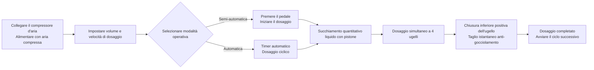

# Macchina dosatrice AL4-5000 per liquidi


## Riepilogo essenziale
> L'AL4-5000 è una macchina dosatrice automatica a pistone con quattro ugelli prodotta dalla Wenzhou T&D Packaging Machinery Factory, progettata per piccole e medie imprese nel settore alimentare e delle bevande, oli commestibili, alcolici, prodotti chimici domestici e farmaceutici. Dosaggio da 5 a 5000 ml per ciclo, con velocità di 1–100 cicli/minuto con precisione ±1%, e possibilità di commutare liberamente tra modalità semi-automatica (pedale a pedale) e completamente automatica (timer). Il sistema completamente pneumatico funziona senza corrente elettrica – un design intrinsecamente sicuro e antiesplosione ideale per officine infiammabili – e tutte le parti a contatto con i liquidi sono in acciaio inossidabile di qualità alimentare 304 (316 opzionale), con anelli O in silicone resistenti fino a 200°C e ugelli anti-gocciolamento a chiusura inferiore (diametro 3–12 mm) che garantiscono zero gocciolamenti. Disponibile immediatamente, spedito via mare, con garanzia di 1 anno.

- **Nome macchina**: Macchina dosatrice per liquidi  
- **Modello**: AL4-5000  
- **Fornitore**: Wenzhou T&D Packaging Machinery Factory  

---

## I. Panoramica del prodotto

### Categoria prodotto
- Macchinari per imballaggio → Attrezzature per dosatura liquidi (Dosatore a pistone)
- Grado di automazione: Automatico completo (convertibile in semi-automatico)
- Tipo di azionamento: Azionamento elettrico + pneumatico (richiede compressore d’aria esterno e presa elettrica)

### Applicazioni
Adatto per il dosaggio di liquidi con buona fluidità, ampiamente utilizzato in:
- Alimentare e bevande: acqua potabile, succo, latte, olio commestibile, alcol
- Prodotti chimici quotidiani: detersivo per piatti, detersivo liquido
- Farmaceutica: medicamenti liquidi

### Caratteristiche principali
- Intervallo di dosaggio: 5–5000 ml, velocità di dosaggio: 1–100 cicli/minuto
- Precisione di dosaggio controllata entro ±1%
- Dosaggio a 4 ugelli (opzionale testa singola o doppia)
- Due modalità operative: interruttore a pedale o timer automatico, commutabile tra modalità semi-automatica e automatica
- Volume e velocità di dosaggio regolabili

---

## II. Vantaggi chiave

1. **Antiesplosione e sicuro (nessuna corrente elettrica necessaria per operazioni pneumatiche)**: Equipaggiato con componenti pneumatici Airtac e azionamento completamente pneumatico. Può funzionare senza alimentazione elettrica, offrendo alta sicurezza, semplicità d’uso e elevata precisione di dosaggio.
2. **Corpo in acciaio inossidabile completo, conforme ai requisiti di sicurezza alimentare**: Struttura in acciaio inossidabile completo, corpo in acciaio inossidabile 201, parti a contatto con liquidi in acciaio inossidabile di qualità alimentare 304, conforme agli standard di sicurezza alimentare. Le parti a contatto possono essere aggiornate a 304 o 316 acciaio inossidabile. Design del sistema valvola in acciaio inossidabile.
3. **Design anti-gocciolamento**: Volume e velocità di dosaggio regolabili. Ugello a chiusura positiva inferiore garantisce assenza di gocciolamenti durante il processo di dosaggio. Diametro dell’ugello selezionabile tra 3–12 mm.
4. **Dosaggio a pistone con commutazione a due modalità**: Supporta l’operazione con pedale a pedale o timer automatico, consentendo lo scambio libero tra modalità semi-automatica e automatica.
5. **Guarnizioni ad alte temperature di qualità alimentare**: Anelli O in silicone resistono fino a 200℃ e rispettano gli standard di sicurezza alimentare. Guarnizioni in silicone o gomma opzionali; guarnizioni in gomma adatte per prodotti corrosivi.
6. **Cilindro indipendente per ogni testa, configurazione flessibile**: Ogni testa di dosaggio è dotata di un cilindro indipendente. Le teste di dosaggio possono essere personalizzate come testa singola o doppia.

---

## III. Specifiche tecniche

| Parametro | Specifica |
| --- | --- |
| Modello | AL4-5000 |
| Campo di dosaggio | 5–5000 ml |
| Ugelli di dosaggio | 4 ugelli (opzionale testa singola / doppia) |
| Velocità di dosaggio | 1–100 cicli/minuto |
| Precisione di dosaggio | ≤1% |
| Grado di automazione | Automatico (convertibile in semi-automatico) |
| Tipo di azionamento | Azionamento pneumatico completo (richiesto compressore d’aria esterno, nessuna corrente elettrica necessaria per il controllo pneumatico) |
| Diametro ugello | 3–12 mm (opzionale) |
| Guarnizione anello | Anello O in silicone (resistente fino a 200℃) / Anello in gomma (antiruggine) |
| Peso lordo / netto | 200 kg |
| Dimensioni imballo | 165 × 80 × 65 cm |

### Informazioni sull'imballaggio

| Voce | Contenuto |
| --- | --- |
| Ricambi inclusi | Strumenti, accessori |
| Imballaggio unitario | 1 macchina per scatola |
| Metodo di imballaggio | Scatola cartonata rinforzata |

---

## IV. Raccomandazioni commerciali e FAQ

### Raccomandazioni commerciali
- **Punti di vendita principali**: Design antiesplosione senza corrente + acciaio inossidabile di qualità alimentare + ugello anti-gocciolamento. Ideale per esigenze di produzione sicura nei settori alimentare, chimico e farmaceutico.
- **Clienti target**: Piccole e medie fabbriche di alimenti e bevande, officine di riempimento per oli commestibili/alcolici, produttori di prodotti chimici quotidiani e aziende di imballaggio farmaceutico.
- **Proposta conclusiva**: Merce disponibile + trasporto marittimo incluso + garanzia di 1 anno (ottimo per conversione rapida).
- **Vendita incrociata / accessori**: Chiedere al cliente il volume di riempimento richiesto per consigliare modelli (6 range da 5–150 ml a 500–5000 ml); consigliare acciaio 316 + guarnizioni in gomma per liquidi corrosivi; consigliare configurazione alimentare 304/316 per standard igienici elevati.

### FAQ
1. **La macchina richiede corrente elettrica?**  
   No. L’azionamento completamente pneumatico richiede solo la connessione a un compressore d’aria per funzionare in modo sicuro e antiesplosione.
2. **Quali liquidi può dosare?**  
   Adatto a liquidi con buona fluidità: acqua, olio commestibile, succo, latte, alcol, medicamenti liquidi, detersivo per piatti, ecc.
3. **Quanto è precisa la dosatura? Ci sono gocciolamenti?**  
   La precisione è entro il 1%. Gli ugelli utilizzano un design a chiusura positiva inferiore per garantire zero gocciolamenti.
4. **Come si opera la macchina?**  
   Può essere operata tramite pedale a pedale o timer automatico per riempimento continuo. È facile commutare tra modalità semi-automatica e automatica.
5. **Qual è la politica di garanzia?**  
   Garanzia di 1 anno. Riparazione o sostituzione gratuita per danni dovuti all’uso normale durante il periodo di garanzia (le spese di spedizione dalla Cina al luogo di destinazione sono a carico del cliente). Le spese di viaggio per tecnico sul posto sono a carico del cliente. Manutenzione a vita fornita dopo la fine della garanzia.
6. **È possibile personalizzare il diametro degli ugelli o il numero di teste di dosaggio?**  
   Sì. Il diametro degli ugelli varia da 3 a 12 mm, e le teste di dosaggio possono essere personalizzate come testa singola o doppia (impostazione predefinita: 4 teste).
7. **Qual è il tempo di consegna?**  
   Disponibile immediatamente. Spedizione immediata dopo il pagamento (compreso il trasporto marittimo).

### FAQ Schema (JSON-LD)

```json
{
  "@context": "https://schema.org",
  "@type": "FAQPage",
  "mainEntity": [
    {
      "@type": "Question",
      "name": "Does the machine require electricity?",
      "acceptedAnswer": {
        "@type": "Answer",
        "text": "No. Full pneumatic drive only requires connecting an air compressor to operate safely and explosion-proof."
      }
    },
    {
      "@type": "Question",
      "name": "What liquids can it fill?",
      "acceptedAnswer": {
        "@type": "Answer",
        "text": "Suitable for liquids with good fluidity: water, edible oil, juice, milk, alcohol, liquid medicine, dishwashing liquid, etc."
      }
    },
    {
      "@type": "Question",
      "name": "How is the filling accuracy? Will it drip?",
      "acceptedAnswer": {
        "@type": "Answer",
        "text": "Accuracy is within 1%. The nozzles use a bottom close positive shutoff design to ensure zero dripping."
      }
    },
    {
      "@type": "Question",
      "name": "How to operate it?",
      "acceptedAnswer": {
        "@type": "Answer",
        "text": "It can be operated via foot pedal switch or automatic timer for continuous filling. Easily switch between semi-automatic and automatic modes."
      }
    },
    {
      "@type": "Question",
      "name": "What is the warranty policy?",
      "acceptedAnswer": {
        "@type": "Answer",
        "text": "1-year warranty. Free repair or replacement for damage under normal operation during the warranty period (shipping costs from China to destination borne by customer). On-site engineer travel expenses are borne by the customer. Lifetime maintenance provided after the warranty expires."
      }
    },
    {
      "@type": "Question",
      "name": "Can nozzle sizes or the number of filling heads be customized?",
      "acceptedAnswer": {
        "@type": "Answer",
        "text": "Yes. Nozzle diameter options range from 3–12 mm, and filling heads can be customized to single-head or double-head (default is 4 heads)."
      }
    },
    {
      "@type": "Question",
      "name": "What is the delivery lead time?",
      "acceptedAnswer": {
        "@type": "Answer",
        "text": "In stock. Ships immediately after payment (including sea freight)."
      }
    }
  ]
}
```

### Condizioni di servizio post-vendita
- Garanzia di 1 anno; riparazione o sostituzione gratuita per danni causati dall’usura normale (spese di spedizione dalla Cina al sito locale a carico del cliente)
- Il cliente copre le spese di viaggio se richiesta assistenza sul posto da parte di un tecnico
- Servizio di manutenzione a vita fornito oltre il periodo di garanzia

---

## V. Biblioteca media e risorse

| Tipo risorsa | Descrizione / Link |
| --- | --- |
| Video del flusso di lavoro | https://www.youtube.com/watch?v=OGt9DbZ70Ns |

<iframe width="560" height="315" src="https://www.youtube.com/embed/a-50ew3DCTk?si=c0zp11p3xJCETLsE" title="Player video YouTube" frameborder="0" allow="accelerometer; autoplay; clipboard-write; encrypted-media; gyroscope; picture-in-picture; web-share" referrerpolicy="strict-origin-when-cross-origin" allowfullscreen></iframe>
---

## VI. Flusso di lavoro



### Richiedi un preventivo e acquista

[🛒 Clicca qui per visualizzare i prezzi e acquistare sul nostro negozio ufficiale](https://cecle.net/it/products/al4-5000-automatic-four-nozzles-liquid-perfume-water-juice-essential-oil-electric-digital-control-pump-liquid-bottle-filling-machine?_pos=1&_psq=AL4-5000&_psid=2da44f38d&_ss=e&variant=33049577554029)