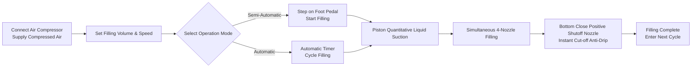

# AL4-5000 Liquid Filling Machine


## Overview
> The AL4-5000 is a fully automatic four-nozzle piston liquid filling machine from Wenzhou T&D Packaging Machinery Factory, engineered for small-to-medium food & beverage, edible oil, alcohol, daily chemical, and pharmaceutical producers. It fills 5–5000 ml per cycle at 1–100 times per minute with ±1% accuracy, and switches freely between semi-automatic (foot pedal) and fully automatic (timer) operation. Its full pneumatic drive runs without electricity — an intrinsically safe, explosion-proof design ideal for flammable workshops — and every liquid-contact part is food-grade 304 stainless steel (316 optional), with 200°C-rated silicone O-rings and bottom-close anti-drip nozzles (3–12 mm) guaranteeing zero dripping. In stock, shipped by sea, backed by a 1-year warranty.

- **Machine Name**: Liquid Filling Machine
- **Model**: AL4-5000
- **Supplier**: Wenzhou T&D Packaging Machinery Factory

---

## I. Product Overview

### Product Category
- Packaging Machinery → Liquid Filling Equipment (Piston Type Liquid Filler)
- Automation Grade: Fully Automatic (Switchable to Semi-Automatic)
- Drive Type: Electric + Pneumatic Drive (Requires external air compressor and power plug)

### Applications
Suitable for filling liquids with good fluidity, widely used in:
- Food & Beverage: Drinking water, juice, milk, edible oil, alcohol
- Daily Chemicals: Dishwashing liquid, liquid detergent
- Pharmaceuticals: Liquid medicine

### Core Features
- Filling volume range: 5–5000 ml, filling speed: 1–100 times/min
- Filling accuracy controlled within ±1%
- Four-nozzle filling (Single-head or double-head optional)
- Two operating modes: Foot pedal switch or automatic timer, switchable between semi-automatic and automatic modes
- Adjustable filling volume and filling speed

---

## II. Key Advantages

1. **Explosion-Proof & Safe (No Electricity Needed for Pneumatic Operations)**: Equipped with Airtac pneumatic components and full pneumatic drive. It can operate without power supply, offering high safety, simple operation, and high filling precision.
2. **Full Stainless Steel Body, Compliant with Food Safety**: Full stainless steel frame, 201 stainless steel body, and food-grade 304 stainless steel for liquid contact parts, meeting food safety requirements. Contact parts can be upgraded to 304 or 316 stainless steel. Stainless steel valve system design.
3. **Anti-Drip Design**: Adjustable filling volume and speed. Bottom close positive shutoff nozzle ensures no dripping during the filling process. Nozzle diameter selectable from 3–12 mm.
4. **Piston Filling with Dual Mode Switching**: Supports foot pedal operation or automatic timer operation, allowing free switching between semi-automatic and automatic modes.
5. **High-Temperature Food-Grade Seals**: Silicone O-rings withstand temperatures up to 200℃ and meet food safety standards. Optional silicone or rubber seals; rubber seals are suitable for corrosive products.
6. **Independent Cylinder Per Head, Flexible Configuration**: Each filling head is independently equipped with a cylinder. Filling heads can be customized to single-head or double-head.

---

## III. Technical Specifications

| Parameter | Specification |
| --- | --- |
| Model | AL4-5000 |
| Filling Range | 5–5000 ml |
| Filling Nozzle | 4 nozzles (Single-head / Double-head optional) |
| Filling Speed | 1–100 times/min |
| Filling Accuracy | ≤1% |
| Automatic Grade | Automatic (Switchable to semi-automatic) |
| Drive Type | Full Pneumatic Drive (External air compressor required, no electricity needed for pneumatic control) |
| Nozzle Diameter | 3–12 mm (Optional) |
| Seal Ring | Silicone O-ring (Resistant to 200℃) / Rubber seal ring (Anti-corrosion) |
| G.W. / N.W. | 200 kg |
| Packaging Dimension | 165 × 80 × 65 cm |

### Packaging Information

| Item | Content |
| --- | --- |
| Spare Parts Included | Tools, Accessories |
| Unit Packaging | 1 Machine per Case |
| Packaging Method | Thickened Carton Box |

---

## IV. Sales Recommendations & FAQ

### Sales Recommendations
- **Main Selling Points**: No-electricity explosion-proof design + Food-grade stainless steel + Anti-drip nozzle. Ideal for safety production needs in food, chemical, and pharmaceutical industries.
- **Target Customers**: Small to medium-sized food & beverage factories, edible oil/alcohol filling workshops, daily chemical product manufacturers, and pharmaceutical packaging enterprises.
- **Closing Pitch**: Goods in stock + Ocean freight included + 1-year warranty (great for quick conversion).
- **Upsell / Add-ons**: Ask for customer filling volume requirements to recommend models (6 ranges from 5-150 ml to 500-5000 ml); recommend 316 stainless steel + rubber seals for corrosive liquids; recommend 304/316 food-grade configuration for high hygiene standards.

### FAQ
1. **Does the machine require electricity?**
 No. Full pneumatic drive only requires connecting an air compressor to operate safely and explosion-proof.
2. **What liquids can it fill?**
 Suitable for liquids with good fluidity: water, edible oil, juice, milk, alcohol, liquid medicine, dishwashing liquid, etc.
3. **How is the filling accuracy? Will it drip?**
 Accuracy is within 1%. The nozzles use a bottom close positive shutoff design to ensure zero dripping.
4. **How to operate it?**
 It can be operated via foot pedal switch or automatic timer for continuous filling. Easily switch between semi-automatic and automatic modes.
5. **What is the warranty policy?**
 1-year warranty. Free repair or replacement for damage under normal operation during the warranty period (shipping costs from China to destination borne by customer). On-site engineer travel expenses are borne by the customer. Lifetime maintenance provided after the warranty expires.
6. **Can nozzle sizes or the number of filling heads be customized?**
 Yes. Nozzle diameter options range from 3–12 mm, and filling heads can be customized to single-head or double-head (default is 4 heads).
7. **What is the delivery lead time?**
 In stock. Ships immediately after payment (including sea freight).

### FAQ Schema (JSON-LD)

```json
{
 "@context": "https://schema.org",
 "@type": "FAQPage",
 "mainEntity": [
 {
 "@type": "Question",
 "name": "Does the machine require electricity?",
 "acceptedAnswer": {
 "@type": "Answer",
 "text": "No. Full pneumatic drive only requires connecting an air compressor to operate safely and explosion-proof."
 }
 },
 {
 "@type": "Question",
 "name": "What liquids can it fill?",
 "acceptedAnswer": {
 "@type": "Answer",
 "text": "Suitable for liquids with good fluidity: water, edible oil, juice, milk, alcohol, liquid medicine, dishwashing liquid, etc."
 }
 },
 {
 "@type": "Question",
 "name": "How is the filling accuracy? Will it drip?",
 "acceptedAnswer": {
 "@type": "Answer",
 "text": "Accuracy is within 1%. The nozzles use a bottom close positive shutoff design to ensure zero dripping."
 }
 },
 {
 "@type": "Question",
 "name": "How to operate it?",
 "acceptedAnswer": {
 "@type": "Answer",
 "text": "It can be operated via foot pedal switch or automatic timer for continuous filling. Easily switch between semi-automatic and automatic modes."
 }
 },
 {
 "@type": "Question",
 "name": "What is the warranty policy?",
 "acceptedAnswer": {
 "@type": "Answer",
 "text": "1-year warranty. Free repair or replacement for damage under normal operation during the warranty period (shipping costs from China to destination borne by customer). On-site engineer travel expenses are borne by the customer. Lifetime maintenance provided after the warranty expires."
 }
 },
 {
 "@type": "Question",
 "name": "Can nozzle sizes or the number of filling heads be customized?",
 "acceptedAnswer": {
 "@type": "Answer",
 "text": "Yes. Nozzle diameter options range from 3–12 mm, and filling heads can be customized to single-head or double-head (default is 4 heads)."
 }
 },
 {
 "@type": "Question",
 "name": "What is the delivery lead time?",
 "acceptedAnswer": {
 "@type": "Answer",
 "text": "In stock. Ships immediately after payment (including sea freight)."
 }
 }
 ]
}
```

### After-Sales Service Terms
- 1-year warranty; free repair/replacement for normal wear damage (shipping from China to local site paid by customer)
- Customer covers travel costs if on-site engineer service is required
- Lifetime maintenance service provided beyond the warranty period

---

## V. Media & Resource Library

| Resource Type | Description / Link |
| --- | --- |
| Workflow Video | https://www.youtube.com/watch?v=OGt9DbZ70Ns |

<iframe width="560" height="315" src="https://www.youtube.com/embed/a-50ew3DCTk?si=c0zp11p3xJCETLsE" title="YouTube video player" frameborder="0" allow="accelerometer; autoplay; clipboard-write; encrypted-media; gyroscope; picture-in-picture; web-share" referrerpolicy="strict-origin-when-cross-origin" allowfullscreen></iframe>
---

## VI. Workflow



### Request a Quote & Purchase

[🛒 Click here to view pricing and purchase on our official store](https://cecle.net/products/al4-5000-automatic-four-nozzles-liquid-perfume-water-juice-essential-oil-electric-digital-control-pump-liquid-bottle-filling-machine?_pos=1&_psq=AL4-5000&_psid=2da44f38d&_ss=e&variant=33049577554029)
