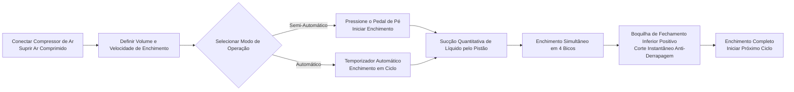

# Máquina de Enchimento Líquido AL4-5000


## Resumo Central
> A AL4-5000 é uma máquina de enchimento líquido automática de quatro bicos com pistão da Fábrica de Equipamentos de Embalagem Wenzhou T&D, projetada para pequenas a médias indústrias de alimentos e bebidas, óleos comestíveis, álcool, produtos químicos diários e farmacêuticas. Enche 5–5000 ml por ciclo a 1–100 vezes por minuto com precisão de ±1%, e alterna livremente entre operação semi-automática (pedal de pé) e totalmente automática (temporizador). Seu acionamento pneumático completo funciona sem eletricidade — um design intrinsecamente seguro e à prova de explosões ideal para oficinas inflamáveis — e todas as partes em contato com líquidos são de aço inoxidável alimentício 304 (316 opcional), com anéis O de silicone resistentes a 200°C e bicos anti-derrapagem com fechamento inferior (3–12 mm), garantindo zero respingos. Em estoque, enviado por mar, com garantia de 1 ano.

- **Nome da Máquina**: Máquina de Enchimento Líquido  
- **Modelo**: AL4-5000  
- **Fornecedor**: Fábrica de Equipamentos de Embalagem Wenzhou T&D  

---

## I. Visão Geral do Produto

### Categoria do Produto
- Equipamentos de Embalagem → Equipamentos de Enchimento Líquido (Enchimento por Pistão)
- Grau de Automação: Totalmente Automático (alternável para Semi-Automático)
- Tipo de Acionamento: Acionamento Elétrico + Pneumático (requer compressor de ar externo e tomada elétrica)

### Aplicações
Adequado para enchimento de líquidos com boa fluidez, amplamente utilizado em:
- Alimentos e Bebidas: Água potável, suco, leite, óleo comestível, álcool
- Produtos Químicos Diários: Sabão para louça, detergente líquido
- Produtos Farmacêuticos: Medicamentos líquidos

### Principais Características
- Faixa de volume de enchimento: 5–5000 ml, velocidade de enchimento: 1–100 vezes/min
- Precisão de enchimento controlada dentro de ±1%
- Enchimento com quatro bicos (opcional cabeça única ou dupla)
- Dois modos de operação: interruptor de pedal de pé ou temporizador automático, alternáveis entre modo semi-automático e automático
- Volume de enchimento e velocidade ajustáveis

---

## II. Vantagens Principais

1. **À Prova de Explosão e Seguro (Nenhuma Eletricidade Necessária para Operações Pneumáticas)**: Equipado com componentes pneumáticos Airtac e acionamento pneumático total. Pode operar sem fornecimento de energia, oferecendo alta segurança, operação simples e alta precisão no enchimento.
2. **Corpo Todo em Aço Inoxidável, Conforme Normas de Segurança Alimentar**: Estrutura toda em aço inoxidável, corpo em aço inoxidável 201 e partes em contato com líquidos em aço inoxidável 304 de qualidade alimentícia, atendendo aos requisitos de segurança alimentar. As peças em contato podem ser atualizadas para aço inoxidável 304 ou 316. Design de sistema de válvulas em aço inoxidável.
3. **Design Anti-Derrapagem**: Volume de enchimento e velocidade ajustáveis. Bico de fechamento positivo inferior garante ausência de respingos durante o processo de enchimento. Diâmetro do bico selecionável entre 3–12 mm.
4. **Enchimento por Pistão com Alteração de Modo Duplo**: Suporta operação com pedal de pé ou temporizador automático, permitindo troca livre entre os modos semi-automático e automático.
5. **Selos Alimentícios de Alta Temperatura**: Anéis O de silicone resistem a temperaturas até 200 °C e atendem às normas de segurança alimentar. Selos de silicone ou borracha opcionais; selos de borracha são adequados para produtos corrosivos.
6. **Cilindro Independente por Cabeça, Configuração Flexível**: Cada cabeçote possui um cilindro independente. Os cabeçotes podem ser personalizados como cabeça única ou dupla.

---

## III. Especificações Técnicas

| Parâmetro | Especificação |
| --- | --- |
| Modelo | AL4-5000 |
| Faixa de Enchimento | 5–5000 ml |
| Bicos de Enchimento | 4 bicos (opcional cabeça única / dupla) |
| Velocidade de Enchimento | 1–100 vezes/min |
| Precisão de Enchimento | ≤1% |
| Grau de Automação | Automático (alternável para semi-automático) |
| Tipo de Acionamento | Acionamento Pneumático Total (compressor de ar externo necessário, nenhuma eletricidade necessária para controle pneumático) |
| Diâmetro do Bico | 3–12 mm (opcional) |
| Anel de Selagem | Anel O de silicone (resistente a 200 °C) / Anel de selagem de borracha (anti-corrosão) |
| Peso Bruto / Líquido | 200 kg |
| Dimensões da Embalagem | 165 × 80 × 65 cm |

### Informações de Embalagem

| Item | Conteúdo |
| --- | --- |
| Peças de Reposição Incluídas | Ferramentas, Acessórios |
| Embalagem por Unidade | 1 Máquina por Caixa |
| Método de Embalagem | Caixa de papelão reforçada |

---

## IV. Recomendações de Vendas & Perguntas Frequentes

### Recomendações de Vendas
- **Pontos Principais de Venda**: Design à prova de explosão sem eletricidade + aço inoxidável alimentício + bico anti-derrapagem. Ideal para necessidades de produção segura nas indústrias de alimentos, químicos e farmacêuticas.
- **Clientes-Alvo**: Fábricas pequenas a médias de alimentos e bebidas, oficinas de enchimento de óleos comestíveis/álcool, fabricantes de produtos químicos diários e empresas de embalagem farmacêutica.
- **Proposta de Fechamento**: Mercadoria em estoque + frete marítimo incluso + garantia de 1 ano (ótimo para conversão rápida).
- **Upsell / Acessórios Adicionais**: Pergunte pelo volume de enchimento do cliente para recomendar modelos (6 faixas de 5–150 ml a 500–5000 ml); recomende aço inoxidável 316 + selos de borracha para líquidos corrosivos; recomende configuração alimentícia 304/316 para padrões elevados de higiene.

### Perguntas Frequentes

1. **A máquina precisa de eletricidade?**  
   Não. O acionamento pneumático total só exige conectar um compressor de ar para operar com segurança e à prova de explosões.
2. **Quais líquidos ela pode encher?**  
   Adequada para líquidos com boa fluidez: água, óleo comestível, suco, leite, álcool, medicamentos líquidos, sabão para louça, etc.
3. **Qual é a precisão do enchimento? Vai escorrer?**  
   A precisão está dentro de 1%. Os bicos utilizam um design de fechamento positivo inferior para garantir zero respingos.
4. **Como operá-la?**  
   Pode ser operada por interruptor de pedal de pé ou temporizador automático para enchimento contínuo. Troca fácil entre modo semi-automático e automático.
5. **Qual é a política de garantia?**  
   Garantia de 1 ano. Reparação ou substituição gratuita por danos causados por desgaste normal durante o período de garantia (custos de envio da China até o destino pagos pelo cliente). Custos de viagem de engenheiro no local são suportados pelo cliente. Manutenção vitalícia oferecida após o término da garantia.
6. **Os tamanhos dos bicos ou número de cabeças de enchimento podem ser personalizados?**  
   Sim. As opções de diâmetro dos bicos variam de 3–12 mm, e as cabeças de enchimento podem ser personalizadas como cabeça única ou dupla (padrão é 4 cabeças).
7. **Qual é o prazo de entrega?**  
   Em estoque. Enviamos imediatamente após o pagamento (incluindo frete marítimo).

### FAQ Schema (JSON-LD)

```json
{
  "@context": "https://schema.org",
  "@type": "FAQPage",
  "mainEntity": [
    {
      "@type": "Question",
      "name": "Does the machine require electricity?",
      "acceptedAnswer": {
        "@type": "Answer",
        "text": "No. Full pneumatic drive only requires connecting an air compressor to operate safely and explosion-proof."
      }
    },
    {
      "@type": "Question",
      "name": "What liquids can it fill?",
      "acceptedAnswer": {
        "@type": "Answer",
        "text": "Suitable for liquids with good fluidity: water, edible oil, juice, milk, alcohol, liquid medicine, dishwashing liquid, etc."
      }
    },
    {
      "@type": "Question",
      "name": "How is the filling accuracy? Will it drip?",
      "acceptedAnswer": {
        "@type": "Answer",
        "text": "Accuracy is within 1%. The nozzles use a bottom close positive shutoff design to ensure zero dripping."
      }
    },
    {
      "@type": "Question",
      "name": "How to operate it?",
      "acceptedAnswer": {
        "@type": "Answer",
        "text": "It can be operated via foot pedal switch or automatic timer for continuous filling. Easily switch between semi-automatic and automatic modes."
      }
    },
    {
      "@type": "Question",
      "name": "What is the warranty policy?",
      "acceptedAnswer": {
        "@type": "Answer",
        "text": "1-year warranty. Free repair or replacement for damage under normal operation during the warranty period (shipping costs from China to destination borne by customer). On-site engineer travel expenses are borne by the customer. Lifetime maintenance provided after the warranty expires."
      }
    },
    {
      "@type": "Question",
      "name": "Can nozzle sizes or the number of filling heads be customized?",
      "acceptedAnswer": {
        "@type": "Answer",
        "text": "Yes. Nozzle diameter options range from 3–12 mm, and filling heads can be customized to single-head or double-head (default is 4 heads)."
      }
    },
    {
      "@type": "Question",
      "name": "What is the delivery lead time?",
      "acceptedAnswer": {
        "@type": "Answer",
        "text": "In stock. Ships immediately after payment (including sea freight)."
      }
    }
  ]
}
```

### Termos de Serviço Pós-Venda
- Garantia de 1 ano; reparo ou substituição grátis para danos por desgaste normal (custos de envio da China até o local pagos pelo cliente)
- Cliente responsável pelos custos de viagem caso seja necessário serviço presencial de engenheiro
- Serviço de manutenção vitalícia oferecido após o término da garantia

---

## V. Biblioteca de Mídia e Recursos

| Tipo de Recurso | Descrição / Link |
| --- | --- |
| Vídeo do Fluxo de Trabalho | https://www.youtube.com/watch?v=OGt9DbZ70Ns |

<iframe width="560" height="315" src="https://www.youtube.com/embed/a-50ew3DCTk?si=c0zp11p3xJCETLsE" title="Player de vídeo do YouTube" frameborder="0" allow="accelerometer; autoplay; clipboard-write; encrypted-media; gyroscope; picture-in-picture; web-share" referrerpolicy="strict-origin-when-cross-origin" allowfullscreen></iframe>
---

## VI. Fluxo de Trabalho



### Solicite um Orçamento e Compre

[🛒 Clique aqui para ver preços e comprar na nossa loja oficial](https://cecle.net/pt/products/al4-5000-automatic-four-nozzles-liquid-perfume-water-juice-essential-oil-electric-digital-control-pump-liquid-bottle-filling-machine?_pos=1&_psq=AL4-5000&_psid=2da44f38d&_ss=e&variant=33049577554029)