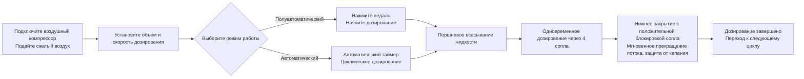

# AL4-5000 Машина для дозирования жидкости


## Основная информация
> AL4-5000 — полностью автоматическая четырехсопловая поршневая машина для дозирования жидкостей от завода по производству упаковочного оборудования Wenzhou T&D. Разработана для малых и средних предприятий в пищевой, напитковой, пищевом масле, алкогольной, бытовой химии и фармацевтической промышленности. Дозирует от 5 до 5000 мл за цикл при скорости 1–100 циклов в минуту с точностью ±1%. Может переключаться между полуавтоматическим (педалью) и полностью автоматическим (таймером) режимами. Полностью пневматический привод работает без электропитания — конструкция, безопасная по взрыву, идеально подходящая для помещений с горючими веществами. Все детали, контактирующие с жидкостью, выполнены из пищевой нержавеющей стали марки 304 (316 по запросу), с силиконовыми кольцами, выдерживающими температуру до 200°C, и нижними сливными клапанами, предотвращающими капание (диаметр сопла 3–12 мм), гарантируя полное отсутствие капель. В наличии, отправка морем, 1-летняя гарантия.

- **Название машины**: Машина для дозирования жидкости
- **Модель**: AL4-5000
- **Поставщик**: Завод по производству упаковочного оборудования Wenzhou T&D

---

## I. Обзор продукта

### Категория продукции
- Оборудование для упаковки → Устройства для дозирования жидкостей (Поршневые дозаторы)
- Степень автоматизации: Полностью автоматическая (может переключаться на полуавтоматическую)
- Тип привода: Электрический + Пневматический привод (требуется внешний воздушный компрессор и розетка)

### Применение
Подходит для дозирования жидкостей с хорошей текучестью, широко используется в:
- Пищевой и напитковой промышленности: вода, сок, молоко, пищевое масло, алкоголь
- Бытовой химии: моющее средство для посуды, жидкие моющие средства
- Фармацевтике: жидкие лекарства

### Основные характеристики
- Диапазон дозирования: 5–5000 мл, скорость дозирования: 1–100 раз/мин
- Точность дозирования контролируется в пределах ±1%
- Четыре сопла (возможно выбор одного или двух сопел)
- Два режима работы: переключение педалью или автоматический таймер, возможность переключения между полуавтоматическим и автоматическим режимами
- Регулировка объема и скорости дозирования

---

## II. Ключевые преимущества

1. **Взрывобезопасность и безопасность (без электропитания для пневматических операций)**: Оборудована пневматическими компонентами Airtac и полностью пневматическим приводом. Может работать без подключения к сети, обеспечивая высокую безопасность, простоту эксплуатации и высокую точность дозирования.
2. **Цельнометаллический корпус из нержавеющей стали, соответствующий требованиям пищевой безопасности**: Цельнометаллический каркас из нержавеющей стали, корпус из нержавеющей стали марки 201, контактные части из пищевой нержавеющей стали марки 304, соответствует требованиям пищевой безопасности. Контактные части можно улучшить до 304 или 316 нержавеющей стали. Конструкция клапанной системы из нержавеющей стали.
3. **Конструкция против капания**: Регулируемый объем и скорость дозирования. Нижнее закрытие с положительным блокированием сопла гарантирует отсутствие капания во время процесса дозирования. Диаметр сопла доступен в диапазоне 3–12 мм.
4. **Поршневое дозирование с возможностью переключения режимов**: Поддерживает работу с педалью или автоматическим таймером, позволяет свободно переключаться между полуавтоматическим и автоматическим режимами.
5. **Высокотемпературные пищевые уплотнители**: Силиконовые кольца выдерживают температуру до 200℃ и соответствуют стандартам пищевой безопасности. По запросу доступны силиконовые или резиновые уплотнители; резиновые уплотнители подходят для агрессивных продуктов.
6. **Отдельный цилиндр на каждый головной модуль, гибкая конфигурация**: Каждая головка оснащена собственным цилиндром. Головки могут быть настроены как одиночные или двойные.

---

## III. Технические характеристики

| Параметр | Характеристика |
| --- | --- |
| Модель | AL4-5000 |
| Диапазон дозирования | 5–5000 мл |
| Сопло дозирования | 4 сопла (по желанию — одинарное / двойное) |
| Скорость дозирования | 1–100 раз/мин |
| Точность дозирования | ≤1% |
| Степень автоматизации | Автоматическая (переключаемая на полуавтоматическую) |
| Тип привода | Полный пневматический привод (требуется внешний воздушный компрессор, электропитание не требуется для пневматического управления) |
| Диаметр сопла | 3–12 мм (по желанию) |
| Уплотнительное кольцо | Силиконовое кольцо (устойчиво к 200℃) / Резиновое уплотнительное кольцо (антикоррозионное) |
| Брутто / Нетто | 200 кг |
| Габаритные размеры упаковки | 165 × 80 × 65 см |

### Информация об упаковке

| Пункт | Содержание |
| --- | --- |
| Включенные запчасти | Инструменты, аксессуары |
| Упаковка единицы | 1 машина в коробке |
| Способ упаковки | Усиленная картонная коробка |

---

## IV. Рекомендации по продажам и ЧАВО

### Рекомендации по продажам
- **Ключевые преимущества**: Взрывобезопасная конструкция без электропитания + пищевая нержавеющая сталь + сопла против капания. Идеально подходит для требований безопасности в пищевой, химической и фармацевтической промышленности.
- **Целевая аудитория**: Малые и средние предприятия пищевой и напитковой промышленности, цеха по наполнению пищевого масла/алкоголя, производители бытовой химии, фармацевтические компании по упаковке.
- **Заключительный аргумент**: Товар в наличии + доставка морем включена + 1-летняя гарантия (отлично подходит для быстрого закрытия сделки).
- **Дополнительные предложения / аксессуары**: Уточните у клиента объем дозирования, чтобы рекомендовать модель (6 вариантов от 5–150 мл до 500–5000 мл); рекомендуйте нержавеющую сталь 316 + резиновые уплотнители для агрессивных жидкостей; рекомендуйте конфигурацию из пищевой стали 304/316 для высоких гигиенических стандартов.

### ЧАВО

1. **Требуется ли электропитание для работы машины?**  
   Нет. Полностью пневматический привод требует только подключения воздушного компрессора для безопасной и взрывобезопасной работы.
2. **Какие жидкости можно дозировать?**  
   Подходит для жидкостей с хорошей текучестью: вода, пищевое масло, сок, молоко, алкоголь, жидкие лекарства, моющее средство для посуды и т.д.
3. **Какова точность дозирования? Будут ли капли?**  
   Точность составляет не более 1%. Сопла используют систему нижнего закрытия с положительной блокировкой, обеспечивающей полное отсутствие капания.
4. **Как осуществляется управление?**  
   Работает через педаль или автоматический таймер для непрерывного дозирования. Легко переключается между полуавтоматическим и автоматическим режимами.
5. **Какова политика гарантии?**  
   1-летняя гарантия. Бесплатный ремонт или замена при повреждении, вызванном нормальной эксплуатацией в течение гарантийного срока (стоимость доставки из Китая до места назначения оплачивается клиентом). Расходы на командировку инженера на объект оплачиваются клиентом. После окончания гарантии предоставляется бессрочное техническое обслуживание.
6. **Можно ли изменить размер сопла или количество голов дозирования?**  
   Да. Диаметр сопла может быть выбран в диапазоне 3–12 мм, а количество голов дозирования можно настроить как одинарное или двойное (по умолчанию — 4 головы).
7. **Каков срок поставки?**  
   В наличии. Отправка сразу после оплаты (включая морскую доставку).

### ЧАВО (JSON-LD)

```json
{
  "@context": "https://schema.org",
  "@type": "FAQPage",
  "mainEntity": [
    {
      "@type": "Question",
      "name": "Does the machine require electricity?",
      "acceptedAnswer": {
        "@type": "Answer",
        "text": "No. Full pneumatic drive only requires connecting an air compressor to operate safely and explosion-proof."
      }
    },
    {
      "@type": "Question",
      "name": "What liquids can it fill?",
      "acceptedAnswer": {
        "@type": "Answer",
        "text": "Suitable for liquids with good fluidity: water, edible oil, juice, milk, alcohol, liquid medicine, dishwashing liquid, etc."
      }
    },
    {
      "@type": "Question",
      "name": "How is the filling accuracy? Will it drip?",
      "acceptedAnswer": {
        "@type": "Answer",
        "text": "Accuracy is within 1%. The nozzles use a bottom close positive shutoff design to ensure zero dripping."
      }
    },
    {
      "@type": "Question",
      "name": "How to operate it?",
      "acceptedAnswer": {
        "@type": "Answer",
        "text": "It can be operated via foot pedal switch or automatic timer for continuous filling. Easily switch between semi-automatic and automatic modes."
      }
    },
    {
      "@type": "Question",
      "name": "What is the warranty policy?",
      "acceptedAnswer": {
        "@type": "Answer",
        "text": "1-year warranty. Free repair or replacement for damage under normal operation during the warranty period (shipping costs from China to destination borne by customer). On-site engineer travel expenses are borne by the customer. Lifetime maintenance provided after the warranty expires."
      }
    },
    {
      "@type": "Question",
      "name": "Can nozzle sizes or the number of filling heads be customized?",
      "acceptedAnswer": {
        "@type": "Answer",
        "text": "Yes. Nozzle diameter options range from 3–12 mm, and filling heads can be customized to single-head or double-head (default is 4 heads)."
      }
    },
    {
      "@type": "Question",
      "name": "What is the delivery lead time?",
      "acceptedAnswer": {
        "@type": "Answer",
        "text": "In stock. Ships immediately after payment (including sea freight)."
      }
    }
  ]
}
```

### Условия послепродажного обслуживания
- 1-летняя гарантия; бесплатный ремонт/замена при износе (доставка из Китая до местоположения клиента оплачивается клиентом)
- Клиент оплачивает расходы на командировку инженера при необходимости выездной помощи
- Бессрочное техническое обслуживание предоставляется после окончания гарантии

---

## V. Медиа и библиотека ресурсов

| Тип ресурса | Описание / Ссылка |
| --- | --- |
| Видео процесса | https://www.youtube.com/watch?v=OGt9DbZ70Ns |

<iframe width="560" height="315" src="https://www.youtube.com/embed/a-50ew3DCTk?si=c0zp11p3xJCETLsE" title="YouTube video player" frameborder="0" allow="accelerometer; autoplay; clipboard-write; encrypted-media; gyroscope; picture-in-picture; web-share" referrerpolicy="strict-origin-when-cross-origin" allowfullscreen></iframe>
---

## VI. Процесс работы



### Запросить цену и купить

[🛒 Нажмите здесь, чтобы просмотреть цены и приобрести в нашем официальном магазине](https://cecle.net/ru/products/al4-5000-automatic-four-nozzles-liquid-perfume-water-juice-essential-oil-electric-digital-control-pump-liquid-bottle-filling-machine?_pos=1&_psq=AL4-5000&_psid=2da44f38d&_ss=e&variant=33049577554029)