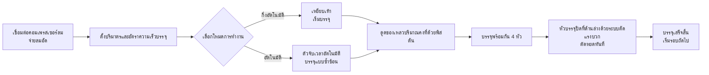

# เครื่องบรรจุของเหลว AL4-5000


## สรุปหลัก
> เครื่องบรรจุของเหลวแบบพิสตัน 4 หัว รุ่น AL4-5000 จากโรงงานเครื่องจักรบรรจุภัณฑ์ Wenzhou T&D เป็นเครื่องอัตโนมัติเต็มรูปแบบ ออกแบบมาเพื่อผู้ผลิตอาหารและเครื่องดื่ม น้ำมันอาหาร แอลกอฮอล์ สินค้าเคมีประจำวัน และยา โดยสามารถบรรจุได้ 5–5,000 มล. ต่อรอบ ที่ความเร็ว 1–100 รอบต่อนาที พร้อมความแม่นยำ ±1% และสามารถสลับโหมดการทำงานระหว่างแบบกึ่งอัตโนมัติ (ใช้เหยียบเท้า) และอัตโนมัติ (ใช้ตัวจับเวลา) ได้อย่างอิสระ ระบบขับเคลื่อนด้วยลมทั้งหมด ไม่ต้องใช้ไฟฟ้า — ออกแบบให้ปลอดภัยต่อการเกิดประกายไฟ ป้องกันการระเบิด จึงเหมาะอย่างยิ่งสำหรับโรงงานที่มีสารไวไฟ ทุกชิ้นส่วนที่สัมผัสกับของเหลวเป็นสแตนเลสเกรดอาหาร 304 (เลือกใช้ 316 ได้) พร้อมโอริงซิลิโคนทนอุณหภูมิสูง 200°C และหัวบรรจุแบบปิดที่ด้านล่างเพื่อป้องกันหยด ขนาดหัว 3–12 มม. รับประกันการไม่หยดเลย พร้อมส่งสินค้าในสต็อก จัดส่งทางเรือ รับประกัน 1 ปี

- **ชื่อเครื่อง**: เครื่องบรรจุของเหลว
- **รุ่น**: AL4-5000
- **ผู้จัดจำหน่าย**: โรงงานเครื่องจักรบรรจุภัณฑ์ Wenzhou T&D

---

## I. ภาพรวมผลิตภัณฑ์

### ประเภทผลิตภัณฑ์
- เครื่องจักรบรรจุภัณฑ์ → อุปกรณ์บรรจุของเหลว (เครื่องบรรจุแบบพิสตัน)
- ระดับอัตโนมัติ: อัตโนมัติเต็มรูปแบบ (สามารถเปลี่ยนเป็นกึ่งอัตโนมัติได้)
- ระบบขับเคลื่อน: ไฟฟ้า + ระบบลม (ต้องการคอมเพรสเซอร์ลมภายนอกและปลั๊กไฟ)

### การใช้งาน
เหมาะสำหรับการบรรจุของเหลวที่มีความไหลดี ใช้กันอย่างแพร่หลายใน:
- อาหารและเครื่องดื่ม: น้ำดื่ม น้ำผลไม้ นม น้ำมันอาหาร แอลกอฮอล์
- สินค้าเคมีประจำวัน: น้ำยาล้างจาน น้ำยาซักผ้า
- ยา: ยาในรูปของเหลว

### คุณสมบัติหลัก
- ช่วงปริมาตรบรรจุ: 5–5,000 มล. ความเร็วบรรจุ: 1–100 รอบต่อนาที
- ความแม่นยำในการบรรจุควบคุมภายใน ±1%
- หัวบรรจุ 4 หัว (เลือกใช้แบบหัวเดียวหรือสองหัวได้)
- โหมดการทำงาน 2 แบบ: ปุ่มเหยียบเท้า หรือตัวจับเวลาอัตโนมัติ สามารถสลับระหว่างกึ่งอัตโนมัติและอัตโนมัติได้
- ปรับปริมาตรบรรจุและอัตราความเร็วได้

---

## II. ข้อได้เปรียบสำคัญ

1. **ป้องกันการระเบิด & ปลอดภัย (ไม่ต้องใช้ไฟฟ้าในการทำงานด้วยลม)**: ติดตั้งชิ้นส่วนลม Airtac และระบบขับเคลื่อนด้วยลมทั้งหมด สามารถทำงานได้โดยไม่ต้องใช้ไฟฟ้า มอบความปลอดภัยสูง ใช้งานง่าย และความแม่นยำสูงในการบรรจุ
2. **ตัวเครื่องสแตนเลสทั้งหมด ตรงตามมาตรฐานความปลอดภัยอาหาร**: โครงสร้างสแตนเลสทั้งหมด ตัวเครื่องทำจากสแตนเลส 201 และชิ้นส่วนที่สัมผัสกับของเหลวเป็นสแตนเลสเกรดอาหาร 304 ตรงตามมาตรฐานความปลอดภัยอาหาร ชิ้นส่วนสัมผัสสามารถอัปเกรดเป็นสแตนเลส 304 หรือ 316 ได้ ออกแบบระบบวาล์วด้วยสแตนเลส
3. **การออกแบบป้องกันหยด**: ปริมาตรบรรจุและอัตราความเร็วสามารถปรับได้ หัวบรรจุแบบปิดที่ด้านล่างด้วยระบบตัดแรงบวก ป้องกันการหยดระหว่างกระบวนการบรรจุ ขนาดหัวเลือกได้ตั้งแต่ 3–12 มม.
4. **ระบบบรรจุแบบพิสตันพร้อมโหมดการทำงานสองแบบ**: รองรับการใช้งานด้วยเหยียบเท้า หรือตัวจับเวลาอัตโนมัติ สามารถสลับระหว่างโหมดกึ่งอัตโนมัติและอัตโนมัติได้อย่างอิสระ
5. **ซีลทนอุณหภูมิสูง ชนิดอาหาร**: โอริงซิลิโคนทนอุณหภูมิสูงถึง 200℃ และตรงตามมาตรฐานความปลอดภัยอาหาร สามารถเลือกใช้ซิลิโคนหรือยางได้ ยางเหมาะกับผลิตภัณฑ์กัดกร่อน
6. **กระบอกสูบแยกต่างหากต่อหัว จัดวางได้ยืดหยุ่น**: แต่ละหัวบรรจุมีกระบอกสูบแยกต่างหาก หัวบรรจุสามารถปรับแต่งเป็นแบบหัวเดียวหรือสองหัวได้

---

## III. ข้อมูลเทคนิค

| พารามิเตอร์ | ข้อกำหนด |
| --- | --- |
| รุ่น | AL4-5000 |
| ช่วงบรรจุ | 5–5,000 มล. |
| หัวบรรจุ | 4 หัว (เลือกใช้แบบหัวเดียว / สองหัวได้) |
| ความเร็วบรรจุ | 1–100 รอบต่อนาที |
| ความแม่นยำในการบรรจุ | ≤1% |
| ระดับอัตโนมัติ | อัตโนมัติ (สามารถเปลี่ยนเป็นกึ่งอัตโนมัติได้) |
| ระบบขับเคลื่อน | ขับเคลื่อนด้วยลมทั้งหมด (ต้องใช้คอมเพรสเซอร์ลมภายนอก ไม่ต้องใช้ไฟฟ้าในการควบคุมลม) |
| ขนาดหัว | 3–12 มม. (เลือกได้) |
| วงแหวนซีล | โอริงซิลิโคน (ทนอุณหภูมิ 200℃) / วงแหวนยาง (กันกัดกร่อน) |
| น้ำหนักสุทธิ / น้ำหนักสุทธิ | 200 กก. |
| ขนาดบรรจุภัณฑ์ | 165 × 80 × 65 ซม. |

### ข้อมูลบรรจุภัณฑ์

| รายการ | รายละเอียด |
| --- | --- |
| ชิ้นส่วนอะไหล่ที่แถมมา | เครื่องมือ อุปกรณ์เสริม |
| บรรจุภัณฑ์ต่อหน่วย | 1 เครื่องต่อกล่อง |
| วิธีการบรรจุ | กล่องกระดาษแข็งหนาพิเศษ |

---

## IV. คำแนะนำการขาย & คำถามที่พบบ่อย

### คำแนะนำการขาย
- **จุดขายหลัก**: ระบบป้องกันการระเบิดโดยไม่ต้องใช้ไฟฟ้า + สแตนเลสเกรดอาหาร + หัวบรรจุป้องกันหยด ตอบโจทย์ความต้องการด้านความปลอดภัยในการผลิตในอุตสาหกรรมอาหาร เคมี และยา
- **กลุ่มเป้าหมาย**: โรงงานอาหารและเครื่องดื่มขนาดเล็กถึงกลาง โรงบรรจุน้ำมันอาหาร/แอลกอฮอล์ ผู้ผลิตสินค้าเคมีประจำวัน และบริษัทบรรจุภัณฑ์ยา
- **ข้อเสนอปิดการขาย**: สินค้าพร้อมส่ง + ค่าขนส่งทางทะเลรวมแล้ว + รับประกัน 1 ปี (เหมาะสำหรับการเปลี่ยนแปลงเร็ว)
- **สินค้าเสริม / แนะนำเพิ่มเติม**: สอบถามปริมาตรบรรจุที่ลูกค้าต้องการ เพื่อแนะนำรุ่นที่เหมาะสม (6 รุ่นตั้งแต่ 5–150 มล. ถึง 500–5,000 มล.); แนะนำสแตนเลส 316 + วงแหวนยางสำหรับของเหลวที่กัดกร่อน; แนะนำการตั้งค่าสแตนเลส 304/316 สำหรับมาตรฐานความสะอาดสูง

### คำถามที่พบบ่อย

1. **เครื่องนี้ต้องการไฟฟ้าไหม?**  
   ไม่ ระบบขับเคลื่อนด้วยลมทั้งหมด แค่เชื่อมต่อคอมเพรสเซอร์ลมก็สามารถใช้งานได้อย่างปลอดภัยและป้องกันการระเบิด
2. **สามารถบรรจุของเหลวอะไรได้บ้าง?**  
   เหมาะกับของเหลวที่มีความไหลดี เช่น น้ำ น้ำมันอาหาร น้ำผลไม้ นม แอลกอฮอล์ ยาในรูปของเหลว น้ำยาล้างจาน เป็นต้น
3. **ความแม่นยำในการบรรจุเป็นอย่างไร? จะหยดไหม?**  
   ความแม่นยำอยู่ในระดับ ±1% หัวบรรจุใช้ระบบตัดแรงบวกแบบปิดที่ด้านล่าง รับประกันการไม่หยดเลย
4. **จะใช้งานได้อย่างไร?**  
   ใช้งานได้ทั้งแบบเหยียบเท้าหรือตัวจับเวลาอัตโนมัติสำหรับการบรรจุต่อเนื่อง สามารถสลับระหว่างโหมดกึ่งอัตโนมัติและอัตโนมัติได้ง่าย
5. **นโยบายรับประกันเป็นอย่างไร?**  
   รับประกัน 1 ปี ซ่อมหรือเปลี่ยนชิ้นส่วนฟรีหากเสียหายจากการใช้งานปกติในช่วงรับประกัน (ค่าขนส่งจากจีนไปยังปลายทาง ลูกค้าเป็นผู้รับผิดชอบ) ค่าเดินทางของวิศวกรที่เข้าซ่อมนอกสถานที่ ลูกค้าเป็นผู้รับผิดชอบ บริการบำรุงรักษาตลอดชีวิตหลังหมดอายุรับประกัน
6. **สามารถปรับขนาดหัวหรือจำนวนหัวบรรจุได้ไหม?**  
   ได้ ขนาดหัวเลือกได้ตั้งแต่ 3–12 มม. และหัวบรรจุสามารถปรับแต่งเป็นแบบหัวเดียวหรือสองหัว (ค่าเริ่มต้นคือ 4 หัว)
7. **ระยะเวลาจัดส่งคือเท่าไหร่?**  
   สินค้าพร้อมส่ง จัดส่งทันทีหลังชำระเงิน (รวมค่าขนส่งทางทะเล)

### ข้อมูล FAQ (JSON-LD)

```json
{
  "@context": "https://schema.org",
  "@type": "FAQPage",
  "mainEntity": [
    {
      "@type": "Question",
      "name": "Does the machine require electricity?",
      "acceptedAnswer": {
        "@type": "Answer",
        "text": "No. Full pneumatic drive only requires connecting an air compressor to operate safely and explosion-proof."
      }
    },
    {
      "@type": "Question",
      "name": "What liquids can it fill?",
      "acceptedAnswer": {
        "@type": "Answer",
        "text": "Suitable for liquids with good fluidity: water, edible oil, juice, milk, alcohol, liquid medicine, dishwashing liquid, etc."
      }
    },
    {
      "@type": "Question",
      "name": "How is the filling accuracy? Will it drip?",
      "acceptedAnswer": {
        "@type": "Answer",
        "text": "Accuracy is within 1%. The nozzles use a bottom close positive shutoff design to ensure zero dripping."
      }
    },
    {
      "@type": "Question",
      "name": "How to operate it?",
      "acceptedAnswer": {
        "@type": "Answer",
        "text": "It can be operated via foot pedal switch or automatic timer for continuous filling. Easily switch between semi-automatic and automatic modes."
      }
    },
    {
      "@type": "Question",
      "name": "What is the warranty policy?",
      "acceptedAnswer": {
        "@type": "Answer",
        "text": "1-year warranty. Free repair or replacement for damage under normal operation during the warranty period (shipping costs from China to destination borne by customer). On-site engineer travel expenses are borne by the customer. Lifetime maintenance provided after the warranty expires."
      }
    },
    {
      "@type": "Question",
      "name": "Can nozzle sizes or the number of filling heads be customized?",
      "acceptedAnswer": {
        "@type": "Answer",
        "text": "Yes. Nozzle diameter options range from 3–12 mm, and filling heads can be customized to single-head or double-head (default is 4 heads)."
      }
    },
    {
      "@type": "Question",
      "name": "What is the delivery lead time?",
      "acceptedAnswer": {
        "@type": "Answer",
        "text": "In stock. Ships immediately after payment (including sea freight)."
      }
    }
  ]
}
```

### เงื่อนไขบริการหลังการขาย
- รับประกัน 1 ปี ซ่อมหรือเปลี่ยนชิ้นส่วนฟรีสำหรับความเสียหายจากสภาพปกติ (ค่าขนส่งจากจีนไปยังปลายทาง ลูกค้าเป็นผู้รับผิดชอบ)
- ลูกค้าต้องรับผิดชอบค่าเดินทางหากต้องการบริการวิศวกรเข้าซ่อมนอกสถานที่
- บริการบำรุงรักษาตลอดชีวิตหลังหมดอายุรับประกัน

---

## V. คลังสื่อและทรัพยากร

| ประเภททรัพยากร | คำอธิบาย / ลิงก์ |
| --- | --- |
| วิดีโอแสดงขั้นตอนการทำงาน | https://www.youtube.com/watch?v=OGt9DbZ70Ns |

<iframe width="560" height="315" src="https://www.youtube.com/embed/a-50ew3DCTk?si=c0zp11p3xJCETLsE" title="YouTube video player" frameborder="0" allow="accelerometer; autoplay; clipboard-write; encrypted-media; gyroscope; picture-in-picture; web-share" referrerpolicy="strict-origin-when-cross-origin" allowfullscreen></iframe>
---

## VI. ขั้นตอนการทำงาน



### ขอใบเสนอราคาและซื้อสินค้า

[🛒 คลิกที่นี่เพื่อดูราคาและซื้อสินค้าที่ร้านค้าทางการของเรา](https://cecle.net/th/products/al4-5000-automatic-four-nozzles-liquid-perfume-water-juice-essential-oil-electric-digital-control-pump-liquid-bottle-filling-machine?_pos=1&_psq=AL4-5000&_psid=2da44f38d&_ss=e&variant=33049577554029)