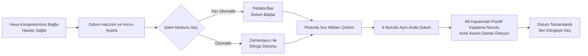

# AL4-5000 Sıvı Dolum Makinesi


## Temel Özeti
> AL4-5000, Wenzhou T&D Paketleme Makineleri Fabrikası'ndan gelen tam otomatik dört nozullu pistonlu sıvı dolum makinesidir. Küçük ve orta ölçekli gıda ve içecek, yemeklik yağ, alkollü içecek, günlük kimyasal ürün ve ilaç üreticileri için tasarlanmıştır. Her döngüde 5–5000 ml dolum yapar, dakikada 1–100 kez dolum hızı ile ±1% hassasiyet sunar ve ayak pedali (yarı otomatik) ile zamanlayıcı (tam otomatik) arasında serbest geçiş yapabilir. Tam pnömatik tahrik sistemi elektrik gerektirmeden çalışır — yanıcı çalışma alanları için içsel olarak güvenli, patlama geçirmez bir tasarım — ve tüm sıvı temas yüzeyleri gıda kalitesi 304 paslanmaz çelik (316 seçeneğinde), 200°C’ye dayanıklı silikon O-ring’ler ve alt kapanmalı damla önleyici nozullar (3–12 mm) ile sıfır damlama garantisi sunar. Stokta olan ürünler deniz yoluyla gönderilir ve 1 yıllık garantiyle desteklenir.

- **Makine Adı**: Sıvı Dolum Makinesi  
- **Model**: AL4-5000  
- **Tedarikçi**: Wenzhou T&D Paketleme Makineleri Fabrikası  

---

## I. Ürün Gözatması

### Ürün Kategorisi
- Paketleme Makineleri → Sıvı Dolum Cihazları (Piston Tipi Sıvı Dolum Makinesi)  
- Otomasyon Seviyesi: Tam Otomatik (Yarı Otomatik’e Geçiş Mümkün)  
- Tahrik Türü: Elektrik + Pnömatik Tahrik (Dış hava kompresörü ve güç prizi gereklidir)

### Uygulamalar
İyi akışkanlık gösteren sıvıların dolumunda uygun, yaygın olarak şu alanlarda kullanılır:
- Gıda ve İçecek: Su, meyve suyu, süt, yemeklik yağ, alkollü içecekler  
- Günlük Kimyasallar: Yemek yıkama sıvısı, sıvı deterjan  
- İlaçlar: Sıvı ilaçlar

### Temel Özellikler
- Dolum hacmi aralığı: 5–5000 ml, dolum hızı: 1–100 kez/dakika  
- Dolum doğruluğu ±1% içinde kontrol edilir  
- Dört nozullu dolum (Tek başlı veya çift başlı seçenek)  
- İki çalışma modu: Ayak pedali anahtarı veya otomatik zamanlayıcı, yarı otomatik ve otomatik modlar arasında kolay geçiş  
- Dolum hacmi ve dolum hızı ayarlanabilir

---

## II. Ana Avantajlar

1. **Patlama Önleyici ve Güvenli (Pnömatik İşlemler İçin Elektrik Gerektirmez)**: Airtac pnömatik parçalarla donatılmış ve tam pnömatik tahrik sistemine sahiptir. Güç kaynağı olmadan çalışabilir, yüksek güvenlik, basit kullanım ve yüksek dolum hassasiyeti sunar.
2. **Tam Paslanmaz Çelik Gövde, Gıda Güvenliği Standartlarına Uygun**: Tam paslanmaz çelik çerçeve, 201 paslanmaz çelik gövde ve sıvı temas bölümleri için gıda kalitesi 304 paslanmaz çelik, gıda güvenliği gereksinimlerini karşılar. Temas bölümleri 304 veya 316 paslanmaz çelik olarak yükseltilebilir. Paslanmaz çelik vanalı sistem tasarımı.
3. **Damla Önleyici Tasarım**: Dolum hacmi ve hızı ayarlanabilir. Alt kapanmalı pozitif kapatma nozul, dolum sırasında hiçbir damla bırakmaz. Nozul çapı 3–12 mm arasında seçilir.
4. **Çift Modlu Piston Dolumu**: Ayak pedali veya otomatik zamanlayıcı ile çalıştırılabilir, yarı otomatik ve otomatik modlar arasında serbest geçiş sağlar.
5. **Yüksek Sıcaklığa Dayanıklı Gıda Kalitesi O-Ring’leri**: 200℃’ye kadar dayanıklı silikon O-ring’ler gıda güvenliği standartlarını karşılar. Silikon veya lastik O-ring’ler seçenek halindedir; lastik O-ring’ler korozif ürünler için uygundur.
6. **Her Baş İçin Bağımsız Silindir, Esnek Yapılandırma**: Her dolum başı ayrı bir silindirle donatılmıştır. Dolum başları tek başlı veya çift başlı olarak özelleştirilebilir.

---

## III. Teknik Özellikler

| Parametre | Özellik |
| --- | --- |
| Model | AL4-5000 |
| Dolum Aralığı | 5–5000 ml |
| Dolum Nozulu | 4 nozul (Tek başlı / Çift başlı seçenek) |
| Dolum Hızı | 1–100 kez/dakika |
| Dolum Doğruluğu | ≤1% |
| Otomasyon Seviyesi | Otomatik (Yarı otomatik’e geçiş mümkündür) |
| Tahrik Türü | Tam Pnömatik Tahrik (Harici hava kompresörü gerekir, pnömatik kontrol için elektrik gerekmez) |
| Nozul Çapı | 3–12 mm (Seçenek) |
| Sızdırmazlık O-Ring’i | Silikon O-ring (200℃’ye dayanıklı) / Lastik o-ring (Korozif direnç) |
| Brüt Ağırlık / Net Ağırlık | 200 kg |
| Paket Boyutu | 165 × 80 × 65 cm |

### Paketleme Bilgileri

| Madde | İçerik |
| --- | --- |
| İkincil Parçalar Dahil | Araçlar, Aksesuarlar |
| Birim Paketleme | 1 Makine / Kasa |
| Paketleme Yöntemi | Kalınlaştırılmış karton kutu |

---

## IV. Satış Önerileri ve SSS

### Satış Önerileri
- **Ana Satış Noktaları**: Elektriksiz patlama geçirmez tasarım + Gıda kalitesi paslanmaz çelik + Damla önleyici nozul. Gıda, kimyasal ve ilaç sektörlerinde güvenlik üretim ihtiyaçları için idealdir.
- **Hedef Müşteriler**: Küçük ve orta ölçekli gıda ve içecek fabrikaları, yemeklik yağ/alkol dolum atölyeleri, günlük kimyasal ürün üreticileri ve ilaç ambalajlama şirketleri.
- **Kapatma Sunumu**: Stokta olan ürünler + Deniz yolu taşımacılığı dahil + 1 yıllık garanti (hızlı dönüşüm için harika).
- **Yüksek Değer Ek Ürünler / Eklentiler**: Müşterinin dolum hacmi gereksinimlerini sorarak modelleri önerin (6 farklı aralık: 5–150 ml'den 500–5000 ml'e kadar); korozif sıvılar için 316 paslanmaz çelik + lastik sızdırmazlık önerin; yüksek hijyen standartları için 304/316 gıda kalitesi yapılandırmasını önerin.

### SSS

1. **Makine elektrik gerektirir mi?**  
   Hayır. Tam pnömatik tahrik, yalnızca bir hava kompresörü bağlamakla güvenli ve patlama geçirmez şekilde çalışabilir.
2. **Hangi sıvıları doldurabilir?**  
   İyi akışkanlık gösteren sıvılar için uygundur: su, yemeklik yağ, meyve suyu, süt, alkollü içecekler, sıvı ilaçlar, yemek yıkama sıvısı vb.
3. **Dolum doğruluğu ne kadardır? Damlar mı olur?**  
   Doğruluk %1’in altında. Nozullar, dolum sürecinde sıfır damlama sağlamak için alt kapanmalı pozitif kapatma tasarımı kullanır.
4. **Nasıl çalıştırılır?**  
   Ayak pedali anahtarı veya otomatik zamanlayıcı ile çalıştırılabilir. Yarı otomatik ve otomatik modlar arasında kolayca geçiş yapılabilir.
5. **Garanti politikası nedir?**  
   1 yıllık garanti. Garanti süresi içinde normal kullanım koşullarında oluşan hasarlar için ücretsiz onarım veya değiştirme (Çin’den hedef ülkeye gönderim maliyeti müşteri tarafından karşılanır). Yerinde mühendis hizmeti için seyahat masrafları müşteri tarafından ödenir. Garanti süresi sonrası ömür boyu bakım hizmeti sağlanır.
6. **Nozul çapları veya dolum başı sayısı özelleştirilebilir mi?**  
   Evet. Nozul çapı 3–12 mm arasında değişebilir ve dolum başları tek başlı veya çift başlı olarak özelleştirilebilir (varsayılan 4 başlıdır).
7. **Teslimat süresi ne kadardır?**  
   Stokta. Ödeme sonrası hemen gönderilir (deniz yolu taşımacılığı dahil).

### SSS Şeması (JSON-LD)

```json
{
  "@context": "https://schema.org",
  "@type": "FAQPage",
  "mainEntity": [
    {
      "@type": "Question",
      "name": "Does the machine require electricity?",
      "acceptedAnswer": {
        "@type": "Answer",
        "text": "No. Full pneumatic drive only requires connecting an air compressor to operate safely and explosion-proof."
      }
    },
    {
      "@type": "Question",
      "name": "What liquids can it fill?",
      "acceptedAnswer": {
        "@type": "Answer",
        "text": "Suitable for liquids with good fluidity: water, edible oil, juice, milk, alcohol, liquid medicine, dishwashing liquid, etc."
      }
    },
    {
      "@type": "Question",
      "name": "How is the filling accuracy? Will it drip?",
      "acceptedAnswer": {
        "@type": "Answer",
        "text": "Accuracy is within 1%. The nozzles use a bottom close positive shutoff design to ensure zero dripping."
      }
    },
    {
      "@type": "Question",
      "name": "How to operate it?",
      "acceptedAnswer": {
        "@type": "Answer",
        "text": "It can be operated via foot pedal switch or automatic timer for continuous filling. Easily switch between semi-automatic and automatic modes."
      }
    },
    {
      "@type": "Question",
      "name": "What is the warranty policy?",
      "acceptedAnswer": {
        "@type": "Answer",
        "text": "1-year warranty. Free repair or replacement for damage under normal operation during the warranty period (shipping costs from China to destination borne by customer). On-site engineer travel expenses are borne by the customer. Lifetime maintenance provided after the warranty expires."
      }
    },
    {
      "@type": "Question",
      "name": "Can nozzle sizes or the number of filling heads be customized?",
      "acceptedAnswer": {
        "@type": "Answer",
        "text": "Yes. Nozzle diameter options range from 3–12 mm, and filling heads can be customized to single-head or double-head (default is 4 heads)."
      }
    },
    {
      "@type": "Question",
      "name": "What is the delivery lead time?",
      "acceptedAnswer": {
        "@type": "Answer",
        "text": "In stock. Ships immediately after payment (including sea freight)."
      }
    }
  ]
}
```

### Satın Alma Sonrası Hizmet Koşulları
- 1 yıllık garanti; normal aşınma hasarları için ücretsiz onarım/değişim (Çin’den hedef bölgeye gönderim maliyeti müşteri tarafından karşılanır)
- Yerinde mühendis hizmeti talep edilirse seyahat masrafları müşteri tarafından ödenir
- Garanti süresi sonrası ömür boyu bakım hizmeti sağlanır

---

## V. Medya ve Kaynak Kütüphanesi

| Kaynak Türü | Açıklama / Link |
| --- | --- |
| Akış Diyagramı Videosu | https://www.youtube.com/watch?v=OGt9DbZ70Ns |

<iframe width="560" height="315" src="https://www.youtube.com/embed/a-50ew3DCTk?si=c0zp11p3xJCETLsE" title="YouTube video player" frameborder="0" allow="accelerometer; autoplay; clipboard-write; encrypted-media; gyroscope; picture-in-picture; web-share" referrerpolicy="strict-origin-when-cross-origin" allowfullscreen></iframe>
---

## VI. İş Akışı



### Teklif Al ve Satın Al

[🛒 Resmi mağazamızda fiyatları görüntüleyip satın almak için tıklayın](https://cecle.net/tr/products/al4-5000-automatic-four-nozzles-liquid-perfume-water-juice-essential-oil-electric-digital-control-pump-liquid-bottle-filling-machine?_pos=1&_psq=AL4-5000&_psid=2da44f38d&_ss=e&variant=33049577554029)