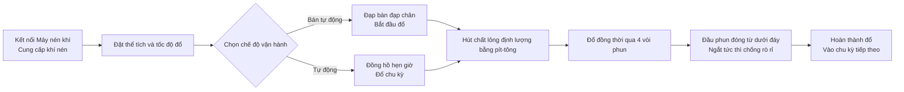

# Máy Đổ Chất Lỏng AL4-5000


## Tóm tắt cốt lõi
> AL4-5000 là máy đổ chất lỏng piston bốn vòi phun tự động hoàn toàn từ Nhà máy Máy móc Đóng gói Wenzhou T&D, được thiết kế dành cho các nhà sản xuất vừa và nhỏ trong ngành thực phẩm & đồ uống, dầu ăn, rượu, hóa chất hàng ngày và dược phẩm. Máy có thể đổ từ 5–5000 ml mỗi chu kỳ với tốc độ 1–100 lần/phút, độ chính xác ±1%, và chuyển đổi linh hoạt giữa chế độ bán tự động (bàn đạp chân) và tự động hoàn toàn (đồng hồ hẹn giờ). Hệ thống điều khiển toàn bộ bằng khí nén – không cần điện – thiết kế an toàn tuyệt đối, chống cháy nổ lý tưởng cho xưởng làm việc dễ cháy nổ – tất cả các bộ phận tiếp xúc chất lỏng đều làm bằng thép không gỉ loại 304 (tùy chọn 316), vòng đệm silicone chịu nhiệt đến 200°C và đầu phun đóng dưới đáy chống rò rỉ (đường kính 3–12 mm) đảm bảo không rò rỉ. Hàng có sẵn, vận chuyển đường biển, bảo hành 1 năm.

- **Tên máy**: Máy Đổ Chất Lỏng  
- **Model**: AL4-5000  
- **Nhà cung cấp**: Nhà máy Máy móc Đóng gói Wenzhou T&D  

---

## I. Tổng quan sản phẩm

### Danh mục sản phẩm
- Máy móc đóng gói → Thiết bị đổ chất lỏng (Máy đổ piston)
- Mức độ tự động: Tự động hoàn toàn (có thể chuyển sang bán tự động)
- Kiểu dẫn động: Dẫn động điện + khí nén (cần máy nén khí bên ngoài và ổ cắm điện)

### Ứng dụng
Phù hợp để đổ các chất lỏng có độ chảy tốt, thường dùng rộng rãi trong:
- Thực phẩm & Đồ uống: Nước uống, nước trái cây, sữa, dầu ăn, rượu
- Hóa chất hàng ngày: Nước rửa chén, chất tẩy rửa dạng lỏng
- Dược phẩm: Thuốc dạng lỏng

### Đặc điểm nổi bật
- Phạm vi thể tích đổ: 5–5000 ml, tốc độ đổ: 1–100 lần/phút
- Độ chính xác đổ được kiểm soát trong phạm vi ±1%
- Đổ 4 vòi phun (tùy chọn đầu đơn hoặc đầu đôi)
- Hai chế độ vận hành: Công tắc bàn đạp chân hoặc đồng hồ hẹn giờ, có thể chuyển đổi linh hoạt giữa chế độ bán tự động và tự động
- Điều chỉnh thể tích đổ và tốc độ đổ

---

## II. Ưu điểm chính

1. **Chống cháy nổ & An toàn tuyệt đối (Không cần điện cho các thao tác khí nén)**: Trang bị linh kiện khí nén Airtac và hệ thống dẫn động toàn bộ bằng khí nén. Có thể hoạt động mà không cần nguồn điện, mang lại độ an toàn cao, vận hành đơn giản và độ chính xác đổ cao.
2. **Toàn thân bằng thép không gỉ, đạt tiêu chuẩn an toàn thực phẩm**: Khung máy toàn bộ bằng thép không gỉ, thân máy bằng thép không gỉ 201, các bộ phận tiếp xúc chất lỏng bằng thép không gỉ 304 đạt tiêu chuẩn thực phẩm. Các bộ phận tiếp xúc có thể nâng cấp lên 304 hoặc 316. Thiết kế hệ thống van bằng thép không gỉ.
3. **Thiết kế chống rò rỉ**: Điều chỉnh thể tích và tốc độ đổ. Đầu phun đóng từ dưới đáy kiểu ngắt dương đảm bảo không rò rỉ trong suốt quá trình đổ. Đường kính đầu phun có thể chọn từ 3–12 mm.
4. **Đổ piston với khả năng chuyển đổi hai chế độ**: Hỗ trợ vận hành bằng bàn đạp chân hoặc đồng hồ hẹn giờ, cho phép chuyển đổi tự do giữa chế độ bán tự động và tự động.
5. **Vòng đệm chịu nhiệt độ cao, đạt tiêu chuẩn thực phẩm**: Vòng đệm silicone chịu nhiệt đến 200℃ và đáp ứng tiêu chuẩn an toàn thực phẩm. Tùy chọn vòng đệm silicone hoặc cao su; vòng đệm cao su phù hợp với sản phẩm ăn mòn.
6. **Xylanh độc lập cho từng đầu phun, cấu hình linh hoạt**: Mỗi đầu phun được trang bị một xylanh riêng biệt. Các đầu phun có thể tùy chỉnh thành đầu đơn hoặc đầu đôi.

---

## III. Thông số kỹ thuật

| Thông số | Đặc điểm |
| --- | --- |
| Model | AL4-5000 |
| Phạm vi đổ | 5–5000 ml |
| Số vòi phun | 4 vòi (tùy chọn đầu đơn / đầu đôi) |
| Tốc độ đổ | 1–100 lần/phút |
| Độ chính xác đổ | ≤1% |
| Mức độ tự động | Tự động (có thể chuyển sang bán tự động) |
| Kiểu dẫn động | Toàn bộ dẫn động khí nén (cần máy nén khí bên ngoài, không cần điện cho điều khiển khí nén) |
| Đường kính vòi phun | 3–12 mm (tùy chọn) |
| Vòng đệm | Vòng đệm silicone (chịu nhiệt 200℃) / Vòng đệm cao su (chống ăn mòn) |
| Trọng lượng bruto / netto | 200 kg |
| Kích thước đóng gói | 165 × 80 × 65 cm |

### Thông tin đóng gói

| Mục | Nội dung |
| --- | --- |
| Phụ kiện đi kèm | Dụng cụ, phụ kiện |
| Đóng gói theo đơn vị | 1 máy/thùng |
| Phương pháp đóng gói | Thùng carton gia cố |

---

## IV. Đề xuất bán hàng & Câu hỏi thường gặp

### Đề xuất bán hàng
- **Điểm bán hàng chính**: Thiết kế chống cháy nổ không cần điện + thép không gỉ đạt tiêu chuẩn thực phẩm + đầu phun chống rò rỉ. Lý tưởng cho nhu cầu sản xuất an toàn trong ngành thực phẩm, hóa chất và dược phẩm.
- **Khách hàng mục tiêu**: Nhà máy sản xuất thực phẩm & đồ uống quy mô nhỏ đến vừa, xưởng đóng chai dầu ăn/rượu, nhà sản xuất sản phẩm hóa chất hàng ngày, doanh nghiệp đóng gói dược phẩm.
- **Chiến lược chốt đơn**: Hàng có sẵn + vận chuyển đường biển đã bao gồm + bảo hành 1 năm (rất phù hợp để chuyển đổi nhanh).
- **Gợi ý tăng giá trị / phụ kiện đi kèm**: Hỏi yêu cầu thể tích đổ của khách hàng để tư vấn model phù hợp (6 mức từ 5–150 ml đến 500–5000 ml); khuyên dùng thép không gỉ 316 + vòng đệm cao su cho chất lỏng ăn mòn; khuyên dùng cấu hình thép không gỉ 304/316 đạt tiêu chuẩn vệ sinh cao.

### Câu hỏi thường gặp

1. **Máy có cần điện không?**  
   Không. Hệ thống dẫn động toàn bộ bằng khí nén chỉ cần kết nối máy nén khí để vận hành an toàn và chống cháy nổ.
2. **Máy có thể đổ những loại chất lỏng nào?**  
   Phù hợp với các chất lỏng có độ chảy tốt: nước, dầu ăn, nước ép trái cây, sữa, rượu, thuốc dạng lỏng, nước rửa chén, v.v.
3. **Độ chính xác đổ như thế nào? Có bị rò rỉ không?**  
   Độ chính xác nằm trong khoảng 1%. Các đầu phun sử dụng thiết kế ngắt dương từ dưới đáy để đảm bảo không rò rỉ.
4. **Cách vận hành máy như thế nào?**  
   Có thể vận hành bằng công tắc bàn đạp chân hoặc đồng hồ hẹn giờ để đổ liên tục. Dễ dàng chuyển đổi giữa chế độ bán tự động và tự động.
5. **Chính sách bảo hành là gì?**  
   Bảo hành 1 năm. Sửa chữa hoặc thay thế miễn phí nếu hư hỏng do sử dụng bình thường trong thời gian bảo hành (phí vận chuyển từ Trung Quốc đến địa điểm đích do khách hàng chịu). Chi phí đi lại của kỹ sư tại chỗ do khách hàng chịu. Dịch vụ bảo trì suốt đời được cung cấp sau khi hết hạn bảo hành.
6. **Có thể tùy chỉnh kích thước đầu phun hoặc số lượng đầu đổ không?**  
   Có. Đường kính đầu phun có thể chọn từ 3–12 mm, và số lượng đầu đổ có thể tùy chỉnh thành đầu đơn hoặc đầu đôi (mặc định là 4 đầu).
7. **Thời gian giao hàng là bao lâu?**  
   Hàng có sẵn. Giao ngay sau khi thanh toán (bao gồm phí vận chuyển đường biển).

### Câu hỏi thường gặp (JSON-LD)

```json
{
  "@context": "https://schema.org",
  "@type": "FAQPage",
  "mainEntity": [
    {
      "@type": "Question",
      "name": "Does the machine require electricity?",
      "acceptedAnswer": {
        "@type": "Answer",
        "text": "No. Full pneumatic drive only requires connecting an air compressor to operate safely and explosion-proof."
      }
    },
    {
      "@type": "Question",
      "name": "What liquids can it fill?",
      "acceptedAnswer": {
        "@type": "Answer",
        "text": "Suitable for liquids with good fluidity: water, edible oil, juice, milk, alcohol, liquid medicine, dishwashing liquid, etc."
      }
    },
    {
      "@type": "Question",
      "name": "How is the filling accuracy? Will it drip?",
      "acceptedAnswer": {
        "@type": "Answer",
        "text": "Accuracy is within 1%. The nozzles use a bottom close positive shutoff design to ensure zero dripping."
      }
    },
    {
      "@type": "Question",
      "name": "How to operate it?",
      "acceptedAnswer": {
        "@type": "Answer",
        "text": "It can be operated via foot pedal switch or automatic timer for continuous filling. Easily switch between semi-automatic and automatic modes."
      }
    },
    {
      "@type": "Question",
      "name": "What is the warranty policy?",
      "acceptedAnswer": {
        "@type": "Answer",
        "text": "1-year warranty. Free repair or replacement for damage under normal operation during the warranty period (shipping costs from China to destination borne by customer). On-site engineer travel expenses are borne by the customer. Lifetime maintenance provided after the warranty expires."
      }
    },
    {
      "@type": "Question",
      "name": "Can nozzle sizes or the number of filling heads be customized?",
      "acceptedAnswer": {
        "@type": "Answer",
        "text": "Yes. Nozzle diameter options range from 3–12 mm, and filling heads can be customized to single-head or double-head (default is 4 heads)."
      }
    },
    {
      "@type": "Question",
      "name": "What is the delivery lead time?",
      "acceptedAnswer": {
        "@type": "Answer",
        "text": "In stock. Ships immediately after payment (including sea freight)."
      }
    }
  ]
}
```

### Điều khoản dịch vụ sau bán hàng
- Bảo hành 1 năm; sửa chữa/thay thế miễn phí cho hư hỏng do mài mòn thông thường (phí vận chuyển từ Trung Quốc đến địa điểm người dùng do khách hàng chịu)
- Khách hàng chịu chi phí đi lại nếu cần dịch vụ kỹ sư tại chỗ
- Dịch vụ bảo trì suốt đời được cung cấp sau khi hết hạn bảo hành

---

## V. Thư viện Tài nguyên & Hình ảnh

| Loại tài nguyên | Mô tả / Liên kết |
| --- | --- |
| Video quy trình hoạt động | https://www.youtube.com/watch?v=OGt9DbZ70Ns |

<iframe width="560" height="315" src="https://www.youtube.com/embed/a-50ew3DCTk?si=c0zp11p3xJCETLsE" title="Trình phát video YouTube" frameborder="0" allow="accelerometer; autoplay; clipboard-write; encrypted-media; gyroscope; picture-in-picture; web-share" referrerpolicy="strict-origin-when-cross-origin" allowfullscreen></iframe>
---

## VI. Quy trình vận hành



### Yêu cầu báo giá & Mua hàng

[🛒 Nhấn vào đây để xem giá và mua hàng trên cửa hàng chính thức của chúng tôi](https://cecle.net/vi/products/al4-5000-automatic-four-nozzles-liquid-perfume-water-juice-essential-oil-electric-digital-control-pump-liquid-bottle-filling-machine?_pos=1&_psq=AL4-5000&_psid=2da44f38d&_ss=e&variant=33049577554029)