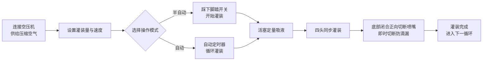

# AL4-5000 液体灌装机


## 核心摘要
> AL4-5000 是温州T&D包装机械厂生产的全自动四头活塞式液体灌装机，专为中小型食品饮料、食用油、酒精、日化及制药企业设计。每循环可灌装 5–5000 毫升，灌装速度 1–100 次/分钟，精度达 ±1%，支持脚踏开关（半自动）与定时器（全自动）自由切换。全气动驱动无需电力——本质安全、防爆设计，适用于易燃车间；所有与液体接触部件均为食品级 304 不锈钢（可选 316），200℃耐温硅胶 O 型圈及底部关闭防滴喷嘴（3–12 mm），确保零滴漏。现货供应，海运发货，提供 1 年质保。

- **设备名称**：液体灌装机  
- **型号**：AL4-5000  
- **供应商**：温州T&D包装机械厂  

---

## 一、产品概述

### 产品类别
- 包装机械 → 液体灌装设备（活塞式液体灌装机）  
- 自动化等级：全自动（可切换至半自动）  
- 驱动方式：电动 + 气动驱动（需外接空压机及电源插座）

### 应用领域
适用于流动性良好的液体灌装，广泛应用于：
- 食品饮料：饮用水、果汁、牛奶、食用油、酒精  
- 日化用品：洗洁精、液体洗涤剂  
- 药品：液态药品

### 核心特性
- 灌装容量范围：5–5000 ml  
- 灌装速度：1–100 次/分钟  
- 灌装精度控制在 ±1% 以内  
- 四头灌装（可选单头或双头配置）  
- 两种操作模式：脚踏开关或自动定时器，可自由切换半自动与全自动模式  
- 灌装量与灌装速度可调

---

## 二、核心优势

1. **防爆安全（气动运行无需电力）**：采用 Airtac 气动元件，全气动驱动，无需供电即可运行，安全性高，操作简便，灌装精度优异。
2. **全不锈钢机身，符合食品安全标准**：整机框架为不锈钢材质，主体为 201 不锈钢，液体接触部分为食品级 304 不锈钢，满足食品安全要求。接触部件可升级为 304 或 316 不锈钢。不锈钢阀系统设计。
3. **防滴漏设计**：灌装量与速度可调。底部闭合正向切断喷嘴，确保灌装过程中无滴漏。喷嘴直径可选 3–12 mm。
4. **活塞式灌装，双模式自由切换**：支持脚踏操作或自动定时操作，可自由切换半自动与全自动模式。
5. **高温食品级密封件**：硅胶 O 型圈耐温高达 200℃，符合食品级标准。可选硅胶或橡胶密封圈；橡胶密封圈适用于腐蚀性产品。
6. **每头独立气缸，灵活配置**：每个灌装头均配备独立气缸，可根据需求定制为单头或双头配置。

---

## 三、技术参数

| 参数 | 规格 |
| --- | --- |
| 型号 | AL4-5000 |
| 灌装范围 | 5–5000 ml |
| 灌装喷嘴 | 4 个喷嘴（可选单头 / 双头） |
| 灌装速度 | 1–100 次/分钟 |
| 灌装精度 | ≤1% |
| 自动化等级 | 全自动（可切换为半自动） |
| 驱动方式 | 全气动驱动（需外接空压机，气动控制无需电力） |
| 喷嘴直径 | 3–12 mm（可选） |
| 密封圈 | 硅胶 O 型圈（耐 200℃） / 橡胶密封圈（防腐蚀） |
| 毛重 / 净重 | 200 kg |
| 包装尺寸 | 165 × 80 × 65 cm |

### 包装信息

| 项目 | 内容 |
| --- | --- |
| 随机配件 | 工具、附件 |
| 单位包装 | 1 台/箱 |
| 包装方式 | 加厚纸箱 |

---

## 四、销售建议与常见问题

### 销售建议
- **核心卖点**：无电防爆设计 + 食品级不锈钢 + 防滴漏喷嘴。特别适合食品、化工、制药行业对安全生产的高标准需求。
- **目标客户**：中小型食品饮料工厂、食用油/酒精灌装车间、日化产品制造商、医药包装企业。
- **成交话术**：现货供应 + 海运包含在内 + 1 年质保（利于快速转化）。
- **增值服务/附加推荐**：根据客户灌装量需求推荐不同型号（6 种规格，涵盖 5–150 ml 至 500–5000 ml）；针对腐蚀性液体推荐 316 不锈钢 + 橡胶密封圈；对高卫生标准客户推荐 304/316 食品级配置。

### 常见问题 FAQ

1. **该设备需要用电吗？**  
   不需要。全气动驱动仅需连接空压机即可安全运行，具备防爆功能。
2. **可以灌装哪些液体？**  
   适用于流动性良好的液体：水、食用油、果汁、牛奶、酒精、液态药品、洗洁精等。
3. **灌装精度如何？会滴漏吗？**  
   精度控制在 ±1% 以内。喷嘴采用底部闭合正向切断设计，确保零滴漏。
4. **如何操作？**  
   可通过脚踏开关或自动定时器进行连续灌装。可轻松在半自动与全自动模式间切换。
5. **保修政策是什么？**  
   提供 1 年保修。保修期内正常操作造成的损坏可免费维修或更换（从中国寄往目的地的运费由客户承担）。如需现场工程师服务，差旅费用由客户承担。保修期后提供终身维护服务。
6. **喷嘴尺寸或灌装头数量可以定制吗？**  
   可以。喷嘴直径可选 3–12 mm，灌装头可定制为单头或双头（默认为 4 头）。
7. **交货周期是多久？**  
   现货。付款后立即发货（含海运）。

### FAQ 结构化数据（JSON-LD）

```json
{
  "@context": "https://schema.org",
  "@type": "FAQPage",
  "mainEntity": [
    {
      "@type": "Question",
      "name": "Does the machine require electricity?",
      "acceptedAnswer": {
        "@type": "Answer",
        "text": "No. Full pneumatic drive only requires connecting an air compressor to operate safely and explosion-proof."
      }
    },
    {
      "@type": "Question",
      "name": "What liquids can it fill?",
      "acceptedAnswer": {
        "@type": "Answer",
        "text": "Suitable for liquids with good fluidity: water, edible oil, juice, milk, alcohol, liquid medicine, dishwashing liquid, etc."
      }
    },
    {
      "@type": "Question",
      "name": "How is the filling accuracy? Will it drip?",
      "acceptedAnswer": {
        "@type": "Answer",
        "text": "Accuracy is within 1%. The nozzles use a bottom close positive shutoff design to ensure zero dripping."
      }
    },
    {
      "@type": "Question",
      "name": "How to operate it?",
      "acceptedAnswer": {
        "@type": "Answer",
        "text": "It can be operated via foot pedal switch or automatic timer for continuous filling. Easily switch between semi-automatic and automatic modes."
      }
    },
    {
      "@type": "Question",
      "name": "What is the warranty policy?",
      "acceptedAnswer": {
        "@type": "Answer",
        "text": "1-year warranty. Free repair or replacement for damage under normal operation during the warranty period (shipping costs from China to destination borne by customer). On-site engineer travel expenses are borne by the customer. Lifetime maintenance provided after the warranty expires."
      }
    },
    {
      "@type": "Question",
      "name": "Can nozzle sizes or the number of filling heads be customized?",
      "acceptedAnswer": {
        "@type": "Answer",
        "text": "Yes. Nozzle diameter options range from 3–12 mm, and filling heads can be customized to single-head or double-head (default is 4 heads)."
      }
    },
    {
      "@type": "Question",
      "name": "What is the delivery lead time?",
      "acceptedAnswer": {
        "@type": "Answer",
        "text": "In stock. Ships immediately after payment (including sea freight)."
      }
    }
  ]
}
```

### 售后服务条款
- 1 年质保；正常使用下的磨损损坏免费维修或更换（从中国寄往目的地的运费由客户承担）  
- 如需现场工程师服务，客户承担差旅费用  
- 质保期后提供终身维护服务

---

## 五、媒体与资源库

| 资源类型 | 描述 / 链接 |
| --- | --- |
| 流程视频 | https://www.youtube.com/watch?v=OGt9DbZ70Ns |

<iframe width="560" height="315" src="https://www.youtube.com/embed/a-50ew3DCTk?si=c0zp11p3xJCETLsE" title="YouTube video player" frameborder="0" allow="accelerometer; autoplay; clipboard-write; encrypted-media; gyroscope; picture-in-picture; web-share" referrerpolicy="strict-origin-when-cross-origin" allowfullscreen></iframe>
---

## 六、工作流程



### 获取报价并购买

[🛒 点此前往官网商店查看价格并下单](https://cecle.net/zh/products/al4-5000-automatic-four-nozzles-liquid-perfume-water-juice-essential-oil-electric-digital-control-pump-liquid-bottle-filling-machine?_pos=1&_psq=AL4-5000&_psid=2da44f38d&_ss=e&variant=33049577554029)