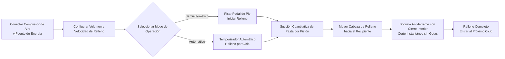

# Máquina de Rellenado FF9-500 para Pasta


## (Resumen Principal)

> La FF9-500 es una máquina de rellenado semiautomática con cabeza móvil para pasta, fabricada por la Fábrica de Maquinaria de Empaquetado Wenzhou T&D, adecuada para rellenar líquidos y pastas viscosas en las industrias alimentaria y de bebidas, química diaria, cosmética y farmacéutica. Rango de relleno: 5–5000 ml, velocidad: 10–40 veces/min, precisión ±1%, con conmutación dual entre pedal de pie y temporizador. La cabeza de relleno móvil incluye una boquilla antidesbordamiento con cierre inferior, las partes en contacto con el líquido son de acero inoxidable grado alimenticio 304 (316 opcional), y los anillos de sellado de gel de sílice resisten hasta 100 °C. En stock, FOB Ningbo, garantía de 1 año.

- **Nombre de la máquina**: Máquina de Rellenado de Pasta
- **Modelo**: FF9-500

---

## I. Visión General del Producto

### Categoría del Producto
- Maquinaria de Empaquetado → Equipos de Rellenado de Pasta/Líquidos (Rellenador de Pistón)
- Grado de Automatización: Semiautomático o Automático
- Tipo de Accionamiento: Accionamiento neumático + eléctrico (requiere compresor de aire externo y enchufe de energía)

### Aplicaciones
Adecuada para rellenar tanto líquidos que fluyen libremente como materiales pasteosos, ampliamente utilizada en:
- **Alimentos y Bebidas**: Agua, aceite de cocina, jugo, leche, yogur, salsa, crema, pasta de chile, puré de tomate
- **Productos Químicos Diarios**: Champú, detergente líquido, líquido para lavar platos
- **Farmacéuticos y Cosméticos**: Crema, lociones, pomadas, medicamentos en pasta

### Características Principales
- Rango de volumen de relleno: 50–500 ml, velocidad de relleno: 10–40 veces/min
- Precisión de relleno controlada dentro de ±1%
- Cabeza de relleno única móvil, alineable flexiblemente a diversos recipientes
- Dos modos de operación: interruptor de pedal de pie o temporizador automático, intercambiables libremente entre semiautomático y automático
- Volumen de relleno y velocidad ajustables
- Gran depósito de 30 L, reduciendo la frecuencia de recarga
- Control totalmente neumático, accionamiento neumático + eléctrico

---

## II. Ventajas Clave

1. **Componentes Neumáticos de Alta Calidad Airtac**: Equipada con componentes neumáticos Airtac, sistema híbrido neumático-eléctrico, requiere conexión a un compresor de aire; operación sencilla con alta precisión de relleno.
2. **Cuerpo Total en Acero Inoxidable, Cumplimiento con Seguridad Alimentaria**: Estructura completa en acero inoxidable, cuerpo en acero inoxidable 201, partes en contacto con líquidos en acero inoxidable grado alimenticio 304, cumpliendo con requisitos de seguridad alimentaria; partes de contacto pueden ser 304 o 316 acero inoxidable; diseño de sistema de válvulas en acero inoxidable.
3. **Cabeza de Relleno Móvil Antiderrame**: Volumen y velocidad de relleno ajustables; boquilla de cierre positivo con cierre inferior evita gotas; la cabeza de relleno es móvil para posicionamiento flexible, con diámetro de boquilla seleccionable entre 3–12 mm.
4. **Relleno por Pistón con Conmutación Dual**: Relleno por pistón, operable mediante interruptor de pedal de pie o temporizador automático, con posibilidad de cambiar libremente entre modo semiautomático y automático en cualquier momento.
5. **Sellos de Alta Temperatura de Grado Alimenticio**: Anillos O de silicona resistentes hasta 100 °C y cumplen con estándares de seguridad alimentaria; sellos de silicona o goma opcionales, con sellos de goma adecuados para productos corrosivos.
6. **Múltiples Especificaciones Disponibles**: Se ofrecen 6 especificaciones de volumen de relleno: 5–100 ml, 10–200 ml, 50–500 ml, 100–1000 ml, 250–2500 ml, 500–5000 ml.
7. **Amplia Compatibilidad con Materiales**: Adecuada para líquidos y materiales pasteosos como agua, aceite de cocina, jugo, leche, yogur, salsa, crema, champú, pasta de chile, puré de tomate, pasta, detergente líquido, etc.

---

## III. Especificaciones Técnicas

| Parámetro | Especificación |
| --- | --- |
| Modelo | FF9-500 |
| Rango de Relleno | 50–500 ml |
| Capacidad del Depósito | 30 L |
| Boquilla de Relleno | 1 (Cabeza de relleno móvil) |
| Velocidad de Relleno | 10–40 veces/min |
| Precisión de Relleno | ≤1% |
| Consumo de Aire | 0,55–1,1 m³/h |
| Presión de Aire | 0,4–0,6 MPa |
| Tipo de Control | Totalmente Neumático |
| Grado de Automatización | Semiautomático o Automático |
| Modo de Operación | Interruptor de pedal de pie / Temporizador automático |
| Diámetro de Boquilla | 3–12 mm (Opcional) |
| Anillo de Sellado | Anillo O de silicona (Resistente a 100 °C) / Anillo de goma (Anticorrosivo) |
| Peso Bruto / Neto | 35 / 30 kg |
| Dimensiones de Empaque | 95 × 45 × 40 + 46 × 44 × 47 cm |
| Embalaje por Unidad | 1 máquina empaquetada en 2 cajas |
| Método de Embalaje | Caja de cartón reforzado |
| Piezas de Repuesto Incluidas | Herramientas, Accesorios |

---

## IV. Recomendaciones de Venta y Preguntas Frecuentes

### Recomendaciones de Venta
- **Puntos Fuertes Principales**: Cabeza de relleno móvil + accionamiento híbrido neumático-eléctrico + acero inoxidable de grado alimenticio + boquilla antidesbordamiento, ideal para rellenado flexible de pequeñas cantidades de líquidos y pastas en talleres de alimentos, cosméticos y químicos.
- **Clientes Objetivo**: Pequeñas y medianas fábricas de alimentos y bebidas, talleres de rellenado de aceite de cocina/salsa, fabricantes de cremas cosméticas, productores de productos químicos diarios y empresas de empaque farmacéutico.
- **Productos Adicionales / Upsell**: Consultar el volumen de relleno requerido por el cliente para recomendar entre las 6 especificaciones disponibles (5–100 ml hasta 500–5000 ml); recomendar acero inoxidable 316 + sellos de goma para productos corrosivos o ácidos; recomendar un depósito más grande o configuración de línea de transporte automática para necesidades de mayor producción.

### Preguntas Frecuentes

1. **¿Requiere la máquina electricidad?**  
   Utiliza un accionamiento neumático + eléctrico, requiriendo tanto un compresor de aire como un enchufe de energía conectados para una operación estable y segura.
2. **¿Qué materiales puede llenar?**  
   Adecuada para líquidos que fluyen libremente y pastas viscosas como agua, aceite de cocina, jugo, leche, yogur, salsa, crema, champú, pasta de chile, puré de tomate, pasta, detergente líquido, etc.
3. **¿Cuál es la precisión del relleno? ¿Derramará?**  
   La precisión del relleno está dentro de ±1%. El diseño de boquilla de cierre positivo con cierre inferior asegura ausencia de gotas durante el relleno.
4. **¿Cómo se opera?**  
   Relleno semiautomático mediante el interruptor de pedal de pie, o relleno continuo automático mediante el temporizador automático, con cambio libre entre ambos modos.
5. **¿Cuál es la política de garantía?**  
   Garantía de 1 año. Reparación o sustitución gratuita por daños por desgaste normal durante el período de garantía (los costos de envío desde China hasta el destino corren por cuenta del cliente). Si se requiere servicio de ingeniero en sitio, los gastos de viaje de ida y vuelta corren por cuenta del cliente. Servicio de mantenimiento de por vida disponible más allá del período de garantía.
6. **¿Se pueden personalizar tamaños de boquilla o rangos de volumen de relleno?**  
   Sí. Las opciones de diámetro de boquilla van de 3–12 mm, y están disponibles 6 rangos de volumen de relleno (5–100 ml, 10–200 ml, 50–500 ml, 100–1000 ml, 250–2500 ml, 500–5000 ml).

### Esquema de Preguntas Frecuentes (JSON-LD)

```json
{
  "@context": "https://schema.org",
  "@type": "FAQPage",
  "mainEntity": [
    {
      "@type": "Question",
      "name": "¿Requiere la máquina electricidad?",
      "acceptedAnswer": {
        "@type": "Answer",
        "text": "Utiliza un accionamiento neumático + eléctrico, requiriendo tanto un compresor de aire como un enchufe de energía conectados para una operación estable y segura."
      }
    },
    {
      "@type": "Question",
      "name": "¿Qué materiales puede llenar?",
      "acceptedAnswer": {
        "@type": "Answer",
        "text": "Adecuada para líquidos que fluyen libremente y pastas viscosas como agua, aceite de cocina, jugo, leche, yogur, salsa, crema, champú, pasta de chile, puré de tomate, pasta, detergente líquido, etc."
      }
    },
    {
      "@type": "Question",
      "name": "¿Cuál es la precisión del relleno? ¿Derramará?",
      "acceptedAnswer": {
        "@type": "Answer",
        "text": "La precisión del relleno está dentro de ±1%. El diseño de boquilla de cierre positivo con cierre inferior asegura ausencia de gotas durante el relleno."
      }
    },
    {
      "@type": "Question",
      "name": "¿Cómo se opera?",
      "acceptedAnswer": {
        "@type": "Answer",
        "text": "Relleno semiautomático mediante el interruptor de pedal de pie, o relleno continuo automático mediante el temporizador automático, con cambio libre entre ambos modos."
      }
    },
    {
      "@type": "Question",
      "name": "¿Cuál es la política de garantía?",
      "acceptedAnswer": {
        "@type": "Answer",
        "text": "Garantía de 1 año. Reparación o sustitución gratuita por daños por desgaste normal durante el período de garantía (los costos de envío desde China hasta el destino corren por cuenta del cliente). Si se requiere servicio de ingeniero en sitio, los gastos de viaje de ida y vuelta corren por cuenta del cliente. Servicio de mantenimiento de por vida disponible más allá del período de garantía."
      }
    },
    {
      "@type": "Question",
      "name": "¿Se pueden personalizar tamaños de boquilla o rangos de volumen de relleno?",
      "acceptedAnswer": {
        "@type": "Answer",
        "text": "Sí. Las opciones de diámetro de boquilla van de 3–12 mm, y están disponibles 6 rangos de volumen de relleno (5–100 ml, 10–200 ml, 50–500 ml, 100–1000 ml, 250–2500 ml, 500–5000 ml)."
      }
    }
  ]
}
```

### Términos de Servicio Postventa
- Garantía de 1 año; reparación o sustitución gratuita por daños por desgaste normal durante el período de garantía (el envío desde China hasta el sitio local pagado por el cliente)
- El cliente cubre los costos de viaje si se requiere servicio de ingeniero en sitio
- Servicio de mantenimiento de por vida proporcionado más allá del período de garantía

---

## V. Biblioteca de Medios y Recursos

| Tipo de Recurso | Descripción / Enlace |
| --- | --- |
| Video de Flujo de Trabajo | https://youtu.be/g3yXyeVzYCM |

<iframe width="560" height="315" src="https://www.youtube.com/embed/DDEElVvBufs?si=VZ1rLT1Ppw3WCY_i" title="Reproductor de video de YouTube" frameborder="0" allow="accelerómetro; autoplay; clipboard-write; medios cifrados; giróscopo; imagen en imagen; compartir web" referrerpolicy="strict-origin-when-cross-origin" allowfullscreen></iframe>

---

## VI. Flujo de Trabajo


### Solicitar Cotización y Comprar

[🛒 Haz clic aquí para ver precios y comprar en nuestra tienda oficial](https://cecle.net/es/products/cecle-ff9-cake-filling-machine-semi-automatic-paste-bottle-filling-machine-for-cake?_pos=1&_psq=FF9&_psid=63c927ce4&_ss=e)