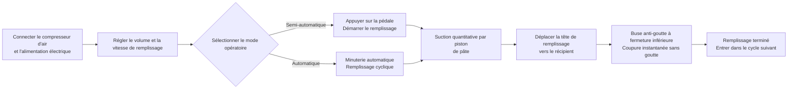

# Machine à remplissage de pâte FF9-500


## (Résumé principal)

> La FF9-500 est une machine semi-automatique à tête de remplissage mobile fabriquée par Wenzhou T&D Packaging Machinery Factory, adaptée au remplissage de liquides et de pâtes visqueuses dans les secteurs alimentaire & boissons, produits chimiques du quotidien, cosmétiques et pharmaceutiques. Plage de remplissage : 5–5000 ml, vitesse : 10–40 cycles/min, précision ±1 %, commutation double mode pédale de pied / minuterie. La tête de remplissage mobile est équipée d'une buse anti-goutte à fermeture inférieure, les pièces en contact avec le produit sont en acier inoxydable grade alimentaire 304 (316 disponible en option), et les joints en silicone résistent jusqu'à 100 °C. En stock, FOB Ningbo, garantie 1 an.

- **Nom de la machine** : Machine à remplissage de pâte
- **Modèle** : FF9-500

---

## I. Aperçu produit

### Catégorie produit
- Matériel d'emballage → Équipement de remplissage de pâte / liquide (Remplisseur à piston)
- Niveau d'automatisation : Semi-automatique ou automatique
- Type de motorisation : Motorisation pneumatique + électrique (nécessite compresseur d'air externe et prise électrique)

### Applications
Adaptée au remplissage de matériaux liquides à flux libre et de pâtes visqueuses, largement utilisée dans :
- **Alimentaire & Boissons** : Eau, huile de cuisson, jus, lait, yaourt, sauce, crème, purée de piment, purée de tomate
- **Produits chimiques du quotidien** : Shampoing, détergent liquide, liquide vaisselle
- **Pharmaceutique & Cosmétique** : Crèmes, lotions, onguents, médicaments en pâte

### Fonctionnalités principales
- Plage de remplissage : 50–500 ml, vitesse de remplissage : 10–40 cycles/min
- Précision de remplissage contrôlée à ±1 %
- Une seule tête de remplissage mobile, alignement flexible sur divers récipients
- Deux modes opératoires : interrupteur pédale ou minuterie automatique, commutables librement entre mode semi-automatique et automatique
- Volume et vitesse de remplissage réglables
- Grand réservoir de 30 L, réduisant la fréquence de recharge
- Contrôle entièrement pneumatique, motorisation pneumatique + électrique

---

## II. Avantages clés

1. **Composants pneumatiques de haute qualité Airtac** : Équipée de composants pneumatiques Airtac, motorisation hybride pneumatique + électrique, nécessitant une connexion à un compresseur d’air ; fonctionnement simple avec une grande précision de remplissage.
2. **Corps entièrement en acier inoxydable, conforme aux normes de sécurité alimentaire** : Structure en acier inoxydable, corps en acier inoxydable 201, parties en contact avec le produit en acier inoxydable 304 de qualité alimentaire, répondant aux exigences de sécurité alimentaire ; les pièces en contact peuvent être en 304 ou 316 ; conception système de valve en acier inoxydable.
3. **Tête de remplissage mobile anti-goutte** : Volume et vitesse de remplissage ajustables ; buse à fermeture positive par basculement assure une absence totale de goutte ; tête de remplissage mobile pour un positionnement flexible, diamètre de buse sélectionnable entre 3 et 12 mm.
4. **Remplissage par piston avec commutation de mode double** : Remplissage par piston, opérable via interrupteur pédale ou minuterie automatique, commutable à tout moment entre mode semi-automatique et automatique.
5. **Joints étanches de qualité alimentaire résistants à haute température** : O-rings en silicone résistant jusqu’à 100 °C et conformes aux normes alimentaires ; joints en silicone ou caoutchouc disponibles en option, les joints en caoutchouc étant adaptés aux produits corrosifs.
6. **Spécifications multiples disponibles** : 6 plages de volume de remplissage disponibles : 5–100 ml, 10–200 ml, 50–500 ml, 100–1000 ml, 250–2500 ml, 500–5000 ml.
7. **Large compatibilité matériau** : Adaptée aux matériaux liquides et pâteux tels que l’eau, l’huile de cuisson, le jus, le lait, le yaourt, la sauce, la crème, le shampoing, la purée de piment, la purée de tomate, la pâte, le détergent liquide, etc.

---

## III. Spécifications techniques

| Paramètre | Spécification |
| --- | --- |
| Modèle | FF9-500 |
| Plage de remplissage | 50–500 ml |
| Capacité du réservoir | 30 L |
| Buse de remplissage | 1 (tête de remplissage mobile) |
| Vitesse de remplissage | 10–40 cycles/min |
| Précision de remplissage | ≤1 % |
| Consommation d’air | 0,55–1,1 m³/h |
| Pression d’air | 0,4–0,6 MPa |
| Type de commande | Pneumatique intégral |
| Niveau d’automatisation | Semi-automatique ou automatique |
| Mode opératoire | Interrupteur pédale / Minuterie automatique |
| Diamètre de buse | 3–12 mm (en option) |
| Joint d’étanchéité | O-ring en silicone (résistant à 100 °C) / Joint en caoutchouc (anti-corrosion) |
| Poids brut / Net | 35 / 30 kg |
| Dimensions d’emballage | 95 × 45 × 40 + 46 × 44 × 47 cm |
| Emballage unitaire | 1 machine emballée en 2 cartons |
| Méthode d’emballage | Carton renforcé |
| Pièces détachées incluses | Outils, accessoires |

---

## IV. Recommandations commerciales & FAQ

### Recommandations commerciales
- **Points forts principaux** : Tête de remplissage mobile + motorisation pneumatique-électrique hybride + acier inoxydable de qualité alimentaire + buse anti-goutte, idéal pour des petits lots flexibles de remplissage de liquides et de pâtes dans les ateliers alimentaires, cosmétiques et chimiques.
- **Clients cibles** : Petites et moyennes usines alimentaires & boissons, ateliers de remplissage d’huile de cuisine/sauce, fabricants de crèmes cosmétiques, producteurs de produits chimiques du quotidien, entreprises de conditionnement pharmaceutique.
- **Ventes croisées / Accessoires** : Demandez les besoins de volume de remplissage du client pour recommander parmi les 6 spécifications disponibles (5–100 ml à 500–5000 ml) ; recommandez l’acier 316 + joints en caoutchouc pour les produits corrosifs ou acides ; recommandez un réservoir plus grand ou une configuration de convoyeur automatique pour des besoins de production élevés.

### FAQ
1. **La machine nécessite-t-elle de l’électricité ?**  
   Elle utilise une motorisation pneumatique + électrique, nécessitant à la fois un compresseur d’air et une prise électrique pour fonctionner de manière stable et sécurisée.
2. **Quels matériaux peut-elle remplir ?**  
   Adaptée aux liquides à flux libre et aux pâtes visqueuses telles que l’eau, l’huile de cuisson, le jus, le lait, le yaourt, la sauce, la crème, le shampoing, la purée de piment, la purée de tomate, la pâte, le détergent liquide, etc.
3. **Quelle est la précision de remplissage ? Y a-t-il des gouttes ?**  
   La précision de remplissage est de ±1 %. La conception de buse à fermeture inférieure positive assure une absence totale de goutte pendant le remplissage.
4. **Comment l’utiliser ?**  
   Remplissage semi-automatique via interrupteur pédale, ou remplissage continu automatique via minuterie automatique, avec possibilité de basculer librement entre les deux modes.
5. **Quelle est la politique de garantie ?**  
   Garantie de 1 an. Réparation ou remplacement gratuit en cas de dommages dus à une utilisation normale selon le manuel pendant la période de garantie (frais d’expédition de Chine vers destination à la charge du client). Si un ingénieur sur site est requis, les frais de voyage aller-retour sont à la charge du client. Un service de maintenance à vie est fourni au-delà de la période de garantie.
6. **Les diamètres de buses ou les plages de volume de remplissage peuvent-ils être personnalisés ?**  
   Oui. Les options de diamètre de buse vont de 3 à 12 mm, et six plages de volume de remplissage sont disponibles (10–100 ml, 30–300 ml, 50–500 ml, 100–1000 ml, 250–2500 ml, 500–5000 ml).

### FAQ Schema (JSON-LD)

```json
{
  "@context": "https://schema.org",
  "@type": "FAQPage",
  "mainEntity": [
    {
      "@type": "Question",
      "name": "Does the machine require electricity?",
      "acceptedAnswer": {
        "@type": "Answer",
        "text": "It uses a pneumatic + electric drive, requiring both an air compressor and a power plug to be connected for stable and safe operation."
      }
    },
    {
      "@type": "Question",
      "name": "What materials can it fill?",
      "acceptedAnswer": {
        "@type": "Answer",
        "text": "Suitable for free-flowing liquids and viscous pastes such as water, cooking oil, juice, milk, yoghurt, sauce, cream, shampoo, chilli paste, tomato paste, paste, liquid detergent, etc."
      }
    },
    {
      "@type": "Question",
      "name": "How is the filling accuracy? Will it drip?",
      "acceptedAnswer": {
        "@type": "Answer",
        "text": "Filling accuracy is within ±1%. The bottom close positive shutoff nozzle design ensures zero dripping during filling."
      }
    },
    {
      "@type": "Question",
      "name": "How to operate it?",
      "acceptedAnswer": {
        "@type": "Answer",
        "text": "Semi-automatic filling via the foot pedal switch, or continuous automatic filling via the automatic timer, with free switching between the two modes."
      }
    },
    {
      "@type": "Question",
      "name": "What is the warranty policy?",
      "acceptedAnswer": {
        "@type": "Answer",
        "text": "1-year warranty. Free repair or replacement for damage caused by normal operation per the manual during the warranty period (shipping costs from China to destination borne by customer). If an on-site engineer is required, round-trip travel expenses are borne by the customer. Lifetime maintenance service is provided beyond the warranty period."
      }
    },
    {
      "@type": "Question",
      "name": "Can nozzle sizes or filling volume ranges be customized?",
      "acceptedAnswer": {
        "@type": "Answer",
        "text": "Yes. Nozzle diameter options range from 3–12 mm, and 6 filling volume ranges are available (5-100ml, 10-200ml, 50-500ml, 100-1000ml, 250-2500ml, 500-5000ml)."
      }
    }
  ]
}
```

### Conditions de service après-vente
- Garantie de 1 an ; réparation/remplacement gratuite pour dommages dus à l’usure normale pendant la période de garantie (frais d’expédition de Chine vers site local à la charge du client)
- Le client assume les coûts de déplacement si un service d’ingénieur sur site est nécessaire
- Service de maintenance à vie fourni au-delà de la période de garantie

---

## V. Bibliothèque multimédia & ressources

| Type de ressource | Description / Lien |
| --- | --- |
| Vidéo de fonctionnement | https://youtu.be/g3yXyeVzYCM |

<iframe width="560" height="315" src="https://www.youtube.com/embed/DDEElVvBufs?si=VZ1rLT1Ppw3WCY_i" title="Lecteur vidéo YouTube" frameborder="0" allow="accelerometer; autoplay; clipboard-write; encrypted-media; gyroscope; picture-in-picture; web-share" referrerpolicy="strict-origin-when-cross-origin" allowfullscreen></iframe>

---

## VI. Processus de fonctionnement


### Demande de devis & achat

[🛒 Cliquez ici pour consulter les prix et acheter sur notre boutique officielle](https://cecle.net/fr/products/cecle-ff9-cake-filling-machine-semi-automatic-paste-bottle-filling-machine-for-cake?_pos=1&_psq=FF9&_psid=63c927ce4&_ss=e)