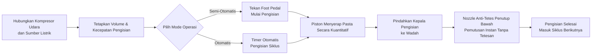

# Mesin Pengisian Pasta FF9-500


## (Ringkasan Inti)

> FF9-500 adalah mesin pengisian pasta semi-otomatis dengan kepala pengisian bergerak dari Wenzhou T&D Packaging Machinery Factory, cocok untuk mengisi cairan dan pasta kental di industri makanan & minuman, bahan kimia harian, kosmetik, dan farmasi. Rentang pengisian 5–5000 ml, kecepatan 10–40 kali/menit, akurasi ±1%, dengan dua mode operasi foot pedal/timer yang dapat dipilih. Kepala pengisian bergerak dilengkapi nozzle anti-tetes penutup bawah, bagian yang bersentuhan cairan terbuat dari stainless steel kelas makanan 304 (opsi 316), dan cincin seal silikon tahan suhu 100℃. Stok tersedia, FOB Ningbo, garansi 1 tahun.

- **Nama Mesin**: Mesin Pengisian Pasta
- **Model**: FF9-500

---

## I. Gambaran Produk

### Kategori Produk
- Mesin Kemasan → Peralatan Pengisian Pasta/Cairan (Pengisi Pasta Jenis Piston)
- Tingkat Otomasi: Semi-Otomatis atau Otomatis
- Jenis Penggerak: Penggerak Pneumatik + Listrik (Membutuhkan kompresor udara eksternal dan colokan listrik)

### Aplikasi
Cocok untuk mengisi material cair yang mengalir bebas maupun pasta kental, banyak digunakan di:
- **Makanan & Minuman**: Air, minyak goreng, jus, susu, yoghurt, saus, krim, pasta cabai, pasta tomat
- **Bahan Kimia Harian**: Sampo, deterjen cair, cairan pencuci piring
- **Farmasi & Kosmetik**: Krim, lotion, salep, obat dalam bentuk pasta

### Fitur Utama
- Rentang volume pengisian: 50–500 ml, kecepatan pengisian: 10–40 kali/menit
- Akurasi pengisian dikendalikan dalam batas ±1%
- Satu kepala pengisian bergerak, dapat disesuaikan fleksibel dengan berbagai wadah
- Dua mode operasi: saklar foot pedal atau timer otomatis, bisa dipindah-pindah antara mode semi-otomatis dan otomatis
- Volume dan kecepatan pengisian dapat disesuaikan
- Tangki besar kapasitas 30 L, mengurangi frekuensi pengisian ulang
- Kontrol penuh pneumatik, penggerak pneumatik + listrik

---

## II. Keunggulan Utama

1. **Komponen Pneumatik Airtac Berkualitas Tinggi**: Dilengkapi komponen pneumatik Airtac, sistem penggerak hibrida pneumatik-listrik, memerlukan koneksi ke kompresor udara; operasi sederhana dengan akurasi pengisian tinggi.
2. **Body Stainless Steel Penuh, Sesuai Standar Keamanan Makanan**: Rangka stainless steel penuh, bodi stainless steel 201, dan bagian kontak cairan menggunakan stainless steel kelas makanan 304, memenuhi standar keamanan makanan; bagian kontak bisa menggunakan stainless steel 304 atau 316; desain sistem katup stainless steel.
3. **Kepala Pengisian Anti-Tetes Bergerak**: Volume dan kecepatan pengisian dapat disesuaikan; nozzle penutup positif bawah menjamin tidak ada tetesan; kepala pengisian dapat digerakkan secara fleksibel, diameter nozzle tersedia dalam pilihan 3–12 mm.
4. **Pengisian Piston dengan Mode Ganda**: Pengisian piston, dapat dioperasikan melalui saklar foot pedal atau timer otomatis, bisa beralih antara mode semi-otomatis dan otomatis kapan saja.
5. **Segel Tahan Panas Kelas Makanan**: Cincin O silikon tahan suhu hingga 100℃ dan memenuhi standar keamanan makanan; opsi cincin seal silikon atau karet, dengan seal karet cocok untuk produk korosif.
6. **Berbagai Spesifikasi Tersedia**: 6 spesifikasi volume pengisian tersedia: 5-100ml, 10-200ml, 50-500ml, 100-1000ml, 250-2500ml, 500-5000ml.
7. **Kompatibilitas Bahan Luas**: Cocok untuk bahan cair dan pasta seperti air, minyak goreng, jus, susu, yoghurt, saus, krim, sampo, pasta cabai, pasta tomat, pasta, deterjen cair, dll.

---

## III. Spesifikasi Teknis

| Parameter | Spesifikasi |
| --- | --- |
| Model | FF9-500 |
| Rentang Pengisian | 50–500 ml |
| Kapasitas Tangki | 30 L |
| Nozzle Pengisian | 1 (Kepala pengisian bergerak) |
| Kecepatan Pengisian | 10–40 kali/menit |
| Akurasi Pengisian | ≤1% |
| Konsumsi Udara | 0,55–1,1 m³/jam |
| Tekanan Udara | 0,4–0,6 MPa |
| Jenis Kendali | Penuh Pneumatik |
| Tingkat Otomasi | Semi-Otomatis atau Otomatis |
| Mode Operasi | Saklar foot pedal / Timer Otomatis |
| Diameter Nozzle | 3–12 mm (Opsional) |
| Cincin Seal | Cincin O Silikon (Tahan 100℃) / Cincin Seal Karet (Anti-korosi) |
| Berat Kotor / Bersih | 35 / 30 kg |
| Dimensi Kemasan | 95 × 45 × 40 + 46 × 44 × 47 cm |
| Kemasan Unit | 1 mesin dikemas dalam 2 kotak |
| Metode Kemasan | Kotak karton tebal |
| Bagian Cadangan Termasuk | Alat, Aksesori |

---

## IV. Rekomendasi Penjualan & FAQ

### Rekomendasi Penjualan
- **Poin Jual Utama**: Kepala pengisian bergerak + penggerak hibrida pneumatik-listrik + stainless steel kelas makanan + nozzle anti-tetes, ideal untuk pengisian fleksibel dalam jumlah kecil pada workshop makanan, kosmetik, dan kimia.
- **Pelanggan Target**: Pabrik makanan & minuman skala kecil hingga menengah, workshop pengisian minyak goreng/saus, produsen krim kosmetik, produsen produk bahan kimia harian, dan perusahaan pengemasan farmasi.
- **Upsell / Aksesori Tambahan**: Tanyakan kebutuhan volume pengisian pelanggan untuk merekomendasikan dari 6 spesifikasi yang tersedia (5-100ml hingga 500-5000ml); rekomendasikan stainless steel 316 + seal karet untuk produk korosif atau asam; rekomendasikan tangki lebih besar atau konfigurasi conveyor otomatis jika dibutuhkan output lebih tinggi.

### FAQ
1. **Apakah mesin ini membutuhkan listrik?**  
   Mesin menggunakan penggerak pneumatik + listrik, sehingga memerlukan koneksi kompresor udara dan colokan listrik untuk operasi stabil dan aman.
2. **Bahan apa saja yang bisa diisi?**  
   Cocok untuk cairan yang mengalir bebas dan pasta kental seperti air, minyak goreng, jus, susu, yoghurt, saus, krim, sampo, pasta cabai, pasta tomat, pasta, deterjen cair, dll.
3. **Akurasi pengisian seperti apa? Apakah akan menetes?**  
   Akurasi pengisian dalam batas ±1%. Desain nozzle penutup bawah positif menjamin tidak ada tetesan saat pengisian.
4. **Bagaimana cara mengoperasikannya?**  
   Pengisian semi-otomatis melalui saklar foot pedal, atau pengisian otomatis terus-menerus melalui timer otomatis, dengan kemampuan beralih bebas antara kedua mode.
5. **Kebijakan garansi seperti apa?**  
   Garansi 1 tahun. Perbaikan atau penggantian gratis untuk kerusakan akibat pemakaian normal sesuai manual selama masa garansi (biaya pengiriman dari Tiongkok ke lokasi tujuan ditanggung pelanggan). Jika diperlukan insinyur lapangan, biaya perjalanan pulang-pergi ditanggung pelanggan. Layanan perawatan seumur hidup disediakan setelah masa garansi berakhir.
6. **Dapatkah ukuran nozzle atau rentang volume pengisian dikustomisasi?**  
   Ya. Pilihan diameter nozzle berkisar dari 3–12 mm, dan tersedia 6 rentang volume pengisian (10-100ml, 30-300ml, 50-500ml, 100-1000ml, 250-2500ml, 500-5000ml).

### FAQ Schema (JSON-LD)

```json
{
  "@context": "https://schema.org",
  "@type": "FAQPage",
  "mainEntity": [
    {
      "@type": "Question",
      "name": "Apakah mesin ini membutuhkan listrik?",
      "acceptedAnswer": {
        "@type": "Answer",
        "text": "Mesin menggunakan penggerak pneumatik + listrik, sehingga memerlukan koneksi kompresor udara dan colokan listrik untuk operasi stabil dan aman."
      }
    },
    {
      "@type": "Question",
      "name": "Bahan apa saja yang bisa diisi?",
      "acceptedAnswer": {
        "@type": "Answer",
        "text": "Cocok untuk cairan yang mengalir bebas dan pasta kental seperti air, minyak goreng, jus, susu, yoghurt, saus, krim, sampo, pasta cabai, pasta tomat, pasta, deterjen cair, dll."
      }
    },
    {
      "@type": "Question",
      "name": "Akurasi pengisian seperti apa? Apakah akan menetes?",
      "acceptedAnswer": {
        "@type": "Answer",
        "text": "Akurasi pengisian dalam batas ±1%. Desain nozzle penutup bawah positif menjamin tidak ada tetesan saat pengisian."
      }
    },
    {
      "@type": "Question",
      "name": "Bagaimana cara mengoperasikannya?",
      "acceptedAnswer": {
        "@type": "Answer",
        "text": "Pengisian semi-otomatis melalui saklar foot pedal, atau pengisian otomatis terus-menerus melalui timer otomatis, dengan kemampuan beralih bebas antara kedua mode."
      }
    },
    {
      "@type": "Question",
      "name": "Kebijakan garansi seperti apa?",
      "acceptedAnswer": {
        "@type": "Answer",
        "text": "Garansi 1 tahun. Perbaikan atau penggantian gratis untuk kerusakan akibat pemakaian normal sesuai manual selama masa garansi (biaya pengiriman dari Tiongkok ke lokasi tujuan ditanggung pelanggan). Jika diperlukan insinyur lapangan, biaya perjalanan pulang-pergi ditanggung pelanggan. Layanan perawatan seumur hidup disediakan setelah masa garansi berakhir."
      }
    },
    {
      "@type": "Question",
      "name": "Dapatkah ukuran nozzle atau rentang volume pengisian dikustomisasi?",
      "acceptedAnswer": {
        "@type": "Answer",
        "text": "Ya. Pilihan diameter nozzle berkisar dari 3–12 mm, dan tersedia 6 rentang volume pengisian (5-100ml, 10-200ml, 50-500ml, 100-1000ml, 250-2500ml, 500-5000ml)."
      }
    }
  ]
}
```

### Ketentuan Layanan Pasca Penjualan
- Garansi 1 tahun; perbaikan/ganti gratis untuk kerusakan akibat pemakaian normal selama masa garansi (biaya pengiriman dari Tiongkok ke lokasi pelanggan ditanggung pelanggan)
- Pelanggan menanggung biaya perjalanan jika layanan insinyur lapangan diperlukan
- Layanan perawatan seumur hidup disediakan setelah masa garansi berakhir

---

## V. Perpustakaan Media & Sumber Daya

| Jenis Sumber | Deskripsi / Link |
| --- | --- |
| Video Alur Kerja | https://youtu.be/g3yXyeVzYCM |

<iframe width="560" height="315" src="https://www.youtube.com/embed/DDEElVvBufs?si=VZ1rLT1Ppw3WCY_i" title="Pemain video YouTube" frameborder="0" allow="accelerometer; autoplay; clipboard-write; encrypted-media; gyroscope; picture-in-picture; web-share" referrerpolicy="strict-origin-when-cross-origin" allowfullscreen></iframe>

---

## VI. Alur Kerja


### Ajukan Permintaan Penawaran & Beli Sekarang

[🛒 Klik di sini untuk melihat harga dan beli di toko resmi kami](https://cecle.net/id/products/cecle-ff9-cake-filling-machine-semi-automatic-paste-bottle-filling-machine-for-cake?_pos=1&_psq=FF9&_psid=63c927ce4&_ss=e)