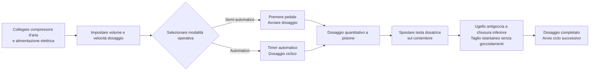

# Macchina dosatrice per pasta FF9-500


## (Riassunto essenziale)

> La FF9-500 è una macchina dosatrice semi-automatica con testa mobile per paste, prodotta dalla Wenzhou T&D Packaging Machinery Factory, adatta al dosaggio di liquidi e paste viscose nei settori alimentare, cosmetico, chimico e farmaceutico. Campo dosaggio 5–5000 ml, velocità 10–40 cicli/min, precisione ±1%, con commutazione tra modalità pedale e timer. La testa dosatrice mobile è dotata di ugello antigoccia a chiusura inferiore, le parti a contatto con il liquido sono in acciaio inossidabile alimentare 304 (316 opzionale), anelli di tenuta in silicone resistente fino a 100℃. Disponibile immediatamente, FOB Ningbo, garanzia 1 anno.

- **Nome macchina**: Macchina dosatrice per paste
- **Modello**: FF9-500

---

## I. Panoramica del prodotto

### Categoria prodotto
- Macchinari per imballaggio → Equipaggiamento per dosatura di paste/liquidi (Dosatore a pistone)
- Grado di automazione: Semi-automatico o automatico
- Tipo di azionamento: Pneumatico + elettrico (richiede compressore d'aria esterno e presa elettrica)

### Applicazioni
Adatto al dosaggio sia di liquidi che di paste viscose, ampiamente utilizzato in:
- **Alimentare e bevande**: Acqua, olio da cucina, succo, latte, yogurt, salsa, panna, pasta di peperoncino, pomodoro
- **Prodotti chimici per uso quotidiano**: Shampoo, detergente liquido, detersivo per piatti
- **Farmaceutico e cosmetico**: Creme, lozioni, unguenti, medicamenti in pasta

### Caratteristiche principali
- Campo dosaggio: 50–500 ml, velocità dosatura: 10–40 cicli/min
- Precisione dosaggio controllata entro ±1%
- Testa dosatrice singola mobile, posizionabile flessibilmente su contenitori diversi
- Due modalità operative: interruttore a pedale o timer automatico, commutabili liberamente tra semi-automatico e automatico
- Volume e velocità dosaggio regolabili
- Serbatoio grande da 30 L, riduce la frequenza di riempimento
- Controllo completamente pneumatico, azionamento pneumatico + elettrico

---

## II. Vantaggi chiave

1. **Componenti pneumatici di alta qualità Airtac**: Dotata di componenti pneumatici Airtac, azionamento ibrido pneumatico-elettrico, richiede collegamento a un compressore d’aria; funzionamento semplice con elevata precisione di dosaggio.
2. **Corpo in acciaio inossidabile di prima qualità, conforme ai requisiti di sicurezza alimentare**: Struttura in acciaio inossidabile, corpo in acciaio 201, parti a contatto con liquidi in acciaio inossidabile alimentare 304 (opzionale 316), conforme agli standard di sicurezza alimentare; parti in contatto possono essere in 304 o 316; sistema valvola in acciaio inossidabile.
3. **Testa dosatrice mobile antigoccia**: Regolazione volume e velocità dosaggio; ugello a chiusura positiva inferiore garantisce assenza di gocciolamento; testa mobile per posizionamento flessibile, diametro ugello selezionabile da 3–12 mm.
4. **Dosatura a pistone con commutazione a due modalità**: Dosatura a pistone, operabile tramite interruttore a pedale o timer automatico, commutabile in qualsiasi momento tra modalità semi-automatica e automatica.
5. **Guarnizioni resistenti ad alte temperature, di grado alimentare**: Anelli O in silicone resistenti fino a 100℃ e conformi agli standard alimentari; guarnizioni in silicone o gomma opzionali, con guarnizioni in gomma adatte a prodotti corrosivi.
6. **Multiple specifiche disponibili**: 6 diverse portate di dosaggio disponibili: 5-100ml, 10-200ml, 50-500ml, 100-1000ml, 250-2500ml, 500-5000ml.
7. **Amplia compatibilità con materiali**: Adatto a liquidi e paste come acqua, olio da cucina, succo, latte, yogurt, salsa, panna, shampoo, pasta di peperoncino, pomodoro, detersivo liquido, ecc.

---

## III. Specifiche tecniche

| Parametro | Specifica |
| --- | --- |
| Modello | FF9-500 |
| Campo dosaggio | 50–500 ml |
| Capacità serbatoio | 30 L |
| Ugello dosatore | 1 (testa dosatrice mobile) |
| Velocità dosaggio | 10–40 cicli/min |
| Precisione dosaggio | ≤1% |
| Consumo d’aria | 0,55–1,1 m³/h |
| Pressione aria | 0,4–0,6 MPa |
| Tipo di controllo | Pneumatico completo |
| Grado di automazione | Semi-automatico o automatico |
| Modalità operativa | Interruttore a pedale / Timer automatico |
| Diametro ugello | 3–12 mm (opzionale) |
| Guarnizione | Anello O in silicone (resistente a 100℃) / Guarnizione in gomma (antiruggine) |
| Peso lordo / netto | 35 / 30 kg |
| Dimensioni imballaggio | 95 × 45 × 40 + 46 × 44 × 47 cm |
| Imballo unitario | 1 macchina imballata in 2 scatole |
| Metodo imballaggio | Scatola cartonata rinforzata |
| Accessori inclusi | Strumenti, accessori |

---

## IV. Raccomandazioni commerciali e FAQ

### Raccomandazioni commerciali
- **Punti di forza principali**: Testa dosatrice mobile + azionamento ibrido pneumatico-elettrico + acciaio inossidabile alimentare + ugello antigoccia, ideale per piccole produzioni flessibili di liquidi e paste in officine alimentari, cosmetiche e chimiche.
- **Clientela target**: Piccole e medie industrie alimentari, officine di riempimento per olio da cucina/salse, produttori di creme cosmetiche, produttori di prodotti chimici per uso quotidiano, aziende di imballaggio farmaceutico.
- **Upsell / Accessori aggiuntivi**: Chiedere al cliente il volume di dosaggio richiesto per consigliare una delle 6 specifiche disponibili (da 5-100ml a 500-5000ml); consigliare acciaio 316 + guarnizioni in gomma per prodotti corrosivi o acidi; suggerire un serbatoio più grande o configurazione di nastro trasportatore automatico per esigenze di produzione elevate.

### FAQ
1. **La macchina richiede corrente elettrica?**  
   Utilizza un azionamento pneumatico + elettrico, richiedendo sia un compressore d’aria che una presa elettrica per un funzionamento stabile e sicuro.
2. **Quali materiali può dosare?**  
   Adatto a liquidi che scorrono liberamente e paste viscose come acqua, olio da cucina, succo, latte, yogurt, salsa, panna, shampoo, pasta di peperoncino, pomodoro, pasta, detersivo liquido, ecc.
3. **Qual è la precisione del dosaggio? Ci sono gocciolamenti?**  
   La precisione del dosaggio è entro ±1%. Il design dell’ugello a chiusura inferiore positiva garantisce assenza di gocciolamenti durante il dosaggio.
4. **Come si utilizza?**  
   Dosaggio semi-automatico tramite interruttore a pedale, oppure dosaggio automatico continuo tramite timer automatico, con possibilità di commutare liberamente tra le due modalità.
5. **Qual è la politica di garanzia?**  
   Garanzia di 1 anno. Riparazione o sostituzione gratuita per danni dovuti all’uso normale secondo il manuale durante il periodo di garanzia (le spese di spedizione dall’Italia al luogo di destinazione a carico del cliente). Se necessario un ingegnere sul posto, le spese di viaggio andranno a carico del cliente. Servizio di manutenzione a vita fornito oltre il periodo di garanzia.
6. **È possibile personalizzare i diametri degli ugelli o i campi di dosaggio?**  
   Sì. Le opzioni di diametro ugello vanno da 3–12 mm, e sono disponibili 6 campi di dosaggio (5-100ml, 10-200ml, 50-500ml, 100-1000ml, 250-2500ml, 500-5000ml).

### FAQ Schema (JSON-LD)

```json
{
  "@context": "https://schema.org",
  "@type": "FAQPage",
  "mainEntity": [
    {
      "@type": "Question",
      "name": "Does the machine require electricity?",
      "acceptedAnswer": {
        "@type": "Answer",
        "text": "It uses a pneumatic + electric drive, requiring both an air compressor and a power plug to be connected for stable and safe operation."
      }
    },
    {
      "@type": "Question",
      "name": "What materials can it fill?",
      "acceptedAnswer": {
        "@type": "Answer",
        "text": "Suitable for free-flowing liquids and viscous pastes such as water, cooking oil, juice, milk, yoghurt, sauce, cream, shampoo, chilli paste, tomato paste, paste, liquid detergent, etc."
      }
    },
    {
      "@type": "Question",
      "name": "How is the filling accuracy? Will it drip?",
      "acceptedAnswer": {
        "@type": "Answer",
        "text": "Filling accuracy is within ±1%. The bottom close positive shutoff nozzle design ensures zero dripping during filling."
      }
    },
    {
      "@type": "Question",
      "name": "How to operate it?",
      "acceptedAnswer": {
        "@type": "Answer",
        "text": "Semi-automatic filling via the foot pedal switch, or continuous automatic filling via the automatic timer, with free switching between the two modes."
      }
    },
    {
      "@type": "Question",
      "name": "What is the warranty policy?",
      "acceptedAnswer": {
        "@type": "Answer",
        "text": "1-year warranty. Free repair or replacement for damage caused by normal operation per the manual during the warranty period (shipping costs from China to destination borne by customer). If an on-site engineer is required, round-trip travel expenses are borne by the customer. Lifetime maintenance service is provided beyond the warranty period."
      }
    },
    {
      "@type": "Question",
      "name": "Can nozzle sizes or filling volume ranges be customized?",
      "acceptedAnswer": {
        "@type": "Answer",
        "text": "Yes. Nozzle diameter options range from 3–12 mm, and 6 filling volume ranges are available (5-100ml, 10-200ml, 50-500ml, 100-1000ml, 250-2500ml, 500-5000ml)."
      }
    }
  ]
}
```

### Condizioni di servizio post-vendita
- Garanzia di 1 anno; riparazione o sostituzione gratuita per danni da usura normale durante il periodo di garanzia (spedizione dall’Italia al sito locale a carico del cliente)
- Il cliente copre le spese di viaggio se richiesta assistenza tecnica sul posto
- Servizio di manutenzione a vita offerto oltre il periodo di garanzia

---

## V. Biblioteca media e risorse

| Tipo risorsa | Descrizione / Link |
| --- | --- |
| Video workflow | https://youtu.be/g3yXyeVzYCM |

<iframe width="560" height="315" src="https://www.youtube.com/embed/DDEElVvBufs?si=VZ1rLT1Ppw3WCY_i" title="Player video YouTube" frameborder="0" allow="accelerometer; autoplay; clipboard-write; encrypted-media; gyroscope; picture-in-picture; web-share" referrerpolicy="strict-origin-when-cross-origin" allowfullscreen></iframe>

---

## VI. Flusso di lavoro


### Richiedi un preventivo e acquista

[🛒 Clicca qui per visualizzare prezzi e acquistare nel nostro negozio ufficiale](https://cecle.net/it/products/cecle-ff9-cake-filling-machine-semi-automatic-paste-bottle-filling-machine-for-cake?_pos=1&_psq=FF9&_psid=63c927ce4&_ss=e)