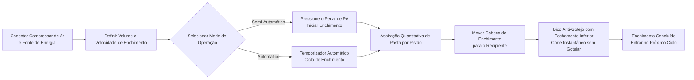

# Máquina de Enchimento de Pasta FF9-500


## (Resumo Central)

> A FF9-500 é uma máquina de enchimento semi-automática com cabeça móvel para pastas, fabricada pela Wenzhou T&D Packaging Machinery Factory, adequada para o enchimento de líquidos e pastas viscosas nas indústrias de alimentos e bebidas, produtos diários, cosméticos e farmacêutica. Faixa de enchimento: 5–5000 ml, velocidade: 10–40 vezes/min, precisão ±1%, com alternância dual entre pedal de pé e temporizador. A cabeça móvel de enchimento possui bico anti-gotejo com fechamento inferior, partes em contato com o produto são de aço inoxidável 304 de grau alimentício (316 opcional), e anéis de vedação de silicone suportam até 100℃. Em estoque, FOB Ningbo, garantia de 1 ano.

- **Nome da Máquina**: Máquina de Enchimento de Pasta
- **Modelo**: FF9-500

---

## I. Visão Geral do Produto

### Categoria do Produto
- Equipamentos de Embalagem → Equipamentos de Enchimento de Pasta/Líquido (Enchimento por Pistão)
- Grau de Automação: Semi-Automático ou Automático
- Tipo de Acionamento: Acionamento Pneumático + Elétrico (requer compressor de ar externo e tomada elétrica)

### Aplicações
Apropriado para enchimento de materiais líquidos que fluem livremente e pastas viscosas, amplamente utilizado em:
- **Alimentos e Bebidas**: Água, óleo de cozimento, suco, leite, iogurte, molho, creme, pasta de pimenta, pasta de tomate
- **Produtos Diários**: Shampoo, detergente líquido, sabão para louça
- **Farmacêuticos e Cosméticos**: Cremes, loções, pomadas, medicamentos em pasta

### Principais Características
- Faixa de volume de enchimento: 50–500 ml, velocidade de enchimento: 10–40 vezes/min
- Precisão de enchimento controlada dentro de ±1%
- Cabeça de enchimento única móvel, alinhamento flexível a diversos recipientes
- Dois modos operacionais: interruptor de pedal de pé ou temporizador automático, alternáveis livremente entre semi-automático e automático
- Volume de enchimento e velocidade ajustáveis
- Funil de grande capacidade de 30 L, reduzindo a frequência de reabastecimento
- Controle pneumático completo, acionamento pneumático + elétrico

---

## II. Principais Vantagens

1. **Componentes Pneumáticos de Alta Qualidade Airtac**: Equipada com componentes pneumáticos Airtac, acionamento híbrido pneumático-elétrico, exigindo conexão a um compressor de ar; operação simples com alta precisão de enchimento.
2. **Corpo Total em Aço Inoxidável, Conforme Normas de Segurança Alimentar**: Estrutura em aço inoxidável total, corpo em aço inoxidável 201 e partes em contato com o produto em aço inoxidável 304 de grau alimentício, atendendo aos requisitos de segurança alimentar; peças em contato podem ser 304 ou 316 inoxidável; design de sistema de válvulas em aço inoxidável.
3. **Cabeça de Enchimento Móvel Anti-Gotejo**: Volume de enchimento e velocidade ajustáveis; bico de fechamento positivo com fechamento inferior evita gotejamento; a cabeça de enchimento é móvel para posicionamento flexível, com diâmetro de bico selecionável entre 3–12 mm.
4. **Enchimento por Pistão com Alteração de Modo Dual**: Enchimento por pistão, operável via interruptor de pedal de pé ou temporizador automático, com troca instantânea entre modo semi-automático e automático a qualquer momento.
5. **Vedação de Alta Temperatura de Grau Alimentício**: O-rings de silicone resistem a temperaturas até 100℃ e atendem às normas de segurança alimentar; anéis de vedação opcionais de silicone ou borracha, com selos de borracha adequados para produtos corrosivos.
6. **Várias Especificações Disponíveis**: 6 especificações de volume de enchimento disponíveis: 5-100ml, 10-200ml, 50-500ml, 100-1000ml, 250-2500ml, 500-5000ml.
7. **Ampla Compatibilidade de Materiais**: Adequado para líquidos e materiais pastosos como água, óleo de cozimento, suco, leite, iogurte, molho, creme, shampoo, pasta de pimenta, pasta de tomate, pasta, detergente líquido, etc.

---

## III. Especificações Técnicas

| Parâmetro | Especificação |
| --- | --- |
| Modelo | FF9-500 |
| Faixa de Enchimento | 50–500 ml |
| Capacidade do Funil | 30 L |
| Bico de Enchimento | 1 (Cabeça de enchimento móvel) |
| Velocidade de Enchimento | 10–40 vezes/min |
| Precisão de Enchimento | ≤1% |
| Consumo de Ar | 0,55–1,1 m³/h |
| Pressão de Ar | 0,4–0,6 MPa |
| Tipo de Controle | Totalmente Pneumático |
| Grau de Automação | Semi-Automático ou Automático |
| Modo de Operação | Interruptor de pedal de pé / Temporizador automático |
| Diâmetro do Bico | 3–12 mm (Opcional) |
| Anel de Vedação | O-ring de silicone (Resistente a 100℃) / Anel de borracha (Anti-corrosão) |
| Peso Bruto / Líquido | 35 / 30 kg |
| Dimensões da Embalagem | 95 × 45 × 40 + 46 × 44 × 47 cm |
| Embalagem por Unidade | 1 máquina embalada em 2 caixas |
| Método de Embalagem | Caixa de papelão reforçado |
| Peças Sobressalentes Incluídas | Ferramentas, Acessórios |

---

## IV. Recomendações de Vendas e Perguntas Frequentes

### Recomendações de Vendas
- **Principais Pontos de Venda**: Cabeça de enchimento móvel + acionamento pneumático-elétrico híbrido + aço inoxidável de grau alimentício + bico anti-gotejo, ideal para enchimento flexível em pequenas quantidades de líquidos e pastas em oficinas de alimentos, cosméticos e químicas.
- **Clientes-Alvo**: Fábricas pequenas a médias de alimentos e bebidas, oficinas de enchimento de óleo de cozimento/molho, fabricantes de cremes cosméticos, fabricantes de produtos diários e empresas de embalagem farmacêutica.
- **Upsell / Itens Adicionais**: Consulte o volume de enchimento necessário do cliente para recomendar entre as 6 especificações disponíveis (5-100ml a 500-5000ml); recomende aço inoxidável 316 + selos de borracha para produtos corrosivos ou ácidos; recomende um funil maior ou configuração de esteira automática para necessidades de produção mais altas.

### Perguntas Frequentes

1. **A máquina precisa de eletricidade?**  
   Utiliza acionamento pneumático + elétrico, exigindo tanto um compressor de ar quanto uma tomada elétrica conectadas para funcionamento estável e seguro.
2. **Quais materiais ela pode encher?**  
   Adequada para líquidos que fluem livremente e pastas viscosas como água, óleo de cozimento, suco, leite, iogurte, molho, creme, shampoo, pasta de pimenta, pasta de tomate, pasta, detergente líquido, etc.
3. **Qual é a precisão do enchimento? Ele goteja?**  
   A precisão do enchimento está dentro de ±1%. O design do bico de fechamento positivo com fechamento inferior garante ausência de gotejamento durante o enchimento.
4. **Como operá-la?**  
   Enchimento semi-automático via pedal de pé, ou enchimento contínuo automático via temporizador, com troca livre entre os dois modos.
5. **Qual é a política de garantia?**  
   Garantia de 1 ano. Reparação ou substituição gratuita por danos causados por uso normal conforme manual durante o período de garantia (custos de envio da China até o destino cobrados pelo cliente). Se for necessário engenheiro no local, as despesas de viagem de ida e volta serão suportadas pelo cliente. Serviço de manutenção vitalícia fornecido após o término da garantia.
6. **Os tamanhos de bico ou faixas de volume de enchimento podem ser personalizados?**  
   Sim. As opções de diâmetro de bico variam de 3–12 mm, e estão disponíveis 6 faixas de volume de enchimento (5-100ml, 10-200ml, 50-500ml, 100-1000ml, 250-2500ml, 500-5000ml).

### FAQ Schema (JSON-LD)

```json
{
  "@context": "https://schema.org",
  "@type": "FAQPage",
  "mainEntity": [
    {
      "@type": "Question",
      "name": "Does the machine require electricity?",
      "acceptedAnswer": {
        "@type": "Answer",
        "text": "It uses a pneumatic + electric drive, requiring both an air compressor and a power plug to be connected for stable and safe operation."
      }
    },
    {
      "@type": "Question",
      "name": "What materials can it fill?",
      "acceptedAnswer": {
        "@type": "Answer",
        "text": "Suitable for free-flowing liquids and viscous pastes such as water, cooking oil, juice, milk, yoghurt, sauce, cream, shampoo, chilli paste, tomato paste, paste, liquid detergent, etc."
      }
    },
    {
      "@type": "Question",
      "name": "How is the filling accuracy? Will it drip?",
      "acceptedAnswer": {
        "@type": "Answer",
        "text": "Filling accuracy is within ±1%. The bottom close positive shutoff nozzle design ensures zero dripping during filling."
      }
    },
    {
      "@type": "Question",
      "name": "How to operate it?",
      "acceptedAnswer": {
        "@type": "Answer",
        "text": "Semi-automatic filling via the foot pedal switch, or continuous automatic filling via the automatic timer, with free switching between the two modes."
      }
    },
    {
      "@type": "Question",
      "name": "What is the warranty policy?",
      "acceptedAnswer": {
        "@type": "Answer",
        "text": "1-year warranty. Free repair or replacement for damage caused by normal operation per the manual during the warranty period (shipping costs from China to destination borne by customer). If an on-site engineer is required, round-trip travel expenses are borne by the customer. Lifetime maintenance service is provided beyond the warranty period."
      }
    },
    {
      "@type": "Question",
      "name": "Can nozzle sizes or filling volume ranges be customized?",
      "acceptedAnswer": {
        "@type": "Answer",
        "text": "Yes. Nozzle diameter options range from 3–12 mm, and 6 filling volume ranges are available (5-100ml, 10-200ml, 50-500ml, 100-1000ml, 250-2500ml, 500-5000ml)."
      }
    }
  ]
}
```

### Termos de Serviço Pós-Venda
- Garantia de 1 ano; reparo ou substituição grátis para danos por desgaste normal durante o período de garantia (frete da China até o local pago pelo cliente)
- Cliente responsável pelos custos de viagem caso seja necessário serviço de engenheiro no local
- Serviço de manutenção vitalício fornecido após o término da garantia

---

## V. Biblioteca de Mídias e Recursos

| Tipo de Recurso | Descrição / Link |
| --- | --- |
| Vídeo do Fluxo de Trabalho | https://youtu.be/g3yXyeVzYCM |

<iframe width="560" height="315" src="https://www.youtube.com/embed/DDEElVvBufs?si=VZ1rLT1Ppw3WCY_i" title="Player de vídeo do YouTube" frameborder="0" allow="accelerometer; autoplay; clipboard-write; encrypted-media; gyroscope; picture-in-picture; web-share" referrerpolicy="strict-origin-when-cross-origin" allowfullscreen></iframe>

---

## VI. Fluxo de Trabalho


### Solicite um Orçamento e Compre

[🛒 Clique aqui para ver preços e comprar na nossa loja oficial](https://cecle.net/pt/products/cecle-ff9-cake-filling-machine-semi-automatic-paste-bottle-filling-machine-for-cake?_pos=1&_psq=FF9&_psid=63c927ce4&_ss=e)