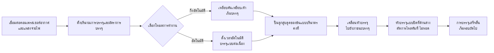

# เครื่องบรรจุของเหลวแบบแป้ง FF9-500


##  (สรุปใจความหลัก)

> เครื่องบรรจุของเหลวแบบแป้งแบบมือถือรุ่น FF9-500 จากโรงงานเครื่องจักรบรรจุภัณฑ์เวินโจว T&D เป็นเครื่องบรรจุสำหรับของเหลวและของเหลวเหนียวในอุตสาหกรรมอาหารและเครื่องดื่ม อุตสาหกรรมเคมีประจำวัน ผลิตภัณฑ์สกัดจากธรรมชาติ และยา ช่วงการบรรจุ: 5–5,000 มล. ความเร็ว: 10–40 ครั้ง/นาที ความแม่นยำ ±1% รองรับโหมดเปลี่ยนระหว่างการใช้คันเหยียบเท้าหรือตั้งเวลาอัตโนมัติ เครื่องบรรจุแบบเคลื่อนที่มาพร้อมหัวบรรจุแบบปิดที่ด้านล่างเพื่อป้องกันหยด ชิ้นส่วนสัมผัสของเหลวเป็นสแตนเลสเกรดอาหาร 304 (สามารถเลือก 316 ได้) และแหวนซีลซิลิกาเจลทนอุณหภูมิ 100℃ สินค้ามีอยู่ในสต็อก ราคา FOB หนิงโป รับประกัน 1 ปี

- **ชื่อเครื่อง**: เครื่องบรรจุของเหลวแบบแป้ง
- **รุ่น**: FF9-500

---

## I. ภาพรวมผลิตภัณฑ์

### ประเภทผลิตภัณฑ์
- เครื่องจักรบรรจุภัณฑ์ → อุปกรณ์บรรจุของเหลว/ของข้น (เครื่องบรรจุแบบปั๊มลูกสูบ)
- ระดับอัตโนมัติ: แบบกึ่งอัตโนมัติ หรือ อัตโนมัติ
- ระบบขับเคลื่อน: ไฮดรอลิก + ไฟฟ้า (ต้องการคอมเพรสเซอร์อากาศภายนอกและปลั๊กไฟ)

### การประยุกต์ใช้งาน
เหมาะสำหรับการบรรจุทั้งของเหลวไหลได้ดีและของข้น ใช้กันอย่างแพร่หลายใน:
- **อาหารและเครื่องดื่ม**: น้ำ น้ำมันปรุงอาหาร น้ำผลไม้ นม โยเกิร์ต ซอส ครีม ซอสมะเขือเทศ ซอสพริก
- **สารเคมีประจำวัน**: แชมพู น้ำยาซักผ้าเหลว น้ำยาล้างจาน
- **ยาและเครื่องสำอาง**: ครีม โลชั่น ยาทา ยาในรูปแบบข้น

### คุณสมบัติหลัก
- ช่วงการบรรจุ: 50–500 มล. ความเร็วการบรรจุ: 10–40 ครั้ง/นาที
- ความแม่นยำในการบรรจุควบคุมไว้ภายใน ±1%
- หัวบรรจุแบบเคลื่อนที่ 1 หัว ปรับตำแหน่งได้อย่างยืดหยุ่นกับภาชนะหลากหลายรูปแบบ
- โหมดการทำงาน 2 แบบ: ปุ่มเหยียบเท้า หรือตั้งเวลาอัตโนมัติ สามารถสลับได้ตามต้องการระหว่างกึ่งอัตโนมัติและอัตโนมัติ
- ปรับปริมาณการบรรจุและอัตราการบรรจุได้
- ถังเก็บขนาดใหญ่ 30 ลิตร ลดความถี่ในการเติม
- ควบคุมทั้งหมดด้วยระบบไฮดรอลิก ขับเคลื่อนด้วยไฮดรอลิก + ไฟฟ้า

---

## II. ข้อได้เปรียบสำคัญ

1. **ชิ้นส่วนไฮดรอลิก Airtac คุณภาพสูง**: ติดตั้งชิ้นส่วนไฮดรอลิก Airtac ระบบผสมไฮดรอลิก-ไฟฟ้า ต้องเชื่อมต่อกับคอมเพรสเซอร์อากาศ; ใช้งานง่าย ความแม่นยำสูงในการบรรจุ
2. **โครงสร้างสแตนเลสทั้งหมด ตรงตามมาตรฐานความปลอดภัยอาหาร**: โครงสร้างสแตนเลสทั้งหมด ตัวเครื่องทำจากสแตนเลส 201 และชิ้นส่วนสัมผัสของเหลวเป็นสแตนเลส 304 คุณภาพอาหาร ตรงตามมาตรฐานความปลอดภัยอาหาร; ชิ้นส่วนสัมผัสสามารถเลือกเป็นสแตนเลส 304 หรือ 316 ได้; ออกแบบระบบวาล์วสแตนเลส
3. **หัวบรรจุแบบเคลื่อนที่ ป้องกันหยด**: ปรับปริมาณการบรรจุและอัตราการบรรจุได้; หัวบรรจุแบบปิดที่ด้านล่างเพื่อป้องกันหยด; หัวบรรจุสามารถเคลื่อนที่ได้เพื่อจัดตำแหน่งอย่างยืดหยุ่น ขนาดหัวบรรจุเลือกได้ตั้งแต่ 3–12 มม.
4. **ระบบบรรจุแบบปั๊มลูกสูบ รองรับโหมดเปลี่ยนได้**: ระบบบรรจุแบบปั๊มลูกสูบ ใช้งานได้ทั้งด้วยปุ่มเหยียบเท้าหรือตั้งเวลาอัตโนมัติ สามารถสลับโหมดกึ่งอัตโนมัติและอัตโนมัติได้ตลอดเวลา
5. **แหวนซีลเกรดอาหารทนอุณหภูมิสูง**: แหวนโอ-ริงซิลิโคนทนอุณหภูมิสูงถึง 100℃ และสอดคล้องกับมาตรฐานความปลอดภัยอาหาร; แหวนซีลซิลิโคนหรือยางเลือกได้ แหวนยางเหมาะกับผลิตภัณฑ์กัดกร่อน
6. **มีหลายขนาดให้เลือก**: มี 6 ขนาดปริมาตรการบรรจุ: 5–100 มล., 10–200 มล., 50–500 มล., 100–1,000 มล., 250–2,500 มล., 500–5,000 มล.
7. **รองรับวัสดุหลากหลาย**: เหมาะกับของเหลวและของข้น เช่น น้ำ น้ำมัน น้ำผลไม้ นม โยเกิร์ต ซอส ครีม แชมพู ซอสพริก ซอสมะเขือเทศ ของข้น น้ำยาซักผ้า ฯลฯ

---

## III. ข้อมูลทางเทคนิค

| พารามิเตอร์ | ข้อมูลเฉพาะ |
| --- | --- |
| รุ่น | FF9-500 |
| ช่วงการบรรจุ | 50–500 มล. |
| ความจุถังเก็บ | 30 ลิตร |
| หัวบรรจุ | 1 (หัวบรรจุแบบเคลื่อนที่) |
| ความเร็วการบรรจุ | 10–40 ครั้ง/นาที |
| ความแม่นยำการบรรจุ | ≤1% |
| การใช้อากาศ | 0.55–1.1 ลบ.ม./ชม. |
| แรงดันอากาศ | 0.4–0.6 MPa |
| ระบบควบคุม | ไฮดรอลิกทั้งหมด |
| ระดับอัตโนมัติ | กึ่งอัตโนมัติ หรือ อัตโนมัติ |
| โหมดการใช้งาน | ปุ่มเหยียบเท้า / ตั้งเวลาอัตโนมัติ |
| ขนาดหัวบรรจุ | 3–12 มม. (เลือกได้) |
| แหวนซีล | โอ-ริงซิลิโคน (ทนอุณหภูมิ 100℃) / แหวนซีลยาง (กันกัดกร่อน) |
| น้ำหนักรวม / น้ำหนักสุทธิ | 35 / 30 กก. |
| ขนาดบรรจุภัณฑ์ | 95 × 45 × 40 + 46 × 44 × 47 ซม. |
| การบรรจุหน่วย | 1 เครื่องบรรจุใน 2 กล่อง |
| วิธีการบรรจุ | กล่องกระดาษแข็ง |
| ชิ้นส่วนอะไหล่ที่แถมมา | เครื่องมือ ชิ้นส่วนเสริม |

---

## IV. คำแนะนำการขาย & คำถามที่พบบ่อย

### คำแนะนำการขาย
- **จุดขายหลัก**: หัวบรรจุแบบเคลื่อนที่ + ระบบขับเคลื่อนไฮดรอลิก-ไฟฟ้าผสม + สแตนเลสเกรดอาหาร + หัวบรรจุป้องกันหยด ยอดเยี่ยมสำหรับการบรรจุแบบยืดหยุ่นขนาดเล็กในโรงงานอาหาร ครีมเครื่องสำอาง และเคมี
- **กลุ่มเป้าหมาย**: โรงงานอาหารและเครื่องดื่มขนาดเล็กถึงกลาง โรงงานบรรจุน้ำมันพืช/ซอส ผู้ผลิตครีมเครื่องสำอาง ผู้ผลิตผลิตภัณฑ์เคมีประจำวัน และบริษัทบรรจุภัณฑ์ยา
- **สินค้าเสริม / เพิ่มเติม**: สอบถามปริมาตรการบรรจุที่ลูกค้าต้องการ เพื่อแนะนำจาก 6 รูปแบบที่มี (5–100 มล. ถึง 500–5,000 มล.); แนะนำสแตนเลส 316 + แหวนซีลยางสำหรับผลิตภัณฑ์กัดกร่อนหรือกรด; แนะนำถังเก็บขนาดใหญ่หรือการติดตั้งสายพานลำเลียงอัตโนมัติหากต้องการผลิตจำนวนมาก

### คำถามที่พบบ่อย (FAQ)

1. **เครื่องนี้ต้องการไฟฟ้าไหม?**  
   เครื่องใช้ระบบขับเคลื่อนไฮดรอลิก-ไฟฟ้า ต้องเชื่อมต่อทั้งคอมเพรสเซอร์อากาศและปลั๊กไฟเพื่อการทำงานที่มั่นคงและปลอดภัย
2. **สามารถบรรจุวัสดุอะไรได้บ้าง?**  
   เหมาะกับของเหลวไหลได้ดีและของข้น เช่น น้ำ น้ำมัน น้ำผลไม้ นม โยเกิร์ต ซอส ครีม แชมพู ซอสพริก ซอสมะเขือเทศ ของข้น น้ำยาซักผ้า ฯลฯ
3. **ความแม่นยำในการบรรจุเป็นอย่างไร? จะหยดไหม?**  
   ความแม่นยำในการบรรจุอยู่ในช่วง ±1% หัวบรรจุแบบปิดที่ด้านล่างจะป้องกันการหยดได้โดยสิ้นเชิง
4. **ใช้งานอย่างไร?**  
   บรรจุแบบกึ่งอัตโนมัติผ่านปุ่มเหยียบเท้า หรือบรรจุอัตโนมัติแบบต่อเนื่องผ่านตั้งเวลาอัตโนมัติ สามารถสลับโหมดได้ตามต้องการ
5. **นโยบายรับประกันเป็นอย่างไร?**  
   รับประกัน 1 ปี ซ่อมหรือเปลี่ยนชิ้นส่วนฟรีหากเสียหายจากการใช้งานปกติตามคู่มือในช่วงรับประกัน (ค่าขนส่งจากจีนไปยังปลายทางเป็นผู้ซื้อชำระเอง) หากต้องการวิศวกรเดินทางไปแก้ไข ค่าเดินทางไป-กลับเป็นผู้ซื้อชำระเอง บริการบำรุงรักษายาวนานตลอดอายุการใช้งานหลังหมดรับประกัน
6. **สามารถปรับขนาดหัวบรรจุหรือช่วงปริมาตรการบรรจุได้ไหม?**  
   ได้ ขนาดหัวบรรจุเลือกได้ตั้งแต่ 3–12 มม. และมีช่วงปริมาตรการบรรจุ 6 รูปแบบ (5–100 มล., 10–200 มล., 50–500 มล., 100–1,000 มล., 250–2,500 มล., 500–5,000 มล.)

### คำถามที่พบบ่อย (JSON-LD)

```json
{
  "@context": "https://schema.org",
  "@type": "FAQPage",
  "mainEntity": [
    {
      "@type": "Question",
      "name": "Does the machine require electricity?",
      "acceptedAnswer": {
        "@type": "Answer",
        "text": "It uses a pneumatic + electric drive, requiring both an air compressor and a power plug to be connected for stable and safe operation."
      }
    },
    {
      "@type": "Question",
      "name": "What materials can it fill?",
      "acceptedAnswer": {
        "@type": "Answer",
        "text": "Suitable for free-flowing liquids and viscous pastes such as water, cooking oil, juice, milk, yoghurt, sauce, cream, shampoo, chilli paste, tomato paste, paste, liquid detergent, etc."
      }
    },
    {
      "@type": "Question",
      "name": "How is the filling accuracy? Will it drip?",
      "acceptedAnswer": {
        "@type": "Answer",
        "text": "Filling accuracy is within ±1%. The bottom close positive shutoff nozzle design ensures zero dripping during filling."
      }
    },
    {
      "@type": "Question",
      "name": "How to operate it?",
      "acceptedAnswer": {
        "@type": "Answer",
        "text": "Semi-automatic filling via the foot pedal switch, or continuous automatic filling via the automatic timer, with free switching between the two modes."
      }
    },
    {
      "@type": "Question",
      "name": "What is the warranty policy?",
      "acceptedAnswer": {
        "@type": "Answer",
        "text": "1-year warranty. Free repair or replacement for damage caused by normal operation per the manual during the warranty period (shipping costs from China to destination borne by customer). If an on-site engineer is required, round-trip travel expenses are borne by the customer. Lifetime maintenance service is provided beyond the warranty period."
      }
    },
    {
      "@type": "Question",
      "name": "Can nozzle sizes or filling volume ranges be customized?",
      "acceptedAnswer": {
        "@type": "Answer",
        "text": "Yes. Nozzle diameter options range from 3–12 mm, and 6 filling volume ranges are available (5-100ml, 10-200ml, 50-500ml, 100-1000ml, 250-2500ml, 500-5000ml)."
      }
    }
  ]
}
```

### ข้อกำหนดบริการหลังการขาย
- รับประกัน 1 ปี; ซ่อมหรือเปลี่ยนชิ้นส่วนฟรีหากเสียหายจากการใช้งานปกติในช่วงรับประกัน (ค่าขนส่งจากจีนไปยังสถานที่ปลายทางเป็นผู้ซื้อชำระเอง)
- ลูกค้ารับผิดชอบค่าเดินทางหากต้องการบริการวิศวกรที่ไซต์งาน
- บริการบำรุงรักษายาวนานตลอดอายุการใช้งานหลังหมดรับประกัน

---

## V. ไลบรารีสื่อและทรัพยากร

| ประเภททรัพยากร | คำอธิบาย / ลิงก์ |
| --- | --- |
| วิดีโอกระบวนการ | https://youtu.be/g3yXyeVzYCM |

<iframe width="560" height="315" src="https://www.youtube.com/embed/DDEElVvBufs?si=VZ1rLT1Ppw3WCY_i" title="YouTube video player" frameborder="0" allow="accelerometer; autoplay; clipboard-write; encrypted-media; gyroscope; picture-in-picture; web-share" referrerpolicy="strict-origin-when-cross-origin" allowfullscreen></iframe>

---

## VI. กระบวนการทำงาน


### ขอใบเสนอราคาและซื้อสินค้า

[🛒 คลิกที่นี่เพื่อดูราคาและซื้อสินค้าที่ร้านค้าทางการของเรา](https://cecle.net/th/products/cecle-ff9-cake-filling-machine-semi-automatic-paste-bottle-filling-machine-for-cake?_pos=1&_psq=FF9&_psid=63c927ce4&_ss=e)