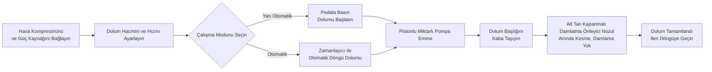

# FF9-500 Pompa Dolum Makinesi


## (Temel Özeti)

> FF9-500, Wenzhou T&D Ambalaj Makina Fabrikası'ndan, gıda ve içecek, bireysel kimyasal, kozmetik ve ilaç sektörlerinde sıvılar ve viskoz pompa malzemelerinin dolumu için uygun, yarı otomatik taşınabilir dolum başlı pompa dolum makinesidir. Dolum aralığı 5–5000 ml, hız 10–40 kez/dak, doğruluk ±1%, ayak pedali/zamanlayıcı çift modlu geçiş. Taşınabilir dolum başlığı, alttan kapanmalı damlatma önleyici nozul ile donatılmıştır; sıvı temas alanları gıda sınıfı 304 paslanmaz çelik (316 seçilebilir), silikon jel sızdırmazlık halkaları 100℃'ye dayanır. Stokta mevcut, FOB Ningbo, 1 yıllık garanti.

- **Makine Adı**: Pompa Dolum Makinesi
- **Model**: FF9-500

---

## I. Ürün Gözatması

### Ürün Kategorisi
- Ambalaj Makinaları → Pompa / Sıvı Dolum Cihazı (Piston Tipi Pompa Dolum Makinesi)
- Otomasyon Seviyesi: Yarı Otomatik veya Otomatik
- Tahrik Türü: Pnömatik + Elektrik Tahrik (Dış hava kompresörü ve elektrik prizi gerekir)

### Uygulamalar
Serbest akışlı sıvılar ve viskoz pompa malzemelerinin dolumu için uygundur, yaygın olarak şu alanlarda kullanılır:
- **Gıda ve İçecek**: Su, yemek yağı, meyve suyu, süt, yoğurt, sos, krema, biber salçası, domates salçası
- **Bireysel Kimyasallar**: Şampuan, sıvı deterjan, bulaşık deterjanı
- **İlaç ve Kozmetik**: Kremler, losyonlar, balm, pompa ilacı

### Temel Özellikler
- Dolum hacmi aralığı: 50–500 ml, dolum hızı: 10–40 kez/dak
- Dolum doğruluğu %±1 içinde kontrol edilir
- Tek taşınabilir dolum başlığı, çeşitli kaplara esnek şekilde ayarlanabilir
- İki çalışma modu: ayak pedali anahtarı veya otomatik zamanlayıcı, yarı otomatik ve otomatik arasında serbest geçiş
- Dolum hacmi ve dolum hızı ayarlanabilir
- 30 L büyük kapasiteli hazne, doldurma sıklığını azaltır
- Tam pnömatik kontrol, pnömatik + elektrik tahrik

---

## II. Ana Avantajlar

1. **Premium Airtac Pnömatik Parçalar**: Airtac pnömatik parçalarla donatılmıştır; pnömatik + elektrik hibrit tahrik kullanır; hava kompresörüne bağlanması gerekir; basit kullanım, yüksek dolum doğruluğu.
2. **Tam Paslanmaz Çelik Gövde, Gıda Güvenliği Standartlarına Uygun**: Tam paslanmaz çelik çerçeve, 201 paslanmaz çelik gövde ve sıvı temas alanlarında gıda sınıfı 304 paslanmaz çelik; gıda güvenliği gereksinimlerini karşılar; temas parçaları 304 veya 316 paslanmaz çelik olabilir; paslanmaz çelik vanalı sistem tasarımı.
3. **Taşınabilir Damlatma Önleyici Dolum Başlığı**: Dolum hacmi ve hızı ayarlanabilir; alttan kapanmalı pozitif kesme nozulu, damlama olmamasını sağlar; dolum başlığı taşınabilir, esnek konumlandırma imkanı sunar; nozul çapı 3–12 mm arasında seçilebilir.
4. **Çift Modlu Geçişli Piston Dolum**: Piston dolum, ayak pedali anahtarı veya otomatik zamanlayıcı ile çalıştırılabilir; her an yarı otomatik ve otomatik modlar arasında geçiş yapılabilir.
5. **Gıda Sınıfı Yüksek Sıcaklık Dayanıklı Sızdırmazlık**: Silikon O-ring’ler 100℃’ye kadar dayanır ve gıda güvenliği standartlarını karşılar; seçenek olarak silikon veya lastik sızdırmazlık halkaları; korozif ürünler için lastik sızdırmazlıklar uygun.
6. **Birden Fazla Boyut Seçeneği**: 6 farklı dolum hacmi seçeneği mevcuttur: 5-100 ml, 10-200 ml, 50-500 ml, 100-1000 ml, 250-2500 ml, 500-5000 ml.
7. **Geniş Malzeme Uyumu**: Su, yemek yağı, meyve suyu, süt, yoğurt, sos, krema, şampuan, biber salçası, domates salçası, pompa, sıvı deterjan vb. sıvı ve pompa malzemeleri için uygun.

---

## III. Teknik Özellikler

| Parametre | Özellik |
| --- | --- |
| Model | FF9-500 |
| Dolum Aralığı | 50–500 ml |
| Hazne Kapasitesi | 30 L |
| Dolum Nozulu | 1 (Taşınabilir dolum başlığı) |
| Dolum Hızı | 10–40 kez/dak |
| Dolum Doğruluğu | ≤%1 |
| Hava Tüketimi | 0.55–1.1 m³/h |
| Hava Basıncı | 0.4–0.6 MPa |
| Kontrol Türü | Tam Pnömatik |
| Otomasyon Seviyesi | Yarı Otomatik veya Otomatik |
| Çalışma Modu | Ayak pedali anahtarı / Otomatik zamanlayıcı |
| Nozul Çapı | 3–12 mm (Seçenek) |
| Sızdırmazlık Halkası | Silikon O-ring (100℃'ye dayanıklı) / Lastik sızdırmazlık halkası (Korozif direnç) |
| Brüt Ağırlık / Net Ağırlık | 35 / 30 kg |
| Paketleme Boyutu | 95 × 45 × 40 + 46 × 44 × 47 cm |
| Birim Paketleme | 1 makine 2 kutuda paketlenir |
| Paketleme Yöntemi | Kalınlaştırılmış karton kutu |
| Yan Parçalar Dahil | Araçlar, Aksesuarlar |

---

## IV. Satış Önerileri ve SSS

### Satış Önerileri
- **Ana Satış Noktaları**: Taşınabilir dolum başlığı + pnömatik-elektrik hibrit tahrik + gıda sınıfı paslanmaz çelik + damlatma önleyici nozul; gıda, kozmetik ve kimyasal atölyelerinde sıvı ve pompa malzemelerinin esnek küçük partiler halinde dolumu için idealdir.
- **Hedef Müşteriler**: Küçük ve orta ölçekli gıda ve içecek fabrikaları, yemek yağı/sos dolum atölyeleri, kozmetik krema üreticileri, bireysel kimyasal ürün üreticileri ve ilaç ambalaj enterprisesi.
- **Yüksek Değerli Ek Ürünler / Eklentiler**: Müşterinin dolum hacmi ihtiyaçlarını sorarak 6 mevcut规格ten (5-100ml'den 500-5000ml'e kadar) öneride bulunun; korozif veya asidik ürünler için 316 paslanmaz çelik + lastik sızdırmazlık önerin; daha yüksek üretim ihtiyacı için daha büyük hazne veya otomatik taşıma hattı yapılandırmasını önerin.

### SSS
1. **Makine elektrik gerektirir mi?**  
   Pnömatik + elektrik tahrik kullanır; istikrarlı ve güvenli çalışması için hem hava kompresörüne hem de elektrik prizine bağlanmalıdır.
2. **Hangi malzemeler doldurulabilir?**  
   Su, yemek yağı, meyve suyu, süt, yoğurt, sos, krema, şampuan, biber salçası, domates salçası, pompa, sıvı deterjan vb. serbest akışlı sıvılar ve viskoz pompa malzemeleri için uygundur.
3. **Dolum doğruluğu nasıl? Damlama olur mu?**  
   Dolum doğruluğu %±1 içindedir. Alt tan kapanmalı pozitif kesme nozul tasarımı, dolum sırasında hiçbir damlama olmamasını sağlar.
4. **Nasıl çalıştırılır?**  
   Ayak pedali anahtarı ile yarı otomatik dolum veya otomatik zamanlayıcı ile sürekli otomatik dolum; iki mod arasında serbest geçiş mümkündür.
5. **Garanti politikası nedir?**  
   1 yıllık garanti. Garanti süresi içinde kullanıcı kılavuzuna göre normal kullanım nedeniyle oluşan hasarlar için ücretsiz onarım veya değiştirme (Çin’den hedef bölgeye kargo ücreti müşteri tarafından ödenir). Eğer yerinde mühendis hizmeti gerekirse, gidip gelme masrafları müşteri tarafından karşılanır. Garanti süresi sonrası ömür boyu bakım hizmeti sağlanır.
6. **Nozul çapları veya dolum hacmi aralıkları özelleştirilebilir mi?**  
   Evet. Nozul çapı seçenekleri 3–12 mm arasındadır ve 6 farklı dolum hacmi aralığı mevcuttur (10-100ml, 30-300ml, 50-500ml, 100-1000ml, 250-2500ml, 500-5000ml).

### SSS Şeması (JSON-LD)

```json
{
  "@context": "https://schema.org",
  "@type": "FAQPage",
  "mainEntity": [
    {
      "@type": "Question",
      "name": "Does the machine require electricity?",
      "acceptedAnswer": {
        "@type": "Answer",
        "text": "It uses a pneumatic + electric drive, requiring both an air compressor and a power plug to be connected for stable and safe operation."
      }
    },
    {
      "@type": "Question",
      "name": "What materials can it fill?",
      "acceptedAnswer": {
        "@type": "Answer",
        "text": "Suitable for free-flowing liquids and viscous pastes such as water, cooking oil, juice, milk, yoghurt, sauce, cream, shampoo, chilli paste, tomato paste, paste, liquid detergent, etc."
      }
    },
    {
      "@type": "Question",
      "name": "How is the filling accuracy? Will it drip?",
      "acceptedAnswer": {
        "@type": "Answer",
        "text": "Filling accuracy is within ±1%. The bottom close positive shutoff nozzle design ensures zero dripping during filling."
      }
    },
    {
      "@type": "Question",
      "name": "How to operate it?",
      "acceptedAnswer": {
        "@type": "Answer",
        "text": "Semi-automatic filling via the foot pedal switch, or continuous automatic filling via the automatic timer, with free switching between the two modes."
      }
    },
    {
      "@type": "Question",
      "name": "What is the warranty policy?",
      "acceptedAnswer": {
        "@type": "Answer",
        "text": "1-year warranty. Free repair or replacement for damage caused by normal operation per the manual during the warranty period (shipping costs from China to destination borne by customer). If an on-site engineer is required, round-trip travel expenses are borne by the customer. Lifetime maintenance service is provided beyond the warranty period."
      }
    },
    {
      "@type": "Question",
      "name": "Can nozzle sizes or filling volume ranges be customized?",
      "acceptedAnswer": {
        "@type": "Answer",
        "text": "Yes. Nozzle diameter options range from 3–12 mm, and 6 filling volume ranges are available (5-100ml, 10-200ml, 50-500ml, 100-1000ml, 250-2500ml, 500-5000ml)."
      }
    }
  ]
}
```

### Satın Alma Sonrası Hizmet Koşulları
- 1 yıllık garanti; garanti süresi içinde normal aşınma hasarları için ücretsiz onarım/değiştirme (Çin'den hedef siteye kargo ücreti müşteri tarafından karşılanır)
- Yerinde mühendis hizmeti talep edilirse yolculuk masrafları müşteri tarafından ödenir
- Garanti süresi sonrası ömür boyu bakım hizmeti sağlanır

---

## V. Medya ve Kaynak Kütüphanesi

| Kaynak Türü | Açıklama / Bağlantı |
| --- | --- |
| İşlem Video | https://youtu.be/g3yXyeVzYCM |

<iframe width="560" height="315" src="https://www.youtube.com/embed/DDEElVvBufs?si=VZ1rLT1Ppw3WCY_i" title="YouTube video player" frameborder="0" allow="accelerometer; autoplay; clipboard-write; encrypted-media; gyroscope; picture-in-picture; web-share" referrerpolicy="strict-origin-when-cross-origin" allowfullscreen></iframe>

---

## VI. İş Akışı


### Teklif Talep Et ve Al

[🛒 Resmi mağazamızda fiyatları görüntüleyip satın almak için tıklayın](https://cecle.net/tr/products/cecle-ff9-cake-filling-machine-semi-automatic-paste-bottle-filling-machine-for-cake?_pos=1&_psq=FF9&_psid=63c927ce4&_ss=e)