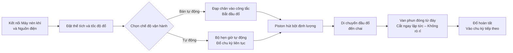

# Máy Đổ Bột FF9-500


## (Tóm tắt chính)

> FF9-500 là máy đổ bột bán tự động có đầu đổ di động đến từ Nhà máy Máy móc đóng gói Wenzhou T&D, phù hợp để đổ các chất lỏng và dạng bột đặc trong ngành thực phẩm & đồ uống, hóa mỹ phẩm hàng ngày, mỹ phẩm và dược phẩm. Phạm vi đổ: 5–5000 ml, tốc độ: 10–40 lần/phút, độ chính xác ±1%, chuyển đổi hai chế độ foot pedal/timer. Đầu đổ di động được trang bị van chống rò rỉ ở đáy, các bộ phận tiếp xúc với chất lỏng là thép không gỉ loại 304 (316 tùy chọn), vòng đệm silicon chịu nhiệt độ lên đến 100℃. Có sẵn kho, FOB Ninh Ba, bảo hành 1 năm.

- **Tên máy**: Máy đổ bột
- **Model**: FF9-500

---

## I. Tổng quan sản phẩm

### Danh mục sản phẩm
- Máy móc đóng gói → Thiết bị đổ bột/chất lỏng (Máy đổ bột kiểu piston)
- Mức độ tự động: Bán tự động hoặc Tự động
- Kiểu dẫn động: Dẫn động khí nén + điện (Cần máy nén khí bên ngoài và ổ cắm điện)

### Ứng dụng
Phù hợp để đổ cả chất lỏng chảy tự do và dạng bột đặc, được sử dụng rộng rãi trong:
- **Thực phẩm & đồ uống**: Nước, dầu ăn, nước ép trái cây, sữa, sữa chua, sốt, kem, sốt ớt, sốt cà chua
- **Hóa chất hàng ngày**: Dầu gội, xà phòng lỏng, nước rửa chén
- **Dược phẩm & Mỹ phẩm**: Kem, lotion, thuốc mỡ, thuốc dạng bột

### Đặc điểm nổi bật
- Phạm vi đổ thể tích: 50–500 ml, tốc độ đổ: 10–40 lần/phút
- Độ chính xác đổ kiểm soát trong phạm vi ±1%
- Một đầu đổ di động, điều chỉnh linh hoạt phù hợp với nhiều loại chai khác nhau
- Hai chế độ vận hành: công tắc foot pedal hoặc bộ hẹn giờ tự động, dễ dàng chuyển đổi giữa bán tự động và tự động
- Điều chỉnh được thể tích đổ và tốc độ đổ
- Hopper dung tích lớn 30 L, giảm tần suất đổ lại
- Điều khiển toàn bộ bằng khí nén, dẫn động khí nén + điện

---

## II. Ưu điểm nổi bật

1. **Thành phần khí nén Airtac cao cấp**: Trang bị thành phần khí nén Airtac, hệ thống dẫn động kết hợp khí nén + điện, cần kết nối máy nén khí; vận hành đơn giản, độ chính xác đổ cao.
2. **Toàn thân bằng thép không gỉ, đạt chuẩn an toàn thực phẩm**: Khung máy toàn bộ bằng thép không gỉ, thân máy bằng thép không gỉ 201, các bộ phận tiếp xúc chất lỏng bằng thép không gỉ 304 đạt tiêu chuẩn an toàn thực phẩm; các bộ phận tiếp xúc có thể chọn thép không gỉ 304 hoặc 316; thiết kế hệ thống van bằng thép không gỉ.
3. **Đầu đổ di động chống rò rỉ**: Điều chỉnh thể tích và tốc độ đổ; van phun đóng từ đáy đảm bảo không rò rỉ; đầu đổ di động cho phép định vị linh hoạt, đường kính nozzle chọn từ 3–12 mm.
4. **Đổ piston với chuyển đổi hai chế độ**: Đổ theo kiểu piston, vận hành qua công tắc foot pedal hoặc bộ hẹn giờ tự động, có thể chuyển đổi bất kỳ lúc nào giữa chế độ bán tự động và tự động.
5. **Vòng đệm chịu nhiệt độ cao đạt chuẩn thực phẩm**: Vòng đệm silicone chịu nhiệt độ lên đến 100℃, đạt tiêu chuẩn an toàn thực phẩm; tùy chọn vòng đệm silicone hoặc cao su, vòng cao su phù hợp với sản phẩm ăn mòn.
6. **Nhiều thông số kỹ thuật tùy chọn**: Có 6 mức thể tích đổ: 5–100ml, 10–200ml, 50–500ml, 100–1000ml, 250–2500ml, 500–5000ml.
7. **Tính tương thích vật liệu rộng**: Phù hợp với chất lỏng và dạng bột như nước, dầu ăn, nước ép, sữa, sữa chua, sốt, kem, dầu gội, sốt ớt, sốt cà chua, bột, nước rửa chén, v.v.

---

## III. Thông số kỹ thuật

| Tham số | Thông số |
| --- | --- |
| Model | FF9-500 |
| Phạm vi đổ | 50–500 ml |
| Dung tích hopper | 30 L |
| Nozzles đổ | 1 (đầu đổ di động) |
| Tốc độ đổ | 10–40 lần/phút |
| Độ chính xác đổ | ≤1% |
| Tiêu thụ khí | 0.55–1.1 m³/h |
| Áp lực khí | 0.4–0.6 MPa |
| Kiểu điều khiển | Toàn bộ khí nén |
| Mức độ tự động | Bán tự động hoặc Tự động |
| Chế độ vận hành | Công tắc foot pedal / Bộ hẹn giờ tự động |
| Đường kính nozzles | 3–12 mm (Tùy chọn) |
| Vòng đệm | Vòng O silicone (chịu 100℃) / Vòng đệm cao su (chống ăn mòn) |
| Trọng lượng thô / Tịnh | 35 / 30 kg |
| Kích thước đóng gói | 95 × 45 × 40 + 46 × 44 × 47 cm |
| Đóng gói đơn vị | 1 máy đóng trong 2 thùng |
| Phương pháp đóng gói | Thùng carton gia cố |
| Phụ kiện đi kèm | Dụng cụ, phụ kiện |

---

## IV. Gợi ý bán hàng & Câu hỏi thường gặp

### Gợi ý bán hàng
- **Điểm bán hàng chính**: Đầu đổ di động + dẫn động khí nén - điện kết hợp + thép không gỉ đạt chuẩn thực phẩm + van chống rò rỉ, lý tưởng cho việc đổ linh hoạt các loại chất lỏng và bột nhỏ trong xưởng sản xuất thực phẩm, mỹ phẩm và hóa chất.
- **Khách hàng mục tiêu**: Nhà máy thực phẩm & đồ uống quy mô nhỏ đến vừa, xưởng đóng chai dầu ăn/sốt, nhà sản xuất kem mỹ phẩm, nhà sản xuất sản phẩm hóa chất hàng ngày, doanh nghiệp đóng gói dược phẩm.
- **Sản phẩm nâng cao / bổ sung**: Hỏi yêu cầu thể tích đổ của khách hàng để giới thiệu từ 6 thông số có sẵn (5-100ml đến 500-5000ml); đề xuất thép không gỉ 316 + vòng đệm cao su cho sản phẩm ăn mòn hoặc axit; đề xuất thêm hopper lớn hơn hoặc cấu hình dây chuyền tải tự động nếu nhu cầu sản xuất cao.

### Câu hỏi thường gặp

1. **Máy có cần điện không?**  
   Máy sử dụng dẫn động khí nén + điện, cần kết nối cả máy nén khí và ổ cắm điện để vận hành ổn định và an toàn.
2. **Máy có thể đổ được những loại nguyên liệu nào?**  
   Phù hợp với chất lỏng chảy tự do và dạng bột đặc như nước, dầu ăn, nước ép, sữa, sữa chua, sốt, kem, dầu gội, sốt ớt, sốt cà chua, bột, nước rửa chén, v.v.
3. **Độ chính xác đổ thế nào? Có bị rò rỉ không?**  
   Độ chính xác đổ nằm trong khoảng ±1%. Thiết kế van phun đóng từ đáy đảm bảo không rò rỉ khi đổ.
4. **Cách vận hành như thế nào?**  
   Đổ bán tự động qua công tắc foot pedal, hoặc đổ liên tục tự động qua bộ hẹn giờ, có thể chuyển đổi linh hoạt giữa hai chế độ.
5. **Chính sách bảo hành là gì?**  
   Bảo hành 1 năm. Sửa chữa hoặc thay thế miễn phí cho hư hỏng do vận hành bình thường theo hướng dẫn trong thời gian bảo hành (chi phí vận chuyển từ Trung Quốc đến địa điểm người dùng do khách hàng chịu). Nếu cần kỹ sư đến tận nơi, chi phí đi lại khứ hồi do khách hàng chịu. Dịch vụ bảo trì suốt đời được cung cấp sau thời gian bảo hành.
6. **Có thể tùy chỉnh kích thước nozzle hay phạm vi thể tích đổ không?**  
   Có. Kích thước nozzle từ 3–12 mm, và có 6 phạm vi thể tích đổ sẵn sàng (5-100ml, 10-200ml, 50-500ml, 100-1000ml, 250-2500ml, 500-5000ml).

### Câu hỏi thường gặp (JSON-LD)

```json
{
  "@context": "https://schema.org",
  "@type": "FAQPage",
  "mainEntity": [
    {
      "@type": "Question",
      "name": "Does the machine require electricity?",
      "acceptedAnswer": {
        "@type": "Answer",
        "text": "It uses a pneumatic + electric drive, requiring both an air compressor and a power plug to be connected for stable and safe operation."
      }
    },
    {
      "@type": "Question",
      "name": "What materials can it fill?",
      "acceptedAnswer": {
        "@type": "Answer",
        "text": "Suitable for free-flowing liquids and viscous pastes such as water, cooking oil, juice, milk, yoghurt, sauce, cream, shampoo, chilli paste, tomato paste, paste, liquid detergent, etc."
      }
    },
    {
      "@type": "Question",
      "name": "How is the filling accuracy? Will it drip?",
      "acceptedAnswer": {
        "@type": "Answer",
        "text": "Filling accuracy is within ±1%. The bottom close positive shutoff nozzle design ensures zero dripping during filling."
      }
    },
    {
      "@type": "Question",
      "name": "How to operate it?",
      "acceptedAnswer": {
        "@type": "Answer",
        "text": "Semi-automatic filling via the foot pedal switch, or continuous automatic filling via the automatic timer, with free switching between the two modes."
      }
    },
    {
      "@type": "Question",
      "name": "What is the warranty policy?",
      "acceptedAnswer": {
        "@type": "Answer",
        "text": "1-year warranty. Free repair or replacement for damage caused by normal operation per the manual during the warranty period (shipping costs from China to destination borne by customer). If an on-site engineer is required, round-trip travel expenses are borne by the customer. Lifetime maintenance service is provided beyond the warranty period."
      }
    },
    {
      "@type": "Question",
      "name": "Can nozzle sizes or filling volume ranges be customized?",
      "acceptedAnswer": {
        "@type": "Answer",
        "text": "Yes. Nozzle diameter options range from 3–12 mm, and 6 filling volume ranges are available (5-100ml, 10-200ml, 50-500ml, 100-1000ml, 250-2500ml, 500-5000ml)."
      }
    }
  ]
}
```

### Điều khoản dịch vụ sau bán hàng
- Bảo hành 1 năm; sửa chữa/thay thế miễn phí cho hư hỏng do mài mòn bình thường trong thời gian bảo hành (chi phí vận chuyển từ Trung Quốc đến địa điểm người dùng do khách hàng chịu)
- Khách hàng chịu chi phí đi lại nếu cần dịch vụ kỹ sư tại chỗ
- Dịch vụ bảo trì suốt đời được cung cấp sau thời gian bảo hành

---

## V. Thư viện phương tiện & tài nguyên

| Loại tài nguyên | Mô tả / Liên kết |
| --- | --- |
| Video quy trình | https://youtu.be/g3yXyeVzYCM |

<iframe width="560" height="315" src="https://www.youtube.com/embed/DDEElVvBufs?si=VZ1rLT1Ppw3WCY_i" title="Trình phát video YouTube" frameborder="0" allow="accelerometer; autoplay; clipboard-write; encrypted-media; gyroscope; picture-in-picture; web-share" referrerpolicy="strict-origin-when-cross-origin" allowfullscreen></iframe>

---

## VI. Quy trình làm việc


### Yêu cầu báo giá & Mua hàng

[🛒 Nhấn vào đây để xem giá cả và mua hàng trên cửa hàng chính thức của chúng tôi](https://cecle.net/vi/products/cecle-ff9-cake-filling-machine-semi-automatic-paste-bottle-filling-machine-for-cake?_pos=1&_psq=FF9&_psid=63c927ce4&_ss=e)