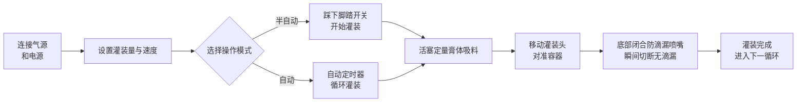

# FF9-500 膏体灌装机


## （核心摘要）

> FF9-500 是温州T&D包装机械厂生产的半自动移动式灌装头膏体灌装机，适用于食品饮料、日化、化妆品及制药行业液体和粘稠膏体的灌装。灌装范围 5–5000 ml，速度 10–40 次/分钟，精度 ±1%，支持脚踏开关/定时器双模式切换。移动式灌装头配备底部闭合防滴漏喷嘴，接触液体部件为食品级 304 不锈钢（可选 316），硅胶密封圈耐温达 100℃。现货供应，宁波离岸价，1 年质保。

- **机器名称**：膏体灌装机  
- **型号**：FF9-500  

---

## 一、产品概述

### 产品类别
- 包装机械 → 膏体/液体灌装设备（活塞式膏体灌装机）  
- 自动化等级：半自动或全自动  
- 驱动方式：气动 + 电动驱动（需外接气源压缩机及电源插座）

### 应用领域
适用于流动性液体与高粘度膏体物料的灌装，广泛应用于：
- **食品饮料**：水、食用油、果汁、牛奶、酸奶、酱料、奶油、辣椒酱、番茄酱  
- **日用化学品**：洗发水、液体洗涤剂、洗碗液  
- **医药与化妆品**：乳霜、乳液、药膏、膏状药品

### 核心特性
- 灌装容量范围：50–500 ml，灌装速度：10–40 次/分钟  
- 灌装精度控制在 ±1% 以内  
- 单个可移动灌装头，灵活适配各类容器  
- 两种操作模式：脚踏开关或自动定时器，可自由切换半自动与全自动模式  
- 可调节灌装量与灌装速度  
- 配备 30 L 大容量料斗，减少加料频率  
- 全气动控制，气动+电动复合驱动

---

## 二、核心优势

1. **高端 Airtac 气动元件**：采用 Airtac 气动组件，气动+电动混合驱动，需连接空压机；操作简便，灌装精度高。
2. **全不锈钢机身，符合食品安全标准**：整机为不锈钢框架，主体为 201 不锈钢，液体接触部分为食品级 304 不锈钢（可选 316），满足食品安全要求；接触部件可选 304 或 316 不锈钢；采用不锈钢阀系统设计。
3. **可移动防滴漏灌装头**：灌装量与速度可调；底部闭合正向切断喷嘴确保无滴漏；灌装头可移动，实现灵活定位，喷嘴直径可选 3–12 mm。
4. **活塞式灌装，双模式自由切换**：活塞式灌装，可通过脚踏开关或自动定时器操作，可随时在半自动与全自动模式间自由切换。
5. **食品级高温密封圈**：硅胶 O 型圈耐温高达 100℃，符合食品卫生标准；可选硅胶或橡胶密封圈，橡胶密封适用于腐蚀性产品。
6. **多种规格可选**：提供 6 种灌装量规格：5–100ml、10–200ml、50–500ml、100–1000ml、250–2500ml、500–5000ml。
7. **广泛材料兼容性**：适用于水、食用油、果汁、牛奶、酸奶、酱料、奶油、洗发水、辣椒酱、番茄酱、膏状物、液体洗涤剂等液态及膏状物料。

---

## 三、技术参数

| 参数 | 规格 |
| --- | --- |
| 型号 | FF9-500 |
| 灌装范围 | 50–500 ml |
| 料斗容量 | 30 L |
| 灌装喷嘴 | 1 个（可移动灌装头） |
| 灌装速度 | 10–40 次/分钟 |
| 灌装精度 | ≤1% |
| 气耗量 | 0.55–1.1 m³/h |
| 气压范围 | 0.4–0.6 MPa |
| 控制方式 | 全气动控制 |
| 自动化等级 | 半自动或全自动 |
| 操作模式 | 脚踏开关 / 自动定时器 |
| 喷嘴直径 | 3–12 mm（可选） |
| 密封圈 | 硅胶 O 型圈（耐 100℃） / 橡胶密封圈（耐腐蚀） |
| 毛重 / 净重 | 35 / 30 kg |
| 包装尺寸 | 95 × 45 × 40 + 46 × 44 × 47 cm |
| 单机包装 | 1 台机器分装于 2 个纸箱 |
| 包装方式 | 加厚瓦楞纸箱 |
| 随机配件 | 工具、附件 |

---

## 四、销售建议与常见问题

### 销售建议
- **核心卖点**：可移动灌装头 + 气电混合驱动 + 食品级不锈钢 + 防滴漏喷嘴，特别适合食品、化妆品及化工车间对液体与膏体进行灵活小批量灌装。
- **目标客户**：中小型食品饮料工厂、食用油/酱料灌装车间、化妆品乳霜生产企业、日化产品制造商、医药包装企业。
- **增值推荐**：根据客户灌装量需求，推荐从 6 种规格中选择（5–100ml 至 500–5000ml）；针对腐蚀性或酸性产品，推荐使用 316 不锈钢 + 橡胶密封圈；如需更高产量，推荐加大料斗容量或配置自动输送线。

### 常见问题 FAQ

1. **机器是否需要电力？**  
   本机采用气动+电动驱动，需同时连接空气压缩机和电源插座，以确保稳定安全运行。
2. **可以灌装哪些物料？**  
   适用于流动性液体及高粘度膏体，如水、食用油、果汁、牛奶、酸奶、酱料、奶油、洗发水、辣椒酱、番茄酱、膏状物、液体洗涤剂等。
3. **灌装精度如何？会不会滴漏？**  
   灌装精度控制在 ±1% 以内。底部闭合正向切断喷嘴设计，确保灌装过程中零滴漏。
4. **如何操作？**  
   可通过脚踏开关实现半自动灌装，也可通过自动定时器实现连续自动灌装，两种模式可自由切换。
5. **保修政策是怎样的？**  
   提供 1 年质保。在保修期内，因正常使用导致的损坏可免费维修或更换（从中国发货至目的地的运费由客户承担）。若需现场工程师服务，往返差旅费用由客户承担。保修期后提供终身维护服务。
6. **喷嘴尺寸或灌装量范围能否定制？**  
   可以。喷嘴直径可选 3–12 mm，提供 6 种灌装量范围（5–100ml、10–200ml、50–500ml、100–1000ml、250–2500ml、500–5000ml）。

### FAQ Schema（JSON-LD）

```json
{
  "@context": "https://schema.org",
  "@type": "FAQPage",
  "mainEntity": [
    {
      "@type": "Question",
      "name": "Does the machine require electricity?",
      "acceptedAnswer": {
        "@type": "Answer",
        "text": "It uses a pneumatic + electric drive, requiring both an air compressor and a power plug to be connected for stable and safe operation."
      }
    },
    {
      "@type": "Question",
      "name": "What materials can it fill?",
      "acceptedAnswer": {
        "@type": "Answer",
        "text": "Suitable for free-flowing liquids and viscous pastes such as water, cooking oil, juice, milk, yoghurt, sauce, cream, shampoo, chilli paste, tomato paste, paste, liquid detergent, etc."
      }
    },
    {
      "@type": "Question",
      "name": "How is the filling accuracy? Will it drip?",
      "acceptedAnswer": {
        "@type": "Answer",
        "text": "Filling accuracy is within ±1%. The bottom close positive shutoff nozzle design ensures zero dripping during filling."
      }
    },
    {
      "@type": "Question",
      "name": "How to operate it?",
      "acceptedAnswer": {
        "@type": "Answer",
        "text": "Semi-automatic filling via the foot pedal switch, or continuous automatic filling via the automatic timer, with free switching between the two modes."
      }
    },
    {
      "@type": "Question",
      "name": "What is the warranty policy?",
      "acceptedAnswer": {
        "@type": "Answer",
        "text": "1-year warranty. Free repair or replacement for damage caused by normal operation per the manual during the warranty period (shipping costs from China to destination borne by customer). If an on-site engineer is required, round-trip travel expenses are borne by the customer. Lifetime maintenance service is provided beyond the warranty period."
      }
    },
    {
      "@type": "Question",
      "name": "Can nozzle sizes or filling volume ranges be customized?",
      "acceptedAnswer": {
        "@type": "Answer",
        "text": "Yes. Nozzle diameter options range from 3–12 mm, and 6 filling volume ranges are available (5-100ml, 10-200ml, 50-500ml, 100-1000ml, 250-2500ml, 500-5000ml)."
      }
    }
  ]
}
```

### 售后服务条款
- 1 年质保；保修期内因正常磨损造成的损坏可免费维修或更换（从中国运至客户所在地的运费由客户承担）
- 如需现场工程师服务，客户承担往返交通费用
- 保修期后提供终身维护服务

---

## 五、媒体与资源库

| 资源类型 | 描述 / 链接 |
| --- | --- |
| 流程视频 | https://youtu.be/g3yXyeVzYCM |

<iframe width="560" height="315" src="https://www.youtube.com/embed/DDEElVvBufs?si=VZ1rLT1Ppw3WCY_i" title="YouTube video player" frameborder="0" allow="accelerometer; autoplay; clipboard-write; encrypted-media; gyroscope; picture-in-picture; web-share" referrerpolicy="strict-origin-when-cross-origin" allowfullscreen></iframe>

---

## 六、工作流程



### 获取报价并购买

[🛒 点此前往官网商店查看价格并下单](https://cecle.net/zh/products/cecle-ff9-cake-filling-machine-semi-automatic-paste-bottle-filling-machine-for-cake?_pos=1&_psq=FF9&_psid=63c927ce4&_ss=e)